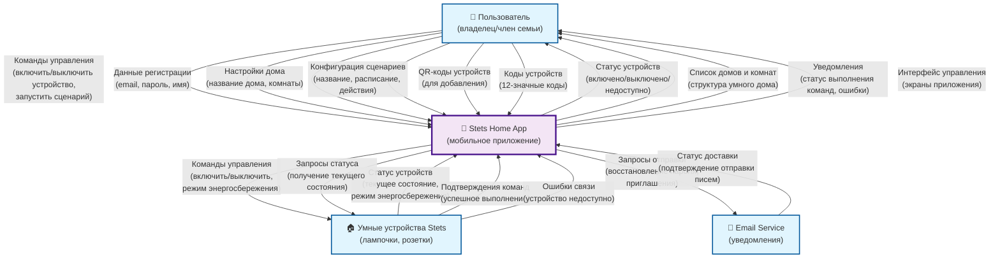

```mermaid
graph TD
    %% Внешние сущности
    User["👤 Пользователь<br/>(владелец/член семьи)"]
    Devices["🏠 Умные устройства Stets<br/>(лампочки, розетки)"]
    Email["📧 Email Service<br/>(уведомления)"]
    
    %% Центральная система
    System["🏡 Stets Home App<br/>(мобильное приложение)"]
    
    %% Потоки от пользователя к системе
    User -->|"Команды управления<br/>(включить/выключить устройство,<br/>запустить сценарий)"| System
    User -->|"Данные регистрации<br/>(email, пароль, имя)"| System
    User -->|"Настройки дома<br/>(название дома, комнаты)"| System
    User -->|"Конфигурация сценариев<br/>(название, расписание, действия)"| System
    User -->|"QR-коды устройств<br/>(для добавления)"| System
    User -->|"Коды устройств<br/>(12-значные коды)"| System
    
    %% Потоки от системы к пользователю
    System -->|"Статус устройств<br/>(включено/выключено/недоступно)"| User
    System -->|"Список домов и комнат<br/>(структура умного дома)"| User
    System -->|"Уведомления<br/>(статус выполнения команд, ошибки)"| User
    System -->|"Интерфейс управления<br/>(экраны приложения)"| User
    
    %% Потоки от устройств к системе
    Devices -->|"Статус устройств<br/>(текущее состояние,<br/>режим энергосбережения)"| System
    Devices -->|"Подтверждения команд<br/>(успешное выполнение)"| System
    Devices -->|"Ошибки связи<br/>(устройство недоступно)"| System
    
    %% Потоки от системы к устройствам
    System -->|"Команды управления<br/>(включить/выключить,<br/>режим энергосбережения)"| Devices
    System -->|"Запросы статуса<br/>(получение текущего состояния)"| Devices
    
    %% Потоки с Email Service
    System -->|"Запросы отправки<br/>(восстановление пароля,<br/>приглашения)"| Email
    Email -->|"Статус доставки<br/>(подтверждение отправки писем)"| System
    
    %% Стили
    classDef external fill:#e1f5fe,stroke:#01579b,stroke-width:2px
    classDef system fill:#f3e5f5,stroke:#4a148c,stroke-width:3px
    
    class User,Devices,Email external
    class System system
```
