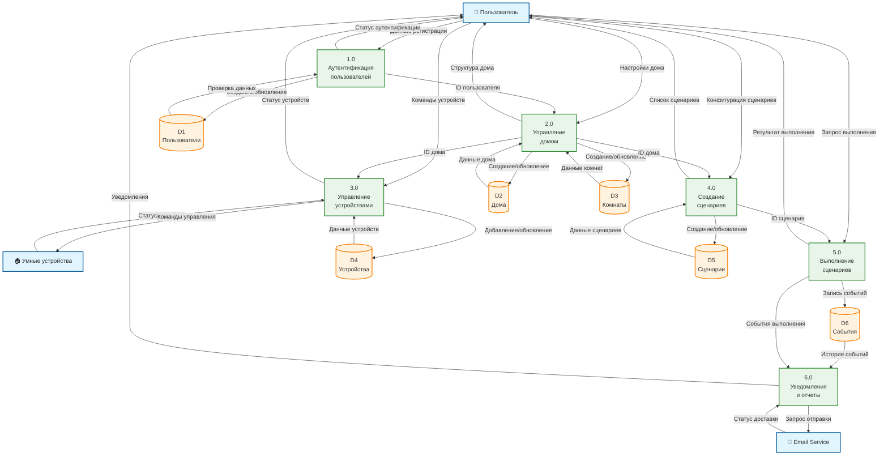

```mermaid
graph TD
    %% Внешние сущности
    User["👤 Пользователь"]
    Devices["🏠 Умные устройства"]
    Email["📧 Email Service"]
    
    %% Процессы системы
    P1["1.0<br/>Аутентификация<br/>пользователей"]
    P2["2.0<br/>Управление<br/>домом"]
    P3["3.0<br/>Управление<br/>устройствами"]
    P4["4.0<br/>Создание<br/>сценариев"]
    P5["5.0<br/>Выполнение<br/>сценариев"]
    P6["6.0<br/>Уведомления<br/>и отчеты"]
    
    %% Хранилища данных
    D1[("D1<br/>Пользователи")]
    D2[("D2<br/>Дома")]
    D3[("D3<br/>Комнаты")]
    D4[("D4<br/>Устройства")]
    D5[("D5<br/>Сценарии")]
    D6[("D6<br/>События")]
    
    %% Потоки от пользователя
    User -->|"Данные регистрации"| P1
    User -->|"Настройки дома"| P2
    User -->|"Команды устройств"| P3
    User -->|"Конфигурация сценариев"| P4
    User -->|"Запрос выполнения"| P5
    
    %% Потоки к пользователю
    P1 -->|"Статус аутентификации"| User
    P2 -->|"Структура дома"| User
    P3 -->|"Статус устройств"| User
    P4 -->|"Список сценариев"| User
    P5 -->|"Результат выполнения"| User
    P6 -->|"Уведомления"| User
    
    %% Потоки с устройствами
    Devices -->|"Статус устройств"| P3
    P3 -->|"Команды управления"| Devices
    
    %% Потоки с Email
    P6 -->|"Запрос отправки"| Email
    Email -->|"Статус доставки"| P6
    
    %% Потоки с хранилищами данных
    P1 -->|"Создание/обновление"| D1
    D1 -->|"Проверка данных"| P1
    
    P2 -->|"Создание/обновление"| D2
    P2 -->|"Создание/обновление"| D3
    D2 -->|"Данные дома"| P2
    D3 -->|"Данные комнат"| P2
    
    P3 -->|"Добавление/обновление"| D4
    D4 -->|"Данные устройств"| P3
    
    P4 -->|"Создание/обновление"| D5
    D5 -->|"Данные сценариев"| P4
    
    P5 -->|"Запись событий"| D6
    D6 -->|"История событий"| P6
    
    %% Межпроцессные потоки
    P1 -->|"ID пользователя"| P2
    P2 -->|"ID дома"| P3
    P2 -->|"ID дома"| P4
    P4 -->|"ID сценария"| P5
    P5 -->|"События выполнения"| P6
    
    %% Стили
    classDef process fill:#e8f5e8,stroke:#388e3c,stroke-width:2px
    classDef storage fill:#fff3e0,stroke:#f57c00,stroke-width:2px
    classDef external fill:#e1f5fe,stroke:#01579b,stroke-width:2px
    
    class P1,P2,P3,P4,P5,P6 process
    class D1,D2,D3,D4,D5,D6 storage
    class User,Devices,Email external
```
