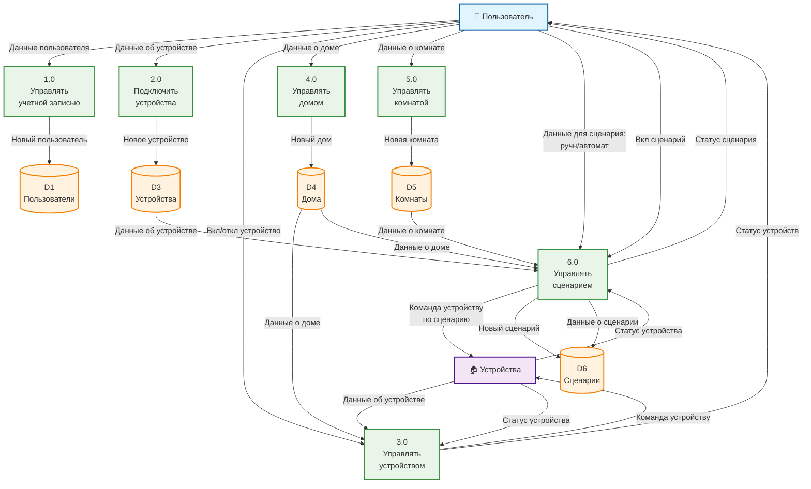

# DFD Уровень 1 - Система управления умным домом

Диаграмма потоков данных уровня 1 для системы управления умным домом.

## Описание элементов диаграммы

### Внешние сущности
- **Пользователь** - основная внешняя сущность, взаимодействующая с системой

### Внутренние сущности
- **Устройства** - интерфейс/подсистема для взаимодействия с физическими устройствами

### Процессы
1. **Управлять учетной записью** - создание и управление учетными записями пользователей
2. **Подключить устройства** - добавление новых устройств в систему
3. **Управлять устройством** - управление состоянием устройств (включение/выключение)
4. **Управлять домом** - создание и управление домами
5. **Управлять комнатой** - создание и управление комнатами в доме
6. **Управлять сценарием** - создание и выполнение сценариев (ручных и автоматических)

### Хранилища данных
- **D1 Пользователи** - информация о пользователях системы
- **D3 Устройства** - информация о подключенных устройствах
- **D4 Дома** - информация о домах
- **D5 Комнаты** - информация о комнатах в домах
- **D6 Сценарии** - информация об определенных сценариях

