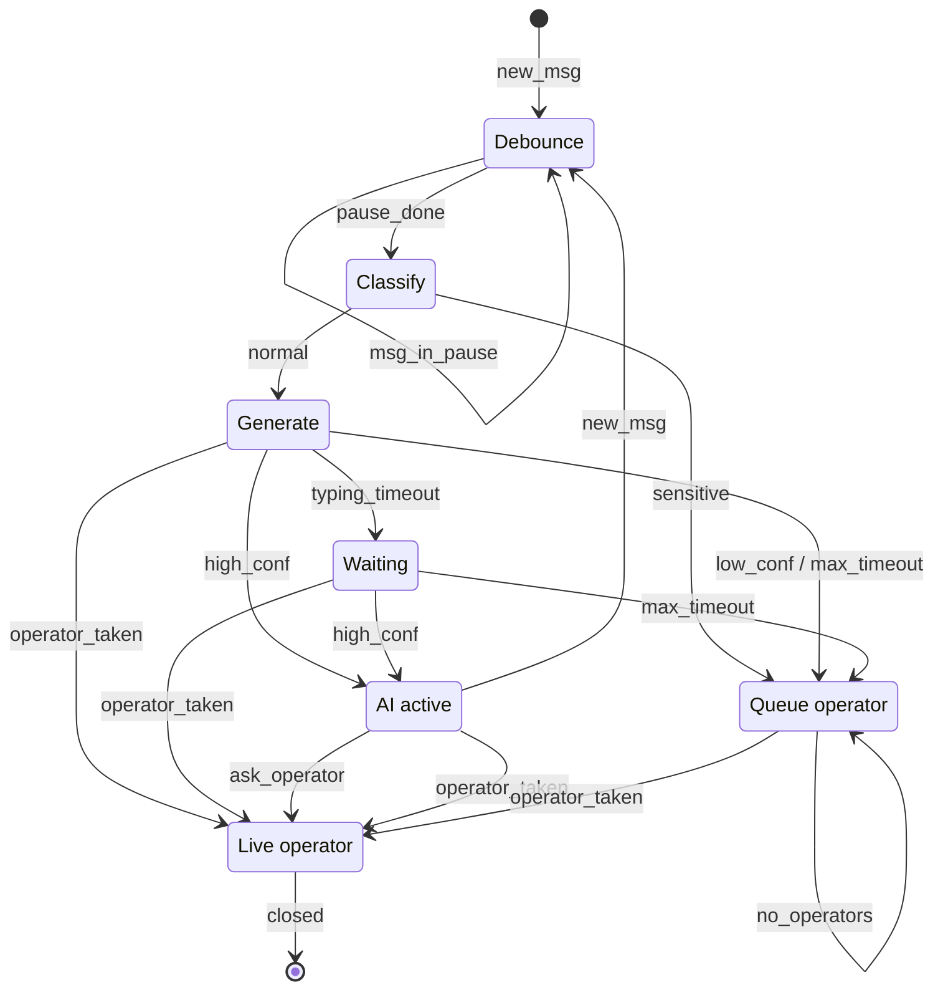
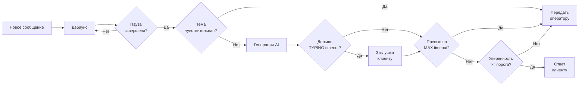
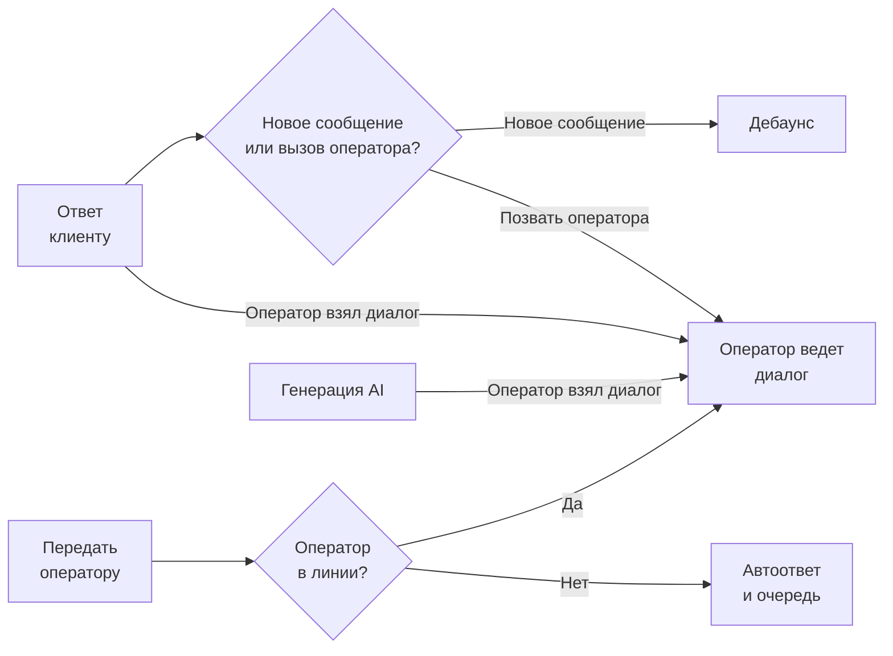

# Аналитический документ: Логика AI-оператора

**Дата:** 2026-04-08 (rev. 1.2)
**Автор:** [Курганский Антон](https://hh.ru/resume/c30088a2ff0e0ef8270039ed1f663351417876?from=share_ios)

---

## 0. Краткое резюме

**Проблема исходного описания:** ТЗ содержит внутренние противоречия — система одновременно "передаёт диалог оператору" и "продолжает отвечать AI", нет порога уверенности, таймаутов и механизма защиты от гонки состояний. В текущем виде реализация неизбежно приведёт к дублированию ответов, галлюцинациям AI и деградации клиентского опыта.

**Ключевое решение:** AI-оператор — первая линия обработки входящих сообщений. Он классифицирует обращение, генерирует ответ при достаточной уверенности и блокируется (взаимоисключение на уровне диалога) при подключении живого оператора. Оператор видит полный контекст работы AI.

**Что входит в MVP:**

- Классификатор тем (чувствительная / нечувствительная)
- Генерация ответа по базе знаний с порогом уверенности
- Дебаунсинг, таймауты, заглушка, автоэскалация
- Блокировка AI при подключении оператора (взаимоисключение)
- Кнопка "Позвать оператора" для клиента
- Отображение ответа AI + источника в интерфейсе оператора

**Топ-5 открытых вопросов к PM:**

1. Какой порог уверенности считается достаточным и кто его пересматривает?
2. Кто ведёт и обновляет список чувствительных тем?
3. Какие конкретные значения таймаутов (заглушка / максимум)?
4. Что означает "оператор взял диалог" — открыл вкладку, нажал "Принять" или отправил сообщение?
5. Что происходит при эскалации в нерабочее время — автоответ или только AI без эскалации?

---

## 1. Проблема и контекст

### Что решает функция

AI-оператор — автоматический агент, отвечающий клиентам вместо живого оператора. Цель: снизить нагрузку на поддержку, ускорить время ответа, обрабатывать типовые обращения без участия человека.

### Почему нельзя отдавать в разработку в текущем виде

1. **Конфликт управления диалогом** (п. 4 vs п. 5): система одновременно "передаёт диалог оператору" и "продолжает отвечать AI".
2. **Нет порога уверенности** (п. 3 и 6): AI будет галлюцинировать на чувствительных темах.
3. **Нет таймаута на генерацию** (п. 8): "клиент просто ждёт" противоречит требованию "не должен долго оставаться без ответа".
4. **Нет механизма недовольства** (п. 9): неясно, что триггерит подключение оператора.
5. **Оператор слеп к логике рассуждений AI** (п. 10): риск продолжить некачественный ответ.
6. **Проблема синхронизации** (п. 7): ответы на каждое сообщение по отдельности приведут к дублированию.

---

## 2. Требования к системе

### 2.1 Функциональные требования

| ID    | Приоритет | Требование                                                                                                                                                                                                                                                                                                                                                                 |
| ------- | -------------------- | -------------------------------------------------------------------------------------------------------------------------------------------------------------------------------------------------------------------------------------------------------------------------------------------------------------------------------------------------------------------------------------- |
| FR-01 | `[MUST MVP]`       | Система определяет**тип обращения** до генерации ответа (чувствительная тема / типовой вопрос / нераспознанный).                                                                                                                                                                          |
| FR-02 | `[MUST MVP]`       | AI генерирует ответ только если обращение**не относится к чувствительным темам**.                                                                                                                                                                                                                                   |
| FR-03 | `[MUST MVP]`       | AI отправляет ответ клиенту только если**уверенность модели ≥ CONFIDENCE_THRESHOLD**. Конкретное значение порога — `[ГИПОТЕЗА]`, согласуется с PM и ML-командой после анализа распределения скоров.                                           |
| FR-04 | `[MUST MVP]`       | Если уверенность < порога —**диалог передаётся оператору** с черновиком ответа AI и причиной.                                                                                                                                                                                                               |
| FR-05 | `[MUST MVP]`       | Если тема чувствительная —**AI не отвечает**, диалог немедленно уходит оператору с пометкой темы.                                                                                                                                                                                                       |
| FR-06 | `[MUST MVP]`       | Как только**оператор взял диалог** — AI **прекращает генерацию** по этому диалогу.                                                                                                                                                                                                                                      |
| FR-07 | `[MUST MVP]`       | При нескольких сообщениях подряд с паузой < DEBOUNCE_TIMEOUT — AI**ждёт паузы** и отвечает на агрегированный контекст.                                                                                                                                                                                |
| FR-08 | `[MUST MVP]`       | Если генерация > TYPING_INDICATOR_TIMEOUT — клиенту отправляется**заглушка**: "Мы уже изучаем ваш вопрос, ответим через несколько секунд".                                                                                                                                                  |
| FR-09 | `[MUST MVP]`       | Если генерация > MAX_GENERATION_TIMEOUT — диалог**автоматически передаётся оператору**.                                                                                                                                                                                                                                          |
| FR-10 | `[MUST MVP]`       | Клиент может**явно запросить оператора** (кнопка или фраза-триггер) — AI останавливается, диалог уходит оператору.                                                                                                                                                                        |
| FR-11 | `[MUST MVP]`       | Оператор видит**ответ AI + источник из базы знаний / причину передачи**.                                                                                                                                                                                                                                                        |
| FR-12 | `[MUST MVP]`       | Оператор**не дублирует ответ AI**: видит историю и продолжает диалог с учётом уже сказанного.                                                                                                                                                                                                               |
| FR-13 | `[MUST MVP]`       | При событии "оператор взял диалог" —**отменить незавершенную генерацию**, запретить отправку уже сформированного буфера. Диалог блокируется для AI (взаимоисключение на уровне диалога).                                      |
| FR-14 | `[MUST MVP]`       | При эскалации в нерабочее время (нет операторов в линии) — клиент получает**автоответ** с временем следующего ответа; диалог сохраняется в очереди. *(Конкретная формулировка — `[ГИПОТЕЗА]`, согласуется с PM.)* |

### 2.2 Нефункциональные требования

| ID     | Приоритет   | Требование                                                                                                                               |
| -------- | ---------------------- | ---------------------------------------------------------------------------------------------------------------------------------------------------- |
| NFR-01 | `[MUST MVP]`         | Время ответа AI — не более**10 сек** в 95% случаев (P95).                                                            |
| NFR-02 | `[MUST MVP]`         | Конкурентная обработка диалогов без взаимного влияния (изолированные очереди). |
| NFR-03 | `[MUST MVP]`         | Все действия AI логируются с меткой времени, ID диалога и причиной.                             |
| NFR-04 | `[ГИПОТЕЗА]` | Архитектура позволяет подключить CRM в v2 без переписывания ядра.                               |

> **Явная граница MVP:** AI работает только с базой знаний. Персональные данные клиента из CRM недоступны (реализация в v2).

---

## 3. Целевая логика работы

### 3.1 Текстовое описание

1. Клиент отправляет сообщение.
2. Система ожидает паузу DEBOUNCE_TIMEOUT — если клиент продолжает набирать, ждёт окончания.
3. Классификация обращения:
   - **Чувствительная тема** → немедленно оператору с пометкой; AI не отвечает.
   - **Обычный вопрос** → AI начинает генерацию.
4. Если генерация > TYPING_INDICATOR_TIMEOUT → клиенту отправляется заглушка.
5. Если генерация > MAX_GENERATION_TIMEOUT → оператору; AI останавливается.
6. Оценка уверенности:
   - **≥ порога** → ответ клиенту; оператор видит ответ + источник.
   - **< порога** → оператору с черновиком.
7. Если **оператор взял диалог** — немедленное взаимоисключение: незавершенная генерация отменяется, AI блокируется.
8. Клиент может в любой момент нажать "Позвать оператора" → AI останавливается.
9. При эскалации без операторов в линии → автоответ клиенту, диалог в очередь.

### 3.2 Компактная схема состояний (Mermaid)

Подробная визуальная схема потока приведена в **Приложении Б**.

### 3.3 Таблица состояний и допустимых переходов

| Состояние  | Переход в  | Условие                                                                                                   |
| --------------------- | -------------------- | ------------------------------------------------------------------------------------------------------------------ |
| `[*]` / `AI_ACTIVE` | `DEBOUNCING`       | получено сообщение клиента                                                               |
| `DEBOUNCING`        | `DEBOUNCING`       | новое сообщение в пределах DEBOUNCE_TIMEOUT                                               |
| `DEBOUNCING`        | `CLASSIFYING`      | пауза ≥ DEBOUNCE_TIMEOUT                                                                                   |
| `CLASSIFYING`       | `OPERATOR_PENDING` | тема = чувствительная                                                                          |
| `CLASSIFYING`       | `AI_GENERATING`    | тема = обычная / нераспознанная                                                         |
| `AI_GENERATING`     | `AI_WAITING`       | генерация > TYPING_INDICATOR_TIMEOUT                                                                    |
| `AI_GENERATING`     | `OPERATOR_PENDING` | генерация > MAX_GENERATION_TIMEOUT ИЛИ уверенность < порога                         |
| `AI_GENERATING`     | `AI_ACTIVE`        | уверенность ≥ порога, ответ отправлен                                            |
| `AI_GENERATING`     | `OPERATOR_ACTIVE`  | оператор взял диалог (взаимоисключение → генерация отменена) |
| `AI_WAITING`        | `OPERATOR_PENDING` | генерация > MAX_GENERATION_TIMEOUT                                                                      |
| `AI_WAITING`        | `AI_ACTIVE`        | уверенность ≥ порога, ответ отправлен                                            |
| `AI_WAITING`        | `OPERATOR_ACTIVE`  | оператор взял диалог (взаимоисключение → генерация отменена) |
| `AI_ACTIVE`         | `DEBOUNCING`       | новое сообщение клиента                                                                     |
| `AI_ACTIVE`         | `OPERATOR_ACTIVE`  | клиент нажал "Позвать оператора" ИЛИ оператор взял диалог        |
| `OPERATOR_PENDING`  | `OPERATOR_ACTIVE`  | оператор взял диалог                                                                           |
| `OPERATOR_PENDING`  | `OPERATOR_PENDING` | нет операторов → автоответ клиенту                                                 |
| `OPERATOR_ACTIVE`   | `[*]`              | оператор закрыл диалог                                                                       |

### 3.4 Что AI обрабатывает / не обрабатывает

| Тип обращения                                             | AI отвечает? | Комментарий                                       |
| ----------------------------------------------------------------------- | ---------------------- | -------------------------------------------------------------- |
| FAQ, типовые вопросы по продукту              | Да                 | При уверенности ≥ порога                |
| Вопросы по статусу заказа / аккаунту    | Нет (v2)          | Требует CRM; в MVP недоступно              |
| Медицинские, юридические темы               | Нет               | Всегда к оператору                           |
| Жалобы и претензии                                    | Нет               | Высокий риск, к оператору               |
| Запрос на возврат средств                       | Нет               | Требует авторизации действий       |
| Нецензурная лексика / агрессия              | Нет               | Отдельный сценарий                          |
| Технические вопросы без ответа в базе | Нет               | Низкая уверенность → к оператору |

---

## 4. Вопросы к Product Manager / стейкхолдерам

### Обязательно до старта разработки

| #   | Тема                                  | Вопрос                                                                                                                                                                            | Рабочая гипотеза                                                                                                                                                                                 |
| ----- | ------------------------------------------- | ----------------------------------------------------------------------------------------------------------------------------------------------------------------------------------------- | ----------------------------------------------------------------------------------------------------------------------------------------------------------------------------------------------------------------- |
| Q1  | Порог уверенности         | Какое минимальное значение достаточно? Кто устанавливает и пересматривает?                                             | `[ГИПОТЕЗА]` 0.75; пересмотр по результатам пилота                                                                                                                          |
| Q2  | Чувствительные темы     | Кто ведёт список? Как добавляется новая тема?                                                                                                      | —                                                                                                                                                                                                              |
| Q3  | Таймауты                          | Значения TYPING_INDICATOR_TIMEOUT и MAX_GENERATION_TIMEOUT?                                                                                                                    | `[ГИПОТЕЗА]` 5 сек и 15 сек                                                                                                                                                                      |
| Q4  | Дебаунс                            | Через сколько секунд считать паузу? Максимум сообщений в очереди?                                                                | `[ГИПОТЕЗА]` 2–3 сек                                                                                                                                                                                |
| Q5  | "Взял диалог"                   | Оператор открыл вкладку / нажал "Принять" / отправил первое сообщение?                                                          | —                                                                                                                                                                                                              |
| Q6  | Механизм недовольства | Кнопка оценки? Триггерная фраза? Повторный вопрос?                                                                                            | `[ГИПОТЕЗА]` Считать "недовольством" негативный сентимент в следующем сообщении ИЛИ нажатие 👎 — прошу подтвердить |
| Q7  | Нерабочее время             | Что получает клиент при эскалации ночью / в выходные? Автоответ? Только AI без эскалации?                         | `[ГИПОТЕЗА]` Автоответ "ответим в рабочее время" + диалог в очередь                                                                                          |
| Q8  | Оператор и интерфейс    | Нужна ли подсказка "Последний ответ дал AI"? Как оператор продолжает без повторения сказанного ботом? | —                                                                                                                                                                                                              |
| Q9  | SLA оператора                    | Есть ли максимальное время ответа после получения диалога? Что при превышении?                                        | —                                                                                                                                                                                                              |
| Q10 | Аналитика                        | Какие метрики с первого дня?                                                                                                                                     | % передач, P95 времени, точность                                                                                                                                                          |

### Юридические требования и приватность (PM + комплаенс)

| #   | Вопрос                                                                                                                                                     |
| ----- | ------------------------------------------------------------------------------------------------------------------------------------------------------------------ |
| Q11 | Срок хранения логов AI-диалогов, кто имеет доступ?                                                                        |
| Q12 | Маскирование ПДн в логах (ФИО, телефон, email в текстах сообщений)?                                              |
| Q13 | Кто имеет доступ к "обоснованию" ответа AI (источник, скор уверенности)?                                  |
| Q14 | Необходимо ли согласование формулировок заглушек и автоответов с юридическим отделом? |

---

## 5. Задача для разработки: MVP

### Название

**[FEAT] AI-оператор: автоматические ответы в чате с управляемой передачей оператору — MVP**

### Проблема / Цель

Операторы перегружены типовыми обращениями. Клиенты ждут дольше допустимого. Необходим автоматический агент, снимающий нагрузку без ошибок на чувствительных темах и без дублирования работы живых операторов.

### Объем MVP

| Компонент                                                                                                 | Приоритет           |
| -------------------------------------------------------------------------------------------------------------------- | ------------------------------ |
| Классификатор тем (чувствительная / нечувствительная)                | `[MUST MVP]`                 |
| Генерация ответа по базе знаний                                                         | `[MUST MVP]`                 |
| Оценка уверенности и логика порога                                                   | `[MUST MVP]`                 |
| Дебаунсинг входящих сообщений                                                           | `[MUST MVP]`                 |
| Заглушка при долгой генерации                                                            | `[MUST MVP]`                 |
| Автопередача оператору при таймауте и низкой уверенности         | `[MUST MVP]`                 |
| Взаимоисключение: блокировка AI при подключении оператора (FR-13) | `[MUST MVP]`                 |
| Кнопка "Позвать оператора" для клиента                                             | `[MUST MVP]`                 |
| Отображение ответа AI + источника в интерфейсе оператора             | `[MUST MVP]`                 |
| Автоответ при эскалации в нерабочее время                                      | `[MUST MVP]`                 |
| Базовое логирование действий AI                                                          | `[MUST MVP]`                 |
| Настройка порогов через интерфейс                                                    | `[ГИПОТЕЗА]` → v1.1 |

**Не входит в объем (MVP):** интеграция с CRM, мультиканальность, автозакрытие диалога, дообучение модели, A/B-тестирование порогов, аналитический дашборд.

### Метрики успеха MVP

| Метрика                                                                                         | Описание                                                                         | Целевое значение                                 |
| -------------------------------------------------------------------------------------------------------- | ------------------------------------------------------------------------------------------ | ----------------------------------------------------------------- |
| Доля автоматически закрытых диалогов                                  | % диалогов без участия оператора                              | Базовый прогноз после 2 нед. пилота |
| Доля эскалаций                                                                            | % диалогов, переданных оператору (любая причина)  | Базовый прогноз после пилота           |
| P95 времени ответа AI                                                                     | 95-й перцентиль времени от сообщения до ответа      | ≤ 10 сек                                                    |
| Доля ошибочных ответов по чувствительным темам                | AI ответил там, где должен был передать оператору | 0%                                                              |
| Среднее время первого ответа оператора после эскалации | После передачи диалога                                               | Определяется по базовым данным       |

> Цели по снижению нагрузки и росту автоматизации — **гипотеза**, требует базового прогноза по историческим данным. Фиксируются как ориентиры по итогам пилота.

### Ключевые параметры

| Параметр           | Описание                                 | Значение по умолчанию |
| ---------------------------- | -------------------------------------------------- | ------------------------------------------ |
| `DEBOUNCE_TIMEOUT`         | Пауза перед обработкой       | 2–3 сек`[ГИПОТЕЗА]`          |
| `CONFIDENCE_THRESHOLD`     | Минимальная уверенность AI | 0.75`[ГИПОТЕЗА]`                 |
| `TYPING_INDICATOR_TIMEOUT` | Таймаут до заглушки             | 5 сек`[ГИПОТЕЗА]`             |
| `MAX_GENERATION_TIMEOUT`   | Максимум генерации              | 15 сек`[ГИПОТЕЗА]`            |

### Критерии приёмки

| AC-ID                         | Условие                                                                                                    | Ожидаемый результат                                                                                                                                                   |
| ------------------------------- | ------------------------------------------------------------------------------------------------------------------- | ----------------------------------------------------------------------------------------------------------------------------------------------------------------------------------------- |
| AC-01                         | Клиент отправил сообщение по чувствительной теме                       | AI не отвечает; диалог передаётся оператору с пометкой темы                                                                             |
| AC-02                         | AI сформировал ответ с уверенностью < CONFIDENCE_THRESHOLD                           | Ответ не отправляется; диалог уходит оператору с черновиком и причиной                                                      |
| AC-03                         | Клиент отправил 3 сообщения с паузами < DEBOUNCE_TIMEOUT                           | Система ждёт; AI отвечает один раз на агрегированный контекст                                                                         |
| AC-04                         | Генерация занимает > TYPING_INDICATOR_TIMEOUT                                                    | Клиент получает сообщение-заглушку                                                                                                                       |
| AC-05                         | Генерация занимает > MAX_GENERATION_TIMEOUT                                                      | Диалог автоматически передаётся оператору; AI останавливается                                                                      |
| AC-06                         | Оператор нажал "Принять" или отправил первое сообщение              | AI немедленно прекращает генерацию (взаимоисключение); новые ответы AI в этом диалоге не отправляются |
| AC-07                         | Клиент нажал "Позвать оператора"                                                       | AI останавливается; диалог передаётся оператору                                                                                                 |
| AC-08                         | AI отправил ответ клиенту                                                                     | Оператор видит ответ AI + источник из базы знаний в своём интерфейсе                                                              |
| AC-09                         | Любое действие AI (генерация, передача, таймаут)                             | Событие записывается в лог с меткой времени и ID диалога                                                                                   |
| AC-10                         | Система обрабатывает стандартный трафик                                       | P95 времени от сообщения клиента до ответа AI ≤ 10 сек                                                                                             |
| AC-11*(негативный)* | Клиент отправил новое сообщение**во время генерации** ответа AI | Текущая генерация отменяется; запускается новый дебаунс с полным контекстом                                           |
| AC-12*(негативный)* | Оператор открыл чат**после** ответа AI и написал продолжение       | AI не генерирует; оператор видит историю с ответом AI и продолжает диалог без повторения                          |
| AC-13*(негативный)* | Инициирована эскалация, операторов нет в линии                            | Клиент получает автоответ с временем следующего ответа; диалог сохраняется в очереди                           |

### Трассировка FR → AC

| FR-ID               | AC-ID        | Краткое описание                                                                |
| --------------------- | -------------- | ------------------------------------------------------------------------------------------------ |
| FR-01, FR-02, FR-05 | AC-01        | Чувствительная тема → немедленно оператору               |
| FR-03, FR-04        | AC-02        | Низкая уверенность → оператору с черновиком              |
| FR-07               | AC-03, AC-11 | Дебаунсинг: агрегация сообщений и отмена генерации |
| FR-08               | AC-04        | Заглушка при долгой генерации                                        |
| FR-09               | AC-05        | MAX_TIMEOUT → автоэскалация                                                      |
| FR-06, FR-13        | AC-06, AC-12 | Взаимоисключение: оператор взял → AI заблокирован     |
| FR-10               | AC-07        | Кнопка "Позвать оператора"                                               |
| FR-11, FR-12        | AC-08, AC-12 | Оператор видит историю AI                                                  |
| NFR-03              | AC-09        | Логирование всех действий AI                                            |
| NFR-01              | AC-10        | P95 ≤ 10 сек                                                                               |
| FR-14               | AC-13        | Нерабочее время — автоответ + очередь                           |

### Зависимости и риски

| #  | Тема                                         | Описание                                                                                                                                                                                                                       | Ответственный                    |
| ---- | -------------------------------------------------- | ---------------------------------------------------------------------------------------------------------------------------------------------------------------------------------------------------------------------------------------- | ----------------------------------------------- |
| Q1 | Список чувствительных тем | Без него невозможен классификатор                                                                                                                                                                        | PM                                            |
| Q2 | Значения таймаутов              | Не согласованы; влияют на пользовательский опыт                                                                                                                                               | PM + техлид                             |
| Q3 | "Взял диалог"                          | Не определено событие-триггер взаимоисключение                                                                                                                                               | PM + фронтенд                         |
| Q4 | Механизм недовольства        | Рабочая гипотеза: негативный сентимент ИЛИ 👎                                                                                                                                                     | PM                                            |
| D1 | База знаний                            | Качество ответов AI прямо зависит от полноты базы                                                                                                                                              | Content-команда                        |
| D2 | ML confidence score                              | FR-03 предполагает калиброванный скор от модели. Если скор недоступен — запасной вариант: только RAG + порог релевантности чанков | ML-команда                             |
| R1 | Галлюцинации AI                      | При низком пороге AI отвечает неточно                                                                                                                                                                    | A/B после MVP                            |
| R2 | Перегрузка операторов        | При высоком пороге все диалоги уйдут к людям                                                                                                                                                      | Мониторинг с первого дня |
| R3 | Состояние гонки                    | Закрыт FR-13 (взаимоисключение); требует ревью техлида                                                                                                                                        | техлид                                  |

### Изменения в рабочем процессе оператора (Управление изменениями)

При внедрении AI-оператора рабочий процесс операторов изменится. До старта разработки необходимо уточнить с PM:

- Нужно ли обучение операторов новому интерфейсу?
- Как оператор понимает, что диалог уже обработан AI (явная метка в интерфейсе)?
- Нужна ли подсказка: *"Последний ответ клиенту дал AI"*?
- Как оператор продолжает диалог без повторения сказанного ботом?

---

## Приложение A: Предложение по этапам развития

> Цифры по снижению нагрузки — **гипотезы**, подлежат подтверждению на пилоте по историческим данным.

| Этап | Содержание                                                                                                                                                                       | Ожидаемый эффект                                                                                   |
| ---------- | -------------------------------------------------------------------------------------------------------------------------------------------------------------------------------------------- | ------------------------------------------------------------------------------------------------------------------- |
| **MVP**  | Классификатор тем, генерация по базе знаний, порог уверенности, передача оператору, взаимоисключение | Базовая автоматизация; замер реального снижения нагрузки        |
| **v1.1** | Кнопка оценки ответа AI клиентом, базовый аналитический дашборд, настройка порогов через интерфейс      | Измерение качества; инструмент обратной связи для операторов |
| **v2.0** | Интеграция с CRM, персонализированные ответы, A/B-тесты порогов                                                                            | Рост автоматизации; сокращение времени ответа                             |
| **v3.0** | Дообучение модели на исторических диалогах, мультиканальность                                                                       | Умный оператор с памятью контекста клиента                                   |

---

## Приложение Б: Визуальная схема потока

### Б.1 Обработка сообщения AI

### Б.2 Эскалация и продолжение диалога

