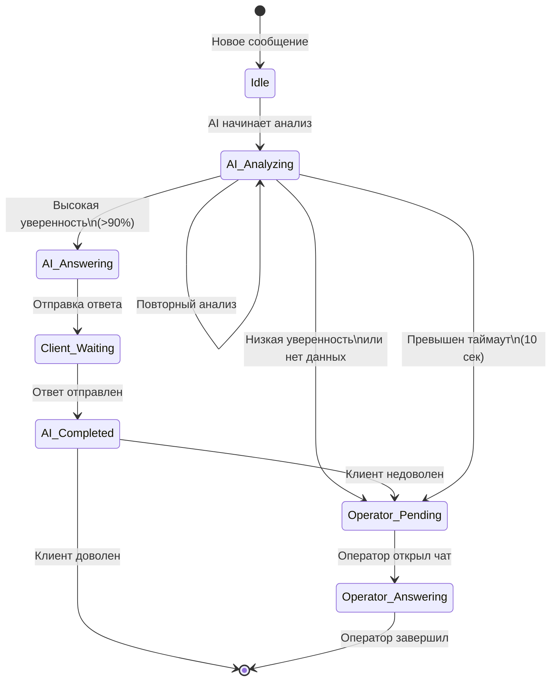
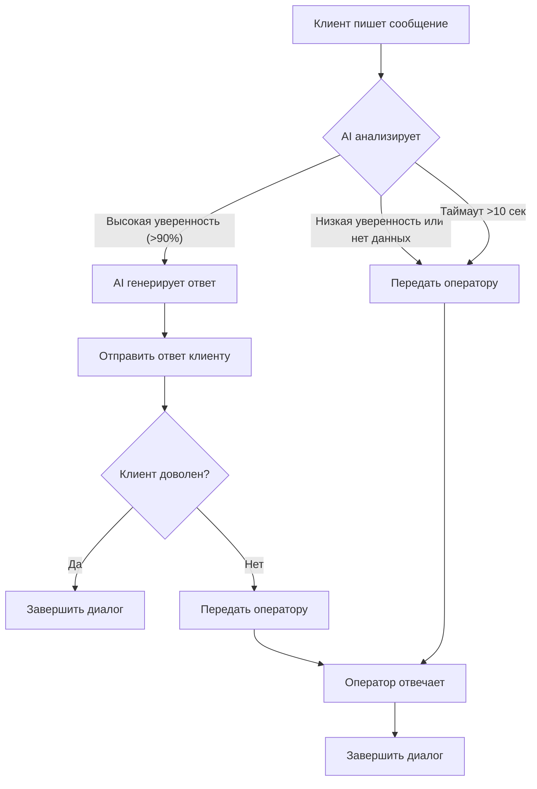

# Решение тестового задания: Аналитик AI-оператора

**Автор:** Аналитик  
**Дата:** 6 апреля 2026  
**Формат:** Markdown  
**Объем:** ~3.5 страницы

---

## 1. Кратко сформулируйте проблему

### Какую задачу решает функция?

AI-оператор — это интеллектуальный помощник, который автоматически отвечает на запросы клиентов, используя базу знаний и данные из CRM. Цель — снизить нагрузку на операторов, обрабатывая рутинные запросы и ускоряя время отклика.

### В чем главная проблема текущего описания?

Текущее описание содержит **критические архитектурные пробелы** и **логические противоречия**, которые делают невозможным безопасный запуск:

| Проблема | Описание | Риск |
|----------|----------|------|
| **Отсутствие контроля состояния диалога** | AI может отвечать, пока оператор уже открыл чат | Дублирование ответов, путаница для клиента |
| **Нет приоритизации ответственности** | Неясно, кто (AI или оператор) должен отвечать в разных сценариях | Операторы не знают, нужно ли им вмешиваться |
| **Отсутствие fallback-механизмов** | AI может отвечать на любые вопросы, даже если не уверен | Ошибки в чувствительных темах, ухудшение репутации |
| **Нет уведомлений оператору** | Оператор не видит, что AI уже отвечал | Дублирование усилий, клиент получает два ответа |
| **Отсутствие SLA** | Клиент может ждать 10+ секунд без обратной связи | Негативный опыт, отток клиентов |

### Почему в таком виде нельзя безопасно отдавать задачу в разработку?

1. **Разработчики не смогут спроектировать архитектуру** — нет четких правил перехода между AI и оператором
2. **Нет критериев качества** — неясно, когда AI должен "сдаться" и передать диалог оператору
3. **Отсутствует защита от ошибок** — AI может дать некорректный ответ в чувствительной теме
4. **Нет механизма обратной связи** — невозможно оценить эффективность AI и улучшить его работу

---

## 2. Сформулируйте требования к системе

### Функциональные требования

| ID | Требование | Приоритет |
|----|------------|-----------|
| FT-01 | AI должен анализировать входящее сообщение и определять, может ли он ответить на него с высокой уверенностью (>90%) | Обязательный |
| FT-02 | Если AI не уверен в ответе или не нашел данных, диалог должен быть передан оператору | Обязательный |
| FT-03 | AI не должен отвечать, если оператор уже открыл чат с клиентом | Обязательный |
| FT-04 | AI должен уведомлять оператора о том, что он попытался ответить (с логом запроса и ответа) | Обязательный |
| FT-05 | Если клиент недоволен ответом AI, оператор должен видеть это в интерфейсе и иметь возможность перехватить диалог | Обязательный |
| FT-06 | AI должен показывать клиенту индикатор "AI печатает..." при ответе | Обязательный |
| FT-07 | Если AI не может ответить за 10 секунд, клиент должен получить уведомление "Мы работаем над вашим запросом" | Обязательный |
| FT-08 | Оператор должен видеть историю диалога, включая ответы AI | Обязательный |
| FT-09 | AI должен использовать данные из CRM только после согласования с оператором (для MVP — только база знаний) | MVP |
| FT-10 | AI должен логировать все свои действия для последующего анализа | MVP |

### Нефункциональные требования

| ID | Требование | Приоритет |
|----|------------|-----------|
| NFT-01 | Время отклика AI: <5 секунд для 95% запросов | Обязательный |
| NFT-02 | Доступность AI: 99.9% | Обязательный |
| NFT-03 | Скорость обработки: до 100 запросов в секунду | Обязательный |
| NFT-04 | Хранение логов: минимум 1 год | Обязательный |
| NFT-05 | Безопасность: шифрование персональных данных | Обязательный |
| NFT-06 | Масштабируемость: возможность добавления новых источников данных (CRM, база знаний) | MVP |

### Требования к пользовательскому опыту

| ID | Требование | Приоритет |
|----|------------|-----------|
| UX-01 | Клиент должен видеть, отвечает AI или оператор | Обязательный |
| UX-02 | Оператор должен видеть статус диалога (AI отвечает, ожидает, передан оператору) | Обязательный |
| UX-03 | Интерфейс оператора должен показывать, какие ответы AI уже дал | Обязательный |
| UX-04 | AI должен использовать вежливый и профессиональный тон | Обязательный |

---

## 3. Опишите целевую логику работы

### Диаграмма состояний диалога

### Таблица логики работы AI-оператора

| Сценарий | Действие AI | Действие оператора | Статус диалога |
|----------|-------------|-------------------|----------------|
| Клиент написал сообщение | Анализирует запрос, проверяет базу знаний | Ждет уведомления | `AI_Analyzing` |
| AI нашел ответ с >90% уверенностью | Генерирует и отправляет ответ | Получает уведомление о попытке ответа | `AI_Answering` → `AI_Completed` |
| AI не нашел ответ или низкая уверенность | Передает диалог оператору | Получает уведомление с запросом клиента | `Operator_Pending` |
| Оператор открыл чат | **Останавливается**, не отвечает | Отвечает клиенту | `Operator_Answering` |
| Клиент недоволен ответом AI | Логирует недовольство | Получает уведомление с пометкой "Клиент недоволен" | `Operator_Pending` |
| AI не может ответить за 10 секунд | Отправляет уведомление "Мы работаем над вашим запросом" | Получает уведомление | `AI_Analyzing` → `Operator_Pending` |
| AI отвечает дольше 10 секунд | Клиент ждет, получает уведомление каждые 5 сек | Получает уведомление | `AI_Analyzing` → `Operator_Pending` |

### Правила передачи диалога

1. **AI передает диалог оператору, если:**
   - Уверенность в ответе < 90%
   - Не найдено данных в базе знаний
   - Превышен таймаут ответа (10 секунд)
   - Клиент выразил недовольство

2. **Оператор передает диалог AI, если:**
   - Оператор явно передает диалог (кнопка "Передать AI")
   - Оператор не отвечает 5 минут (автоматическая передача)

3. **AI не отвечает, если:**
   - Оператор уже открыл чат с клиентом
   - Клиент недоволен ответом AI
   - Оператор явно взял диалог под контроль

---

## 4. Сформулируйте вопросы к Product Manager / заказчику

### Обязательные вопросы (для MVP)

| ID | Вопрос | Причина |
|----|--------|---------|
| Q1 | Какой порог уверенности считать "высоким"? 90% — это слишком строго или можно 80%? | Влияет на частоту передачи диалога оператору |
| Q2 | Какие темы считаются "чувствительными", где AI не должен отвечать без одобрения оператора? | Для настройки фильтров и ограничений |
| Q3 | Какой SLA по времени отклика для операторов? 1 минута, 5 минут? | Для настройки автоматической передачи диалога |
| Q4 | Какие данные из CRM можно использовать в MVP? Только история заказов или еще что-то? | Для планирования интеграции |
| Q5 | Какой лимит на количество одновременных диалогов для одного клиента? | Для предотвращения спама |

### Дополнительные вопросы (для будущих этапов)

| ID | Вопрос | Причина |
|----|--------|---------|
| Q6 | Какие метрики эффективности AI-оператора важны для бизнеса? | Для настройки аналитики и улучшения |
| Q7 | Нужна ли возможность обучения AI на основе ответов операторов? | Для улучшения качества ответов |
| Q8 | Какие каналы коммуникации должны поддерживаться (чат, email, соцсети)? | Для архитектурных решений |
| Q9 | Нужна ли интеграция с внешними API (погода, курсы валют и т.д.)? | Для расширения функциональности |
| Q10 | Какой процесс модерации ответов AI? Автоматический или ручной? | Для обеспечения качества и безопасности |

---

## 5. Оформите задачу для разработки (черновик)

### Название задачи
**AI-оператор: Автоматическая обработка запросов клиентов с передачей на оператора при необходимости**

### Проблема / Цель
Снизить нагрузку на операторов, автоматизируя обработку рутинных запросов клиентов. Текущая логика содержит критические ошибки, которые могут привести к дублированию ответов, ошибкам в чувствительных темах и ухудшению клиентского опыта.

### Краткое описание решения
Реализовать систему AI-оператора с четкими правилами передачи диалога между AI и оператором. AI отвечает на запросы с высокой уверенностью, в остальных случаях передает диалог оператору. Оператор видит историю диалога и может перехватить управление в любой момент.

### Scope MVP (что входит в доработку)

| Компонент | Описание |
|-----------|----------|
| **Анализатор запросов** | Определение темы запроса и поиск в базе знаний |
| **Модуль уверенности** | Оценка качества ответа и принятие решения о передаче |
| **Менеджер состояний диалога** | Управление переходами между AI и оператором |
| **Уведомления оператору** | Информирование оператора о попытках ответа AI |
| **Интерфейс оператора** | Отображение статуса диалога и истории ответов AI |
| **Логирование** | Запись всех действий AI для анализа |

### Out of scope (что не входит)
- Интеграция с CRM (только база знаний)
- Обучение AI на основе ответов операторов
- Интеграция с внешними API
- Поддержка email и соцсетей (только чат)
- Автоматическая модерация ответов AI

### Основные бизнес-правила

1. **Правило 1:** AI отвечает только с уверенностью >90%
2. **Правило 2:** AI не отвечает, если оператор уже открыл чат
3. **Правило 3:** AI уведомляет оператора о каждом ответе
4. **Правило 4:** Если клиент недоволен, оператор получает приоритет
5. **Правило 5:** AI не может отвечать дольше 10 секунд без уведомления

### Требования к системе

См. раздел 2 "Сформулируйте требования к системе"

### Критерии приемки

| ID | Критерий | Метод проверки |
|----|----------|----------------|
| HC-01 | AI отвечает только с уверенностью >90% | Тестирование на выборке запросов |
| HC-02 | AI не отвечает, если оператор открыл чат | Сценарий: оператор открывает чат во время ответа AI |
| HC-03 | Оператор получает уведомление о каждом ответе AI | Проверка логов уведомлений |
| HC-04 | Клиент получает уведомление через 10 секунд | Тайминговый тест |
| HC-05 | Оператор видит историю ответов AI | Проверка интерфейса оператора |
| HC-06 | AI не отвечает дольше 10 секунд без уведомления | Тайминговый тест |
| HC-07 | Логирование всех действий AI | Проверка логов |

### Открытые вопросы / зависимости / риски

| ID | Описание | Статус | Приоритет |
|----|----------|--------|-----------|
| R1 | Неопределенность порога уверенности | Открыт | Высокий |
| R2 | Неопределенность чувствительных тем | Открыт | Высокий |
| R3 | Неопределенность SLA для операторов | Открыт | Средний |
| R4 | Зависимость от качества базы знаний | Зависимость | Высокий |
| R5 | Риск ошибок AI в чувствительных темах | Риск | Высокий |

---

## Дополнительно (по желанию)

### Flow-диаграмма

### Таблица: Что AI может / не может обрабатывать

| Категория | Может AI? | Условия |
|-----------|----------|---------|
| **Общие вопросы** | ✅ Да | Если есть ответ в базе знаний с >90% уверенностью |
| **Техническая поддержка** | ✅ Да | Если вопрос описан в базе знаний |
| **Заказы и доставка** | ✅ Да | Если есть доступ к истории заказов |
| **Финансовые вопросы** | ⚠️ С осторожностью | Только общая информация, без персональных данных |
| **Жалобы и претензии** | ❌ Нет | Только передать оператору |
| **Юридические вопросы** | ❌ Нет | Только передать оператору |
| **Чувствительные темы** | ❌ Нет | Только передать оператору |
| **Несколько вопросов подряд** | ✅ Да | Отвечать на каждый отдельно |
| **Язык клиента** | ✅ Да | Определять язык и отвечать на нем |

### Предложение по MVP и следующим этапам

#### MVP (Минимально жизнеспособный продукт)
- База знаний (статические ответы)
- Анализ запросов с оценкой уверенности
- Передача диалога оператору при необходимости
- Уведомления оператору
- Логирование

#### Этап 2 (Улучшение)
- Интеграция с CRM (история заказов, профиль клиента)
- Обучение AI на основе ответов операторов
- Метрики эффективности AI
- Автоматическая модерация

#### Этап 3 (Масштабирование)
- Интеграция с внешними API
- Поддержка email и соцсетей
- Продвинутая аналитика
- Автоматическое улучшение базы знаний

### Список рисков и ограничений

| ID | Риск | Вероятность | Влияние | Митигация |
|----|------|-------------|---------|-----------|
| R1 | AI дает некорректный ответ | Средняя | Высокое | Порог уверенности >90%, логирование, модерация |
| R2 | Операторы перегружены | Средняя | Среднее | Оптимизация процессов, обучение AI |
| R3 | Клиенты недовольны | Низкая | Высокое | SLA, уведомления, передача на оператора |
| R4 | База знаний неполная | Высокая | Среднее | Постепенное наполнение, обучение AI |
| R5 | Технические сбои AI | Низкая | Высокое | Резервирование, передача на оператора |

---

## Заключение

Предложенное решение устраняет критические ошибки текущей логики AI-оператора и предоставляет четкую архитектуру для разработки. Ключевые улучшения:

1. **Четкие правила передачи диалога** между AI и оператором
2. **Механизмы защиты от ошибок** (порог уверенности, логирование)
3. **Улучшенный пользовательский опыт** (уведомления, статусы)
4. **Масштабируемая архитектура** для будущих этапов

Для запуска MVP необходимо уточнить 5 обязательных вопросов у Product Manager (см. раздел 4).

---

**Конец документа**
