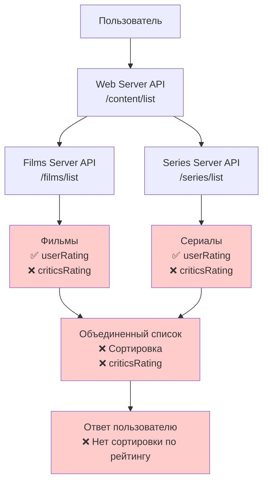
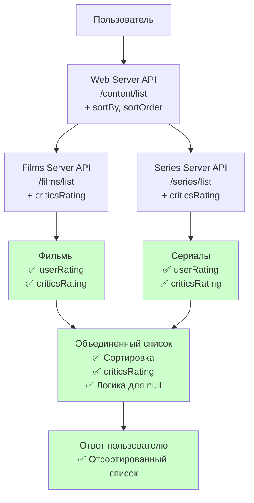
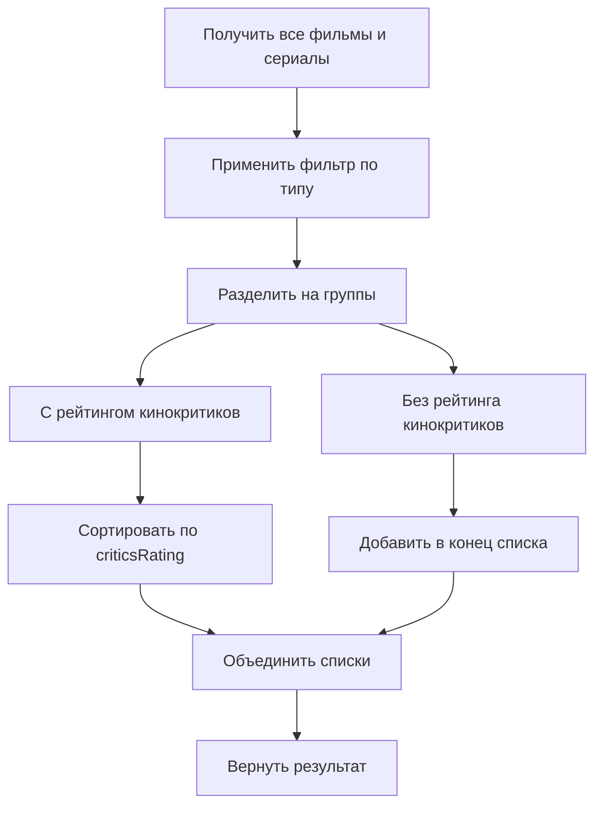

# Диаграмма текущего состояния API

## Текущее состояние API



## Необходимые изменения



## Сравнение параметров запроса

### Текущий запрос
```
GET /content/list?type=film
```

### Новый запрос
```
GET /content/list?type=film&sortBy=criticsRating&sortOrder=desc
```

## Сравнение схемы ответа

### Текущая схема
```json
{
  "id": 104,
  "type": "film",
  "title": "Ребус Атлантиды",
  "rating": 6.5,
  // ... другие поля
}
```

### Новая схема
```json
{
  "id": 104,
  "type": "film", 
  "title": "Ребус Атлантиды",
  "rating": 6.5,
  "criticsRating": 8.2,
  // ... другие поля
}
```

## Логика сортировки



## Приоритет изменений

1. **Web Server API** - Критично
   - Добавить параметры сортировки
   - Реализовать логику сортировки
   - Добавить criticsRating в ответ

2. **Films Server API** - Важно
   - Добавить criticsRating в ответ

3. **Series Server API** - Важно
   - Добавить criticsRating в ответ
