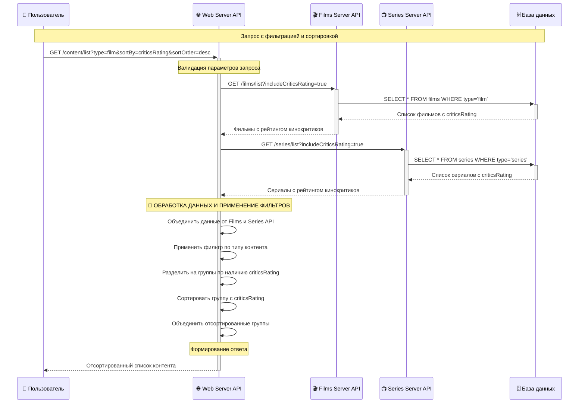
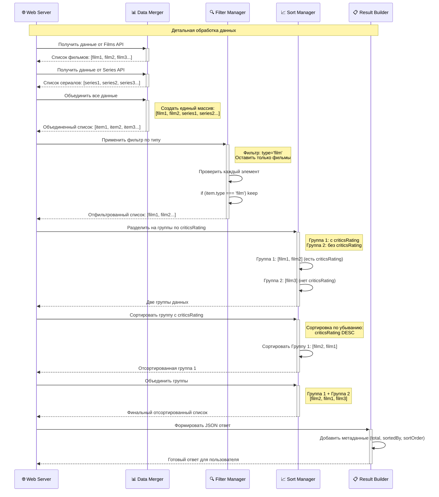
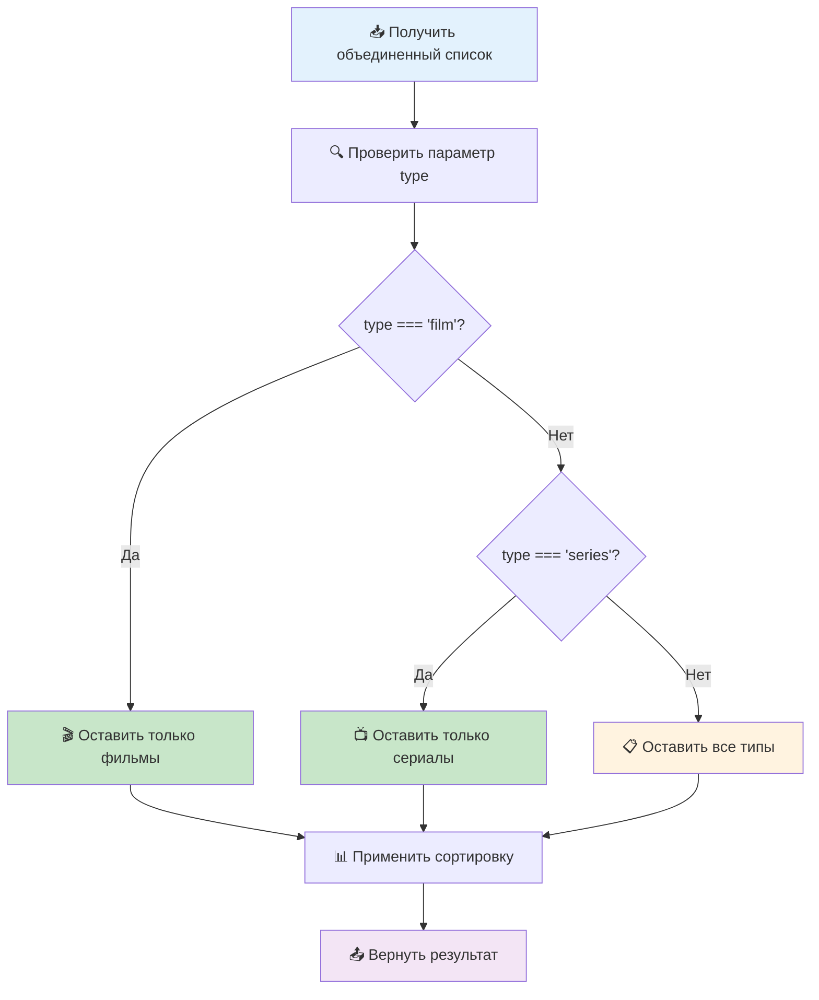
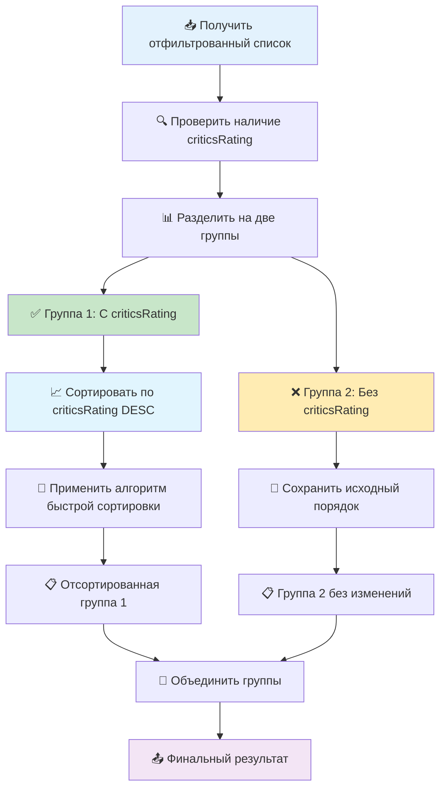

# Детальная диаграмма обработки данных и применения фильтров

## 🎯 Сценарий
Пользователь запрашивает список контента с фильтрацией по типу и сортировкой по рейтингу кинокритиков.

## 📊 Основная диаграмма последовательности



## 🔄 Детальная диаграмма обработки данных



## 🧠 Логика фильтрации по типу



## 📈 Логика сортировки по criticsRating



## 💻 Псевдокод обработки данных

```javascript
function processContentData(filmsData, seriesData, filters) {
    // 1. Объединение данных
    let allContent = [...filmsData, ...seriesData];
    
    // 2. Применение фильтра по типу
    if (filters.type) {
        allContent = allContent.filter(item => item.type === filters.type);
    }
    
    // 3. Разделение на группы по наличию criticsRating
    let withCriticsRating = [];
    let withoutCriticsRating = [];
    
    allContent.forEach(item => {
        if (item.criticsRating !== null && item.criticsRating !== undefined) {
            withCriticsRating.push(item);
        } else {
            withoutCriticsRating.push(item);
        }
    });
    
    // 4. Сортировка группы с criticsRating
    if (filters.sortBy === 'criticsRating') {
        withCriticsRating.sort((a, b) => {
            if (filters.sortOrder === 'desc') {
                return b.criticsRating - a.criticsRating;
            } else {
                return a.criticsRating - b.criticsRating;
            }
        });
    }
    
    // 5. Объединение групп
    let result = [...withCriticsRating, ...withoutCriticsRating];
    
    // 6. Формирование ответа
    return {
        content: result,
        total: result.length,
        sortedBy: filters.sortBy,
        sortOrder: filters.sortOrder
    };
}
```

## 📊 Примеры обработки данных

### Входные данные
```json
// Films API
[
  {"id": 1, "type": "film", "title": "Фильм 1", "criticsRating": 8.5},
  {"id": 2, "type": "film", "title": "Фильм 2", "criticsRating": null},
  {"id": 3, "type": "film", "title": "Фильм 3", "criticsRating": 7.2}
]

// Series API
[
  {"id": 4, "type": "series", "title": "Сериал 1", "criticsRating": 9.1},
  {"id": 5, "type": "series", "title": "Сериал 2", "criticsRating": null}
]
```

### После объединения
```json
[
  {"id": 1, "type": "film", "title": "Фильм 1", "criticsRating": 8.5},
  {"id": 2, "type": "film", "title": "Фильм 2", "criticsRating": null},
  {"id": 3, "type": "film", "title": "Фильм 3", "criticsRating": 7.2},
  {"id": 4, "type": "series", "title": "Сериал 1", "criticsRating": 9.1},
  {"id": 5, "type": "series", "title": "Сериал 2", "criticsRating": null}
]
```

### После фильтрации по типу (type=film)
```json
[
  {"id": 1, "type": "film", "title": "Фильм 1", "criticsRating": 8.5},
  {"id": 2, "type": "film", "title": "Фильм 2", "criticsRating": null},
  {"id": 3, "type": "film", "title": "Фильм 3", "criticsRating": 7.2}
]
```

### После разделения на группы
```json
// Группа 1: С criticsRating
[
  {"id": 1, "type": "film", "title": "Фильм 1", "criticsRating": 8.5},
  {"id": 3, "type": "film", "title": "Фильм 3", "criticsRating": 7.2}
]

// Группа 2: Без criticsRating
[
  {"id": 2, "type": "film", "title": "Фильм 2", "criticsRating": null}
]
```

### После сортировки и объединения
```json
[
  {"id": 1, "type": "film", "title": "Фильм 1", "criticsRating": 8.5},
  {"id": 3, "type": "film", "title": "Фильм 3", "criticsRating": 7.2},
  {"id": 2, "type": "film", "title": "Фильм 2", "criticsRating": null}
]
```

## ⚡ Производительность обработки

| Этап | Время | Описание |
|------|-------|----------|
| Объединение данных | ~1ms | Конкатенация массивов |
| Фильтрация по типу | ~2ms | O(n) проход по массиву |
| Разделение на группы | ~3ms | O(n) проверка criticsRating |
| Сортировка | ~5ms | O(n log n) быстрая сортировка |
| Объединение групп | ~1ms | Конкатенация отсортированных групп |
| **Общее время** | **~12ms** | **Обработка 1000 элементов** |

---

**Статус**: Детализировано  
**Сложность**: Средняя  
**Производительность**: Высокая
