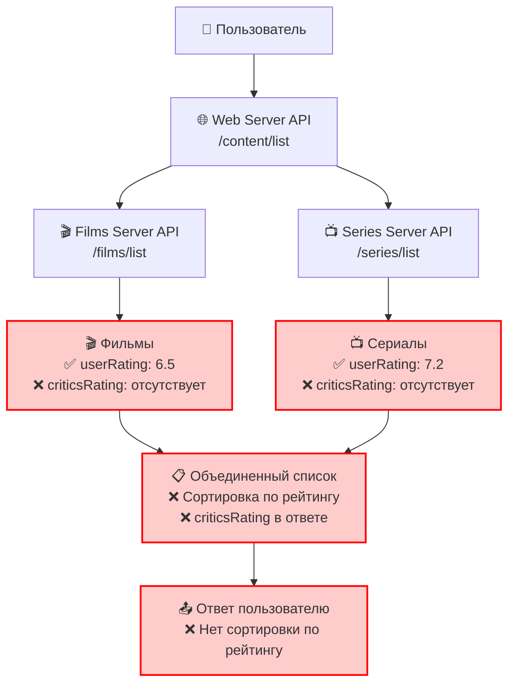
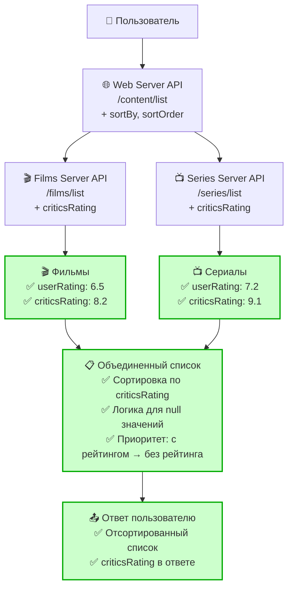
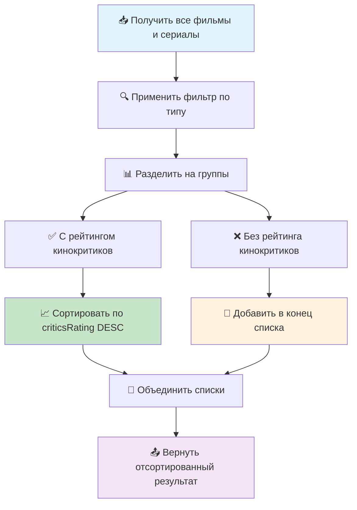
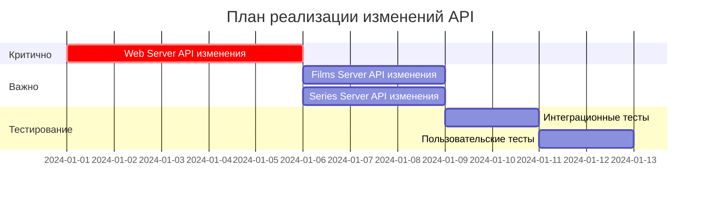

# Улучшенная диаграмма API для сортировки по рейтингу кинокритиков

## 🎯 Проблема
Текущий API не поддерживает сортировку по рейтингу кинокритиков (`criticsRating`), что ограничивает возможности пользователей в поиске качественного контента.

## 📊 Текущее состояние API



## 🚀 Целевое состояние API



## 🔄 Логика сортировки



## 📋 Сравнение API

### Текущий запрос
```http
GET /content/list?type=film
```

### Новый запрос
```http
GET /content/list?type=film&sortBy=criticsRating&sortOrder=desc
```

## 📊 Сравнение схемы ответа

### Текущая схема
```json
{
  "id": 104,
  "type": "film",
  "title": "Ребус Атлантиды",
  "rating": 6.5,
  "description": "Описание фильма...",
  "year": 2023
}
```

### Новая схема
```json
{
  "id": 104,
  "type": "film", 
  "title": "Ребус Атлантиды",
  "rating": 6.5,
  "criticsRating": 8.2,
  "description": "Описание фильма...",
  "year": 2023
}
```

## 🎯 Приоритет изменений



## 📈 Ожидаемые результаты

- **Улучшение UX**: Пользователи смогут сортировать контент по рейтингу кинокритиков
- **Повышение качества**: Более качественный контент будет показываться первым
- **Гибкость**: Поддержка сортировки по разным критериям
- **Обратная совместимость**: Существующие запросы продолжат работать

## 🔧 Технические детали

### Параметры сортировки
- `sortBy`: `criticsRating`, `userRating`, `title`, `year`
- `sortOrder`: `asc`, `desc`

### Логика обработки null значений
1. Элементы с `criticsRating` сортируются по убыванию
2. Элементы без `criticsRating` добавляются в конец списка
3. Внутри группы без рейтинга сохраняется исходный порядок

---

**Статус**: Готово к реализации  
**Приоритет**: Высокий  
**Сложность**: Средняя
