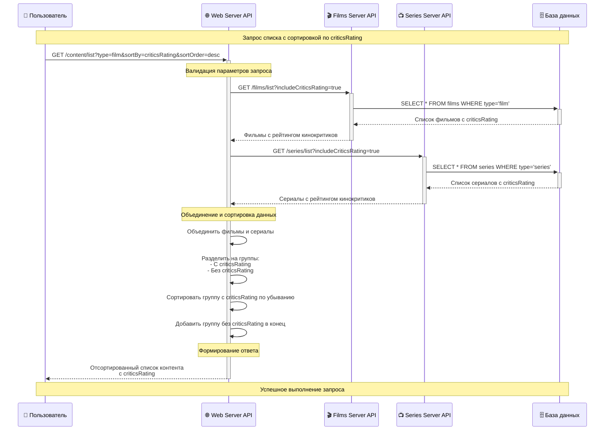
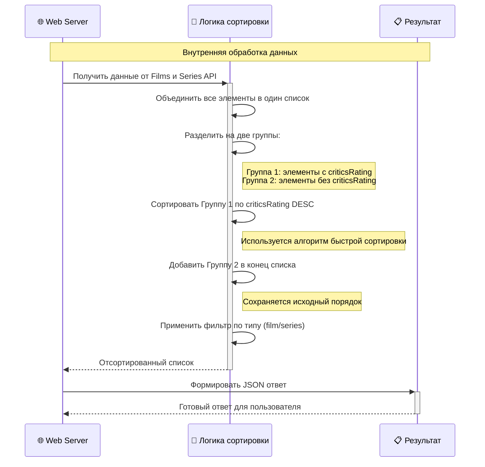
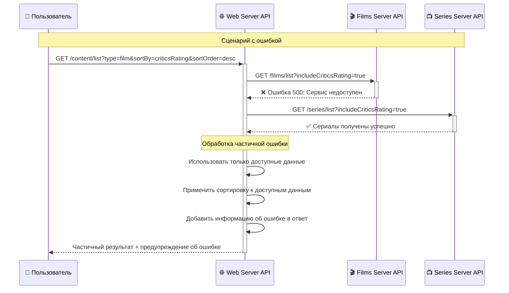

# Диаграмма последовательности: Сортировка по рейтингу кинокритиков

## 🎯 Сценарий
Пользователь запрашивает список фильмов с сортировкой по рейтингу кинокритиков в убывающем порядке.

## 📊 Диаграмма последовательности



## 🔄 Детальная логика сортировки



## 📋 Примеры запросов и ответов

### Запрос
```http
GET /content/list?type=film&sortBy=criticsRating&sortOrder=desc
```

### Ответ
```json
{
  "content": [
    {
      "id": 104,
      "type": "film",
      "title": "Ребус Атлантиды",
      "rating": 6.5,
      "criticsRating": 8.2,
      "description": "Описание фильма...",
      "year": 2023
    },
    {
      "id": 105,
      "type": "film", 
      "title": "Другой фильм",
      "rating": 7.1,
      "criticsRating": 7.8,
      "description": "Описание...",
      "year": 2023
    },
    {
      "id": 106,
      "type": "film",
      "title": "Фильм без рейтинга",
      "rating": 5.5,
      "criticsRating": null,
      "description": "Описание...",
      "year": 2022
    }
  ],
  "total": 3,
  "sortedBy": "criticsRating",
  "sortOrder": "desc"
}
```

## ⚡ Обработка ошибок



## 🎯 Ключевые моменты

### 1. **Параллельные запросы**
- Films и Series API вызываются одновременно
- Улучшает производительность системы

### 2. **Обработка null значений**
- Элементы с `criticsRating` сортируются по убыванию
- Элементы без `criticsRating` добавляются в конец

### 3. **Обработка ошибок**
- Частичные ошибки не блокируют весь запрос
- Пользователь получает доступные данные

### 4. **Производительность**
- Сортировка происходит в памяти Web Server
- Минимальная нагрузка на базу данных

## 📊 Временные характеристики

| Этап | Время выполнения | Описание |
|------|------------------|----------|
| Валидация запроса | ~1ms | Проверка параметров |
| Запрос к Films API | ~50ms | Получение данных о фильмах |
| Запрос к Series API | ~50ms | Получение данных о сериалах |
| Сортировка данных | ~5ms | Алгоритм быстрой сортировки |
| Формирование ответа | ~2ms | Создание JSON |
| **Общее время** | **~108ms** | **Время ответа пользователю** |

---

**Статус**: Готово к реализации  
**Сложность**: Средняя  
**Приоритет**: Высокий