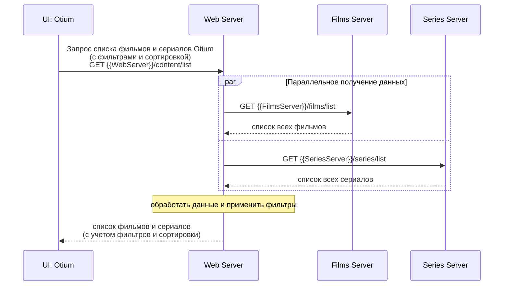

# Диаграмма последовательности: Получение списка контента с фильтрацией и сортировкой

## Описание диаграммы

Диаграмма показывает процесс получения списка фильмов и сериалов с применением фильтров и сортировки в стриминговом сервисе Otium.

## Участники взаимодействия

1. **UI: Otium** - пользовательский интерфейс
2. **Web Server** - веб-сервер, координирующий запросы
3. **Films Server** - сервис фильмов
4. **Series Server** - сервис сериалов

## Диаграмма последовательности

## Описание взаимодействий

### 1. Запрос списка контента
- **От:** UI: Otium
- **К:** Web Server
- **Операция:** `GET {{WebServer}}/content/list`
- **Параметры:** фильтры и параметры сортировки

### 2. Параллельное получение данных
- **Films Server:** `GET {{FilmsServer}}/films/list`
- **Series Server:** `GET {{SeriesServer}}/series/list`
- **Особенность:** Запросы выполняются параллельно для оптимизации производительности

### 3. Обработка данных
- **Действие:** Web Server объединяет списки фильмов и сериалов
- **Фильтрация:** Применяет фильтры по жанрам и другим критериям
- **Сортировка:** Сортирует по рейтингу кинокритиков или пользовательскому рейтингу

### 4. Возврат результата
- **От:** Web Server
- **К:** UI: Otium
- **Данные:** Отфильтрованный и отсортированный список контента

## Ключевые особенности архитектуры

### Параллельное выполнение
- Запросы к Films Server и Series Server выполняются одновременно
- Это ускоряет общее время ответа системы
- Используется оператор `par` для обозначения параллельности

### Централизованная обработка
- Web Server является единой точкой входа
- Вся бизнес-логика фильтрации и сортировки сосредоточена в Web Server
- Это упрощает поддержку и развитие системы

### Микросервисная архитектура
- Films Server и Series Server - независимые сервисы
- Каждый сервис отвечает за свою предметную область
- Легко масштабировать и развивать отдельные сервисы

## Применение к новой функциональности

### Добавление рейтинга кинокритиков
1. **Films Server** и **Series Server** должны возвращать рейтинг кинокритиков
2. **Web Server** должен обрабатывать сортировку по этому рейтингу
3. **UI** должен отображать рейтинг и предоставлять возможность сортировки

### Логика сортировки
- При сортировке по рейтингу кинокритиков
- Контент без рейтинга отображается в конце списка
- Поддерживается сортировка по возрастанию и убыванию

### Обратная совместимость
- Существующие фильтры по жанрам сохраняются
- Новые параметры сортировки добавляются к существующим
- API остается совместимым с предыдущими версиями

## Технические детали

### API Endpoints
- **Web Server:** `GET {{WebServer}}/content/list`
- **Films Server:** `GET {{FilmsServer}}/films/list`
- **Series Server:** `GET {{SeriesServer}}/series/list`

### Параметры запроса
- **Фильтры:** жанр, тип контента, год выпуска
- **Сортировка:** по рейтингу кинокритиков, по пользовательскому рейтингу
- **Направление:** по возрастанию, по убыванию
- **Пагинация:** страница, размер страницы

### Формат ответа
- JSON с массивом объектов контента
- Каждый объект содержит все необходимые поля
- Включает рейтинг кинокритиков и пользовательский рейтинг

## Преимущества архитектуры

### Производительность
- Параллельные запросы ускоряют получение данных
- Централизованная обработка оптимизирует логику

### Масштабируемость
- Микросервисы можно масштабировать независимо
- Легко добавлять новые сервисы

### Поддерживаемость
- Четкое разделение ответственности
- Централизованная бизнес-логика

---

**Создано:** [Текущая дата]
**Статус:** Диаграмма готова для использования разработчиками
