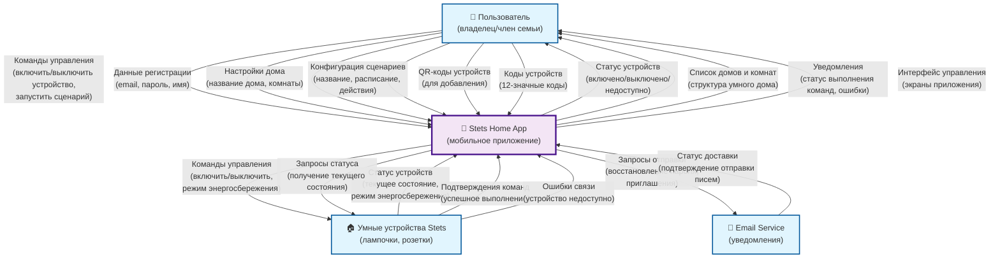

# Диаграммы потоков данных (DFD)

## Контекст

Диаграммы потоков данных описывают информационные потоки в системе Stets Home на разных уровнях абстракции. Использована нотация Гейна-Сарсона для моделирования процессов обработки данных.

## Контекстная диаграмма (Level 0)

### Визуальная диаграмма

### Описание системы
Система "Stets Home App" представляет собой мобильное приложение для управления умным домом с уникальной функцией энергосбережения устройств.

### Внешние сущности
- **Пользователь** - владелец или член семьи, управляющий умным домом
- **Умные устройства Stets** - IoT-устройства (лампочки, розетки) с поддержкой энергосбережения
- **Email Service** - внешний сервис для отправки уведомлений и восстановления паролей

### Потоки данных

#### От Пользователя к системе:
- **Команды управления** (включить/выключить устройство, запустить сценарий)
- **Данные регистрации** (email, пароль, имя пользователя)
- **Настройки дома** (название дома, комнаты, устройства)
- **Конфигурация сценариев** (название, расписание, действия)
- **QR-коды устройств** (для добавления новых устройств)
- **Коды устройств** (12-значные коды для ручного добавления)

#### От системы к Пользователю:
- **Статус устройств** (включено/выключено/недоступно)
- **Список домов и комнат** (структура умного дома)
- **Уведомления** (статус выполнения команд, ошибки)
- **Интерфейс управления** (экраны приложения)

#### От Умных устройств к системе:
- **Статус устройств** (текущее состояние, режим энергосбережения)
- **Подтверждения команд** (успешное выполнение команд)
- **Ошибки связи** (устройство недоступно)

#### От системы к Умным устройствам:
- **Команды управления** (включить/выключить, режим энергосбережения)
- **Запросы статуса** (получение текущего состояния)

#### От Email Service к системе:
- **Статус доставки** (подтверждение отправки писем)

#### От системы к Email Service:
- **Запросы отправки** (восстановление пароля, приглашения)

## Логическая диаграмма (Level 1)

### Процессы системы

#### 1. Управление аутентификацией (1.0)
**Входные потоки:**
- Данные регистрации от Пользователя
- Данные входа от Пользователя
- Запрос восстановления пароля от Пользователя

**Выходные потоки:**
- Токен авторизации к Пользователю
- Запрос отправки письма к Email Service
- Подтверждение регистрации к Пользователю

**Хранилища данных:**
- D1: Users DB (чтение/запись)

**Детальные потоки:**
- Данные регистрации → Проверка уникальности email → Создание пользователя → Автосоздание дома → Токен авторизации
- Данные входа → Проверка учетных данных → Генерация токена → Токен авторизации
- Запрос восстановления → Генерация ссылки → Запрос отправки письма

#### 2. Управление профилями домов (2.0)
**Входные потоки:**
- Настройки дома от Пользователя
- Приглашения участников от Пользователя
- Подтверждения приглашений от Пользователя

**Выходные потоки:**
- Структура домов к Пользователю
- Приглашения к Email Service
- Обновления доступа к Пользователю

**Хранилища данных:**
- D2: Homes DB (чтение/запись)
- D3: User_Homes DB (чтение/запись)

**Детальные потоки:**
- Настройки дома → Создание/обновление дома → Сохранение в Homes DB
- Приглашения → Проверка прав владельца → Отправка приглашения → Сохранение в User_Homes DB
- Подтверждения → Обновление роли → Предоставление доступа

#### 3. Управление комнатами (3.0)
**Входные потоки:**
- Данные комнат от Пользователя
- Запросы списка комнат от Пользователя

**Выходные потоки:**
- Список комнат к Пользователю
- Подтверждения операций к Пользователю

**Хранилища данных:**
- D4: Rooms DB (чтение/запись)
- D5: Icons DB (чтение)

**Детальные потоки:**
- Данные комнаты → Проверка лимита (10 комнат) → Создание комнаты → Сохранение в Rooms DB
- Запрос списка → Получение из Rooms DB → Формирование списка → Список комнат

#### 4. Управление устройствами (4.0)
**Входные потоки:**
- QR-коды от Пользователя
- Коды устройств от Пользователя
- Команды управления от Пользователя
- Статус устройств от Умных устройств Stets

**Выходные потоки:**
- Команды управления к Умным устройствам Stets
- Список устройств к Пользователю
- Подтверждения операций к Пользователю

**Хранилища данных:**
- D6: Devices DB (чтение/запись)
- D7: Device_Models DB (чтение)

**Детальные потоки:**
- QR-код/код устройства → Проверка уникальности → Проверка модели → Создание устройства → Сохранение в Devices DB
- Команды управления → Отправка к устройству → Ожидание подтверждения → Обновление статуса
- Статус устройства → Обновление в Devices DB → Уведомление пользователя

#### 5. Управление сценариями (5.0)
**Входные потоки:**
- Конфигурация сценариев от Пользователя
- Запросы запуска от Пользователя
- Триггеры расписания (внутренние)

**Выходные потоки:**
- Команды выполнения к Управлению устройствами (4.0)
- Список сценариев к Пользователю
- Статус выполнения к Пользователю

**Хранилища данных:**
- D8: Scenarios DB (чтение/запись)
- D9: Scenario_Schedules DB (чтение/запись)
- D10: Scenario_Actions DB (чтение/запись)

**Детальные потоки:**
- Конфигурация сценария → Проверка лимита (10 сценариев) → Создание сценария → Сохранение в Scenarios DB
- Запрос запуска → Получение действий → Формирование команд → Передача к Управлению устройствами
- Триггер расписания → Проверка времени → Запуск сценария → Выполнение действий

#### 6. Синхронизация с IoT (6.0)
**Входные потоки:**
- Статус устройств от Умных устройств Stets
- Ошибки связи от Умных устройств Stets

**Выходные потоки:**
- Запросы статуса к Умным устройствам Stets
- Обновления статуса к Управлению устройствами (4.0)

**Хранилища данных:**
- D6: Devices DB (чтение/запись)

**Детальные потоки:**
- Статус устройства → Обновление в Devices DB → Уведомление о изменении
- Ошибка связи → Установка статуса "недоступно" → Уведомление пользователя
- Периодические запросы → Получение статуса → Обновление данных

### Хранилища данных

#### D1: Users DB
- **Содержимое:** Данные пользователей (ID, email, пароль, имя, даты)
- **Операции:** Создание, чтение, обновление пользователей
- **Связи:** Связано с User_Homes DB через user_id

#### D2: Homes DB
- **Содержимое:** Данные домов (ID, название, дата создания)
- **Операции:** Создание, чтение, обновление домов
- **Связи:** Связано с User_Homes DB через home_id

#### D3: User_Homes DB
- **Содержимое:** Связи пользователей и домов (user_id, home_id, роль, дата добавления)
- **Операции:** Создание, чтение, обновление связей
- **Связи:** Связывает Users DB и Homes DB

#### D4: Rooms DB
- **Содержимое:** Данные комнат (ID, home_id, название, тип, иконка)
- **Операции:** Создание, чтение, обновление, удаление комнат
- **Связи:** Связано с Homes DB через home_id

#### D5: Icons DB
- **Содержимое:** Справочник иконок (ID, название, URL)
- **Операции:** Только чтение
- **Связи:** Связано с Rooms DB через icon_id

#### D6: Devices DB
- **Содержимое:** Данные устройств (ID, код, модель, дом, комната, статус, режим энергосбережения)
- **Операции:** Создание, чтение, обновление, удаление устройств
- **Связи:** Связано с Homes DB, Rooms DB, Device_Models DB

#### D7: Device_Models DB
- **Содержимое:** Справочник моделей устройств (ID, название, тип, возможности)
- **Операции:** Только чтение
- **Связи:** Связано с Devices DB через model_id

#### D8: Scenarios DB
- **Содержимое:** Данные сценариев (ID, home_id, название, даты)
- **Операции:** Создание, чтение, обновление, удаление сценариев
- **Связи:** Связано с Homes DB через home_id

#### D9: Scenario_Schedules DB
- **Содержимое:** Расписания сценариев (ID, scenario_id, дни недели, время начала/окончания)
- **Операции:** Создание, чтение, обновление расписаний
- **Связи:** Связано с Scenarios DB через scenario_id

#### D10: Scenario_Actions DB
- **Содержимое:** Действия сценариев (ID, scenario_id, device_id, тип действия, порядок)
- **Операции:** Создание, чтение, обновление, удаление действий
- **Связи:** Связано с Scenarios DB и Devices DB

## Детальные потоки данных между процессами

### Поток создания сценария:
1. **Пользователь** → Конфигурация сценария → **Управление сценариями (5.0)**
2. **Управление сценариями (5.0)** → Проверка лимита → **Scenarios DB (D8)**
3. **Управление сценариями (5.0)** → Сохранение сценария → **Scenarios DB (D8)**
4. **Управление сценариями (5.0)** → Сохранение расписания → **Scenario_Schedules DB (D9)**
5. **Управление сценариями (5.0)** → Сохранение действий → **Scenario_Actions DB (D10)**
6. **Управление сценариями (5.0)** → Подтверждение создания → **Пользователь**

### Поток выполнения сценария:
1. **Триггер расписания** → Проверка времени → **Управление сценариями (5.0)**
2. **Управление сценариями (5.0)** → Получение действий → **Scenario_Actions DB (D10)**
3. **Управление сценариями (5.0)** → Команды управления → **Управление устройствами (4.0)**
4. **Управление устройствами (4.0)** → Команды управления → **Умные устройства Stets**
5. **Умные устройства Stets** → Статус устройств → **Синхронизация с IoT (6.0)**
6. **Синхронизация с IoT (6.0)** → Обновления статуса → **Управление устройствами (4.0)**
7. **Управление устройствами (4.0)** → Статус выполнения → **Пользователь**

### Поток добавления устройства:
1. **Пользователь** → QR-код/код устройства → **Управление устройствами (4.0)**
2. **Управление устройствами (4.0)** → Проверка уникальности → **Devices DB (D6)**
3. **Управление устройствами (4.0)** → Проверка модели → **Device_Models DB (D7)**
4. **Управление устройствами (4.0)** → Создание устройства → **Devices DB (D6)**
5. **Управление устройствами (4.0)** → Подтверждение добавления → **Пользователь**

## Критические точки системы

### 1. Производительность
- **Управление устройствами (4.0)** - критический процесс, должен обрабатывать команды < 2 сек
- **Синхронизация с IoT (6.0)** - периодические запросы статуса не должны перегружать сеть

### 2. Надежность
- **Синхронизация с IoT (6.0)** - обработка ошибок связи с устройствами
- **Управление сценариями (5.0)** - надежность выполнения по расписанию

### 3. Безопасность
- **Управление аутентификацией (1.0)** - защита токенов и паролей
- **Управление профилями домов (2.0)** - контроль доступа к домам

## Рекомендации по реализации

1. **Асинхронная обработка** - команды к устройствам должны обрабатываться асинхронно
2. **Кэширование** - часто запрашиваемые данные (списки устройств, комнат) должны кэшироваться
3. **Мониторинг** - отслеживание производительности критических процессов
4. **Резервирование** - backup-механизмы для критических операций

## Связанные диаграммы

- **DFD Level 0:** [`../diagrams/01_context/dfd_level_0.mmd`](../diagrams/01_context/dfd_level_0.mmd)
- **DFD Level 1:** [`../diagrams/02_processes/dfd_level_1.mmd`](../diagrams/02_processes/dfd_level_1.mmd)
- **Системная архитектура:** [`../diagrams/05_architecture/system_architecture.mmd`](../diagrams/05_architecture/system_architecture.mmd)
