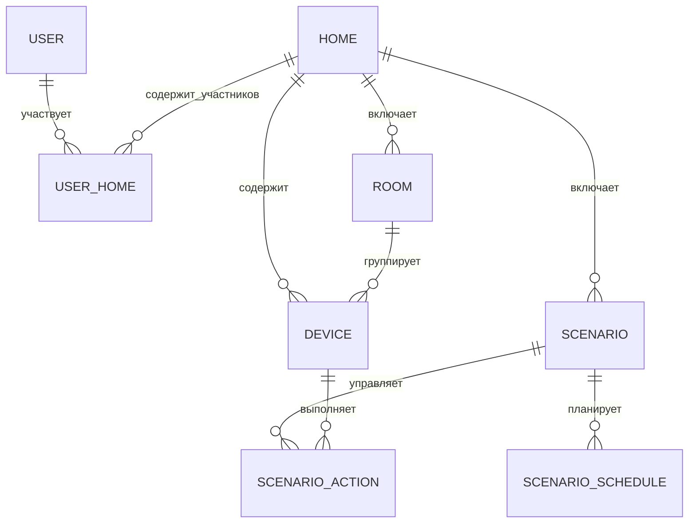

# ER-модель данных (логический уровень)

## Контекст

Логическая модель отражает состав сущностей MVP приложения Stets Home и связи между ними. Модель описана на логическом уровне (Crow’s Foot) — без перечисления физических внешних ключей, что соответствует рекомендациям ревьюера.

## Сущности и атрибуты

### USER — Пользователь
| Атрибут | Тип | Описание |
|---------|-----|----------|
| **user_id** (PK) | INT | Уникальный идентификатор пользователя |
| email | VARCHAR(255) | Уникальный email для аутентификации |
| password_hash | VARCHAR(60) | Захэшированный пароль |
| name | VARCHAR(100) | Имя пользователя |
| created_at | TIMESTAMP | Дата регистрации |
| updated_at | TIMESTAMP | Дата последнего изменения |

### HOME — Дом
| Атрибут | Тип | Описание |
|---------|-----|----------|
| **home_id** (PK) | INT | Уникальный идентификатор дома |
| name | VARCHAR(100) | Название дома («Мой дом» по умолчанию) |
| created_at | TIMESTAMP | Дата создания |

### USER_HOME — Участие пользователя в доме
Ассоциативная сущность для связи USER и HOME.

| Атрибут | Тип | Описание |
|---------|-----|----------|
| **user_home_id** (PK) | INT | Уникальный идентификатор связи |
| role | ENUM('owner','member') | Роль пользователя в доме |
| added_at | TIMESTAMP | Дата добавления пользователя |

### ROOM — Комната
| Атрибут | Тип | Описание |
|---------|-----|----------|
| **room_id** (PK) | INT | Уникальный идентификатор комнаты |
| name | VARCHAR(100) | Название комнаты |
| type | ENUM('living_room','bedroom','kitchen','bathroom','hallway','corridor','other') | Тип помещения |
| icon_code | VARCHAR(50) | Код иконки из UI-справочника |
| created_at | TIMESTAMP | Дата создания |

### DEVICE — Устройство
| Атрибут | Тип | Описание |
|---------|-----|----------|
| **device_id** (PK) | INT | Уникальный идентификатор устройства |
| device_code | CHAR(12) | Уникальный код устройства |
| model_name | VARCHAR(100) | Название модели (перенесено из удалённой сущности «Модель устройства») |
| device_type | ENUM('bulb','socket') | Тип устройства |
| capabilities | JSON | Поддерживаемые функции (энергосбережение, яркость и т.д.) |
| custom_name | VARCHAR(100) | Пользовательское название |
| status | ENUM('on','off','unavailable') | Статус устройства |
| energy_saving_mode | BOOLEAN | Признак режима энергосбережения |
| added_at | TIMESTAMP | Дата добавления |
| last_seen | TIMESTAMP | Последний контакт |

### SCENARIO — Сценарий автоматизации
| Атрибут | Тип | Описание |
|---------|-----|----------|
| **scenario_id** (PK) | INT | Уникальный идентификатор сценария |
| name | VARCHAR(30) | Название сценария |
| created_at | TIMESTAMP | Дата создания |
| updated_at | TIMESTAMP | Дата обновления |

### SCENARIO_SCHEDULE — Расписание сценария
| Атрибут | Тип | Описание |
|---------|-----|----------|
| **schedule_id** (PK) | INT | Уникальный идентификатор расписания |
| weekdays | BOOLEAN[7] | Флаги выполнения по дням недели |
| start_time | TIME | Время запуска |
| end_time | TIME | Время окончания (опционально) |

### SCENARIO_ACTION — Действие сценария
| Атрибут | Тип | Описание |
|---------|-----|----------|
| **action_id** (PK) | INT | Уникальный идентификатор действия |
| action_type | ENUM('turn_on','turn_off') | Тип действия |
| execution_order | INT | Порядок выполнения |

## Диаграмма связей (Crow’s Foot)

## Кардинальности и модальности

1. **USER ↔ HOME (M:N через USER_HOME)** — пользователь может состоять в нескольких домах, домом может управлять несколько пользователей. Минимальная модальность: 1 дом для владельца, 0 для членов (вступление по приглашению).
2. **HOME → ROOM (1:M)** — дом содержит до 10 комнат. Комната не существует без дома.
3. **HOME → DEVICE (1:M)** — каждое устройство принадлежит дому; до 100 устройств на дом.
4. **ROOM → DEVICE (1:M, опционально)** — устройство может быть связано с комнатой или остаться без привязки.
5. **HOME → SCENARIO (1:M)** — дом содержит до 10 сценариев автоматизации.
6. **SCENARIO → SCENARIO_SCHEDULE (1:0..1)** — сценарий может иметь расписание (0 — только ручной запуск).
7. **SCENARIO ↔ DEVICE (M:N через SCENARIO_ACTION)** — сценарий управляет несколькими устройствами; устройство может участвовать в разных сценариях. `execution_order` фиксирует последовательность команд.

## Соответствие замечаниям ревьюера

- Сущность «Модель устройства» удалена, критические атрибуты перенесены в `DEVICE`.
- Логическая ER-модель не содержит явных внешних ключей — связи описаны отдельно.
- Модальности и кардинальности уточнены и отражены в диаграмме.

## Бизнес-ограничения

- До 10 домов на пользователя, до 10 комнат и сценариев на дом, до 100 устройств на дом.
- Код устройства — строго 12 цифр; названия сценариев — до 30 символов.
- Комната с устройствами не может быть удалена без их переноса; сценарий не удаляется во время выполнения.

## Нормализация

- **1НФ:** атрибуты атомарны, повторяющихся групп нет.
- **2НФ:** каждый неключевой атрибут полностью зависит от своего первичного ключа.
- **3НФ:** транзитивные зависимости исключены (например, данные о модели теперь не разделяются на отдельную сущность).

## Связанные артефакты

- Обновлённый словарь данных: [`data_dictionary.md`](data_dictionary.md)
- Диаграммы DFD и описания интерфейса: разделы `../03_design` и `../05_interface`
 