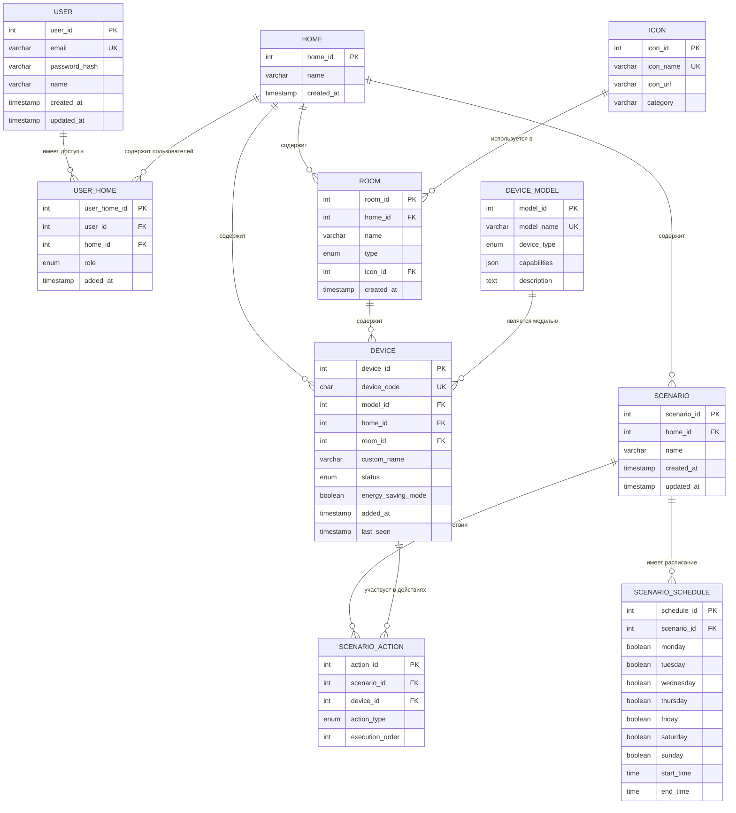

# ER-модель данных (Entity-Relationship Model)

## Контекст

Логическая модель данных для приложения Stets Home в нотации Crow's Foot. Модель нормализована до третьей нормальной формы (3НФ) и включает все сущности, необходимые для функционирования MVP.

## Основные сущности

### 1. USER (Пользователь)
**Описание:** Зарегистрированные пользователи системы
**Первичный ключ:** user_id

| Атрибут | Тип | Ограничения | Описание |
|---------|-----|-------------|----------|
| user_id | INT | PRIMARY KEY, AUTO_INCREMENT | Уникальный идентификатор пользователя |
| email | VARCHAR(255) | UNIQUE, NOT NULL | Email для входа и уведомлений |
| password_hash | VARCHAR(60) | NOT NULL | Хэш пароля (bcrypt) |
| name | VARCHAR(100) | NOT NULL | Имя пользователя |
| created_at | TIMESTAMP | NOT NULL, DEFAULT CURRENT_TIMESTAMP | Дата регистрации |
| updated_at | TIMESTAMP | NOT NULL, DEFAULT CURRENT_TIMESTAMP ON UPDATE | Дата последнего обновления |

### 2. HOME (Дом)
**Описание:** Умные дома пользователей
**Первичный ключ:** home_id

| Атрибут | Тип | Ограничения | Описание |
|---------|-----|-------------|----------|
| home_id | INT | PRIMARY KEY, AUTO_INCREMENT | Уникальный идентификатор дома |
| name | VARCHAR(100) | NOT NULL, DEFAULT 'Мой дом' | Название дома |
| created_at | TIMESTAMP | NOT NULL, DEFAULT CURRENT_TIMESTAMP | Дата создания дома |

### 3. USER_HOME (Связь пользователей и домов)
**Описание:** Связующая таблица для связи многие-ко-многим между пользователями и домами
**Первичный ключ:** user_home_id

| Атрибут | Тип | Ограничения | Описание |
|---------|-----|-------------|----------|
| user_home_id | INT | PRIMARY KEY, AUTO_INCREMENT | Уникальный идентификатор связи |
| user_id | INT | FOREIGN KEY → USER(user_id), NOT NULL | Ссылка на пользователя |
| home_id | INT | FOREIGN KEY → HOME(home_id), NOT NULL | Ссылка на дом |
| role | ENUM('owner', 'member') | NOT NULL, DEFAULT 'member' | Роль пользователя в доме |
| added_at | TIMESTAMP | NOT NULL, DEFAULT CURRENT_TIMESTAMP | Дата добавления к дому |

**Индексы:**
- UNIQUE(user_id, home_id) - один пользователь может быть в доме только один раз
- INDEX(home_id) - для быстрого поиска участников дома

### 4. ICON (Справочник иконок)
**Описание:** Предустановленные иконки для комнат
**Первичный ключ:** icon_id

| Атрибут | Тип | Ограничения | Описание |
|---------|-----|-------------|----------|
| icon_id | INT | PRIMARY KEY, AUTO_INCREMENT | Уникальный идентификатор иконки |
| icon_name | VARCHAR(50) | NOT NULL, UNIQUE | Название иконки |
| icon_url | VARCHAR(255) | NOT NULL | URL иконки |
| category | VARCHAR(30) | NOT NULL | Категория иконки (room_type, device_type) |

### 5. ROOM (Комната)
**Описание:** Комнаты в домах
**Первичный ключ:** room_id

| Атрибут | Тип | Ограничения | Описание |
|---------|-----|-------------|----------|
| room_id | INT | PRIMARY KEY, AUTO_INCREMENT | Уникальный идентификатор комнаты |
| home_id | INT | FOREIGN KEY → HOME(home_id), NOT NULL | Ссылка на дом |
| name | VARCHAR(100) | NOT NULL | Название комнаты |
| type | ENUM('living_room', 'bedroom', 'kitchen', 'bathroom', 'hallway', 'corridor', 'other') | NOT NULL, DEFAULT 'other' | Тип комнаты |
| icon_id | INT | FOREIGN KEY → ICON(icon_id), NOT NULL | Ссылка на иконку |
| created_at | TIMESTAMP | NOT NULL, DEFAULT CURRENT_TIMESTAMP | Дата создания комнаты |

**Индексы:**
- INDEX(home_id) - для быстрого поиска комнат дома
- UNIQUE(home_id, name) - уникальное название комнаты в доме

### 6. DEVICE_MODEL (Справочник моделей устройств)
**Описание:** Модели устройств Stets
**Первичный ключ:** model_id

| Атрибут | Тип | Ограничения | Описание |
|---------|-----|-------------|----------|
| model_id | INT | PRIMARY KEY, AUTO_INCREMENT | Уникальный идентификатор модели |
| model_name | VARCHAR(100) | NOT NULL, UNIQUE | Название модели |
| device_type | ENUM('bulb', 'socket') | NOT NULL | Тип устройства |
| capabilities | JSON | NOT NULL | Возможности устройства (энергосбережение, яркость, цвет) |
| description | TEXT | NULL | Описание модели |

### 7. DEVICE (Устройство)
**Описание:** Умные устройства в домах
**Первичный ключ:** device_id

| Атрибут | Тип | Ограничения | Описание |
|---------|-----|-------------|----------|
| device_id | INT | PRIMARY KEY, AUTO_INCREMENT | Уникальный идентификатор устройства |
| device_code | CHAR(12) | UNIQUE, NOT NULL | 12-значный код устройства |
| model_id | INT | FOREIGN KEY → DEVICE_MODEL(model_id), NOT NULL | Ссылка на модель |
| home_id | INT | FOREIGN KEY → HOME(home_id), NOT NULL | Ссылка на дом |
| room_id | INT | FOREIGN KEY → ROOM(room_id), NULL | Ссылка на комнату (может быть NULL) |
| custom_name | VARCHAR(100) | NULL | Пользовательское название устройства |
| status | ENUM('on', 'off', 'unavailable') | NOT NULL, DEFAULT 'off' | Статус устройства |
| energy_saving_mode | BOOLEAN | NOT NULL, DEFAULT FALSE | Режим энергосбережения |
| added_at | TIMESTAMP | NOT NULL, DEFAULT CURRENT_TIMESTAMP | Дата добавления устройства |
| last_seen | TIMESTAMP | NULL | Последний контакт с устройством |

**Индексы:**
- INDEX(home_id) - для быстрого поиска устройств дома
- INDEX(room_id) - для быстрого поиска устройств комнаты
- INDEX(status) - для фильтрации по статусу

### 8. SCENARIO (Сценарий)
**Описание:** Сценарии автоматизации
**Первичный ключ:** scenario_id

| Атрибут | Тип | Ограничения | Описание |
|---------|-----|-------------|----------|
| scenario_id | INT | PRIMARY KEY, AUTO_INCREMENT | Уникальный идентификатор сценария |
| home_id | INT | FOREIGN KEY → HOME(home_id), NOT NULL | Ссылка на дом |
| name | VARCHAR(30) | NOT NULL | Название сценария |
| created_at | TIMESTAMP | NOT NULL, DEFAULT CURRENT_TIMESTAMP | Дата создания сценария |
| updated_at | TIMESTAMP | NOT NULL, DEFAULT CURRENT_TIMESTAMP ON UPDATE | Дата последнего обновления |

**Индексы:**
- INDEX(home_id) - для быстрого поиска сценариев дома
- UNIQUE(home_id, name) - уникальное название сценария в доме

### 9. SCENARIO_SCHEDULE (Расписание сценария)
**Описание:** Расписания выполнения сценариев
**Первичный ключ:** schedule_id

| Атрибут | Тип | Ограничения | Описание |
|---------|-----|-------------|----------|
| schedule_id | INT | PRIMARY KEY, AUTO_INCREMENT | Уникальный идентификатор расписания |
| scenario_id | INT | FOREIGN KEY → SCENARIO(scenario_id), NOT NULL | Ссылка на сценарий |
| monday | BOOLEAN | NOT NULL, DEFAULT FALSE | Выполнение в понедельник |
| tuesday | BOOLEAN | NOT NULL, DEFAULT FALSE | Выполнение во вторник |
| wednesday | BOOLEAN | NOT NULL, DEFAULT FALSE | Выполнение в среду |
| thursday | BOOLEAN | NOT NULL, DEFAULT FALSE | Выполнение в четверг |
| friday | BOOLEAN | NOT NULL, DEFAULT FALSE | Выполнение в пятницу |
| saturday | BOOLEAN | NOT NULL, DEFAULT FALSE | Выполнение в субботу |
| sunday | BOOLEAN | NOT NULL, DEFAULT FALSE | Выполнение в воскресенье |
| start_time | TIME | NULL | Время начала выполнения |
| end_time | TIME | NULL | Время окончания выполнения |

**Индексы:**
- INDEX(scenario_id) - для быстрого поиска расписания сценария

### 10. SCENARIO_ACTION (Действие сценария)
**Описание:** Действия, выполняемые сценарием
**Первичный ключ:** action_id

| Атрибут | Тип | Ограничения | Описание |
|---------|-----|-------------|----------|
| action_id | INT | PRIMARY KEY, AUTO_INCREMENT | Уникальный идентификатор действия |
| scenario_id | INT | FOREIGN KEY → SCENARIO(scenario_id), NOT NULL | Ссылка на сценарий |
| device_id | INT | FOREIGN KEY → DEVICE(device_id), NOT NULL | Ссылка на устройство |
| action_type | ENUM('turn_on', 'turn_off') | NOT NULL | Тип действия |
| execution_order | INT | NOT NULL, DEFAULT 1 | Порядок выполнения действия |

**Индексы:**
- INDEX(scenario_id) - для быстрого поиска действий сценария
- INDEX(scenario_id, execution_order) - для сортировки по порядку выполнения

## Диаграмма связей (Crow's Foot Notation)

## Детальное описание связей

### 1. USER ←→ HOME (M:N через USER_HOME)
- **Тип связи:** Многие-ко-многим
- **Описание:** Пользователь может управлять несколькими домами, дом может иметь несколько пользователей
- **Ограничения:** 
  - Максимум 10 домов на пользователя
  - Один пользователь может быть владельцем или членом семьи в доме

### 2. HOME → ROOM (1:M)
- **Тип связи:** Один-ко-многим
- **Описание:** В доме может быть много комнат
- **Ограничения:** Максимум 10 комнат на дом
- **Особенности:** Комнаты опциональны (дом может существовать без комнат)

### 3. HOME → DEVICE (1:M)
- **Тип связи:** Один-ко-многим
- **Описание:** В доме может быть много устройств
- **Ограничения:** Максимум 100 устройств на дом

### 4. ROOM → DEVICE (1:M, nullable)
- **Тип связи:** Один-ко-многим (опциональная)
- **Описание:** Устройство может быть привязано к комнате или существовать без привязки
- **Особенности:** room_id может быть NULL

### 5. DEVICE_MODEL → DEVICE (1:M)
- **Тип связи:** Один-ко-многим
- **Описание:** Много устройств могут иметь одну модель
- **Особенности:** Справочная таблица для избежания дублирования

### 6. ICON → ROOM (1:M)
- **Тип связи:** Один-ко-многим
- **Описание:** Много комнат могут использовать одну иконку
- **Особенности:** Справочная таблица для переиспользования иконок

### 7. HOME → SCENARIO (1:M)
- **Тип связи:** Один-ко-многим
- **Описание:** В доме может быть много сценариев
- **Ограничения:** Максимум 10 сценариев на дом

### 8. SCENARIO → SCENARIO_SCHEDULE (1:1)
- **Тип связи:** Один-к-одному
- **Описание:** У сценария может быть одно расписание
- **Особенности:** Расписание опционально (сценарий может выполняться только вручную)

### 9. SCENARIO ←→ DEVICE (M:N через SCENARIO_ACTION)
- **Тип связи:** Многие-ко-многим
- **Описание:** Сценарий может управлять несколькими устройствами, устройство может участвовать в нескольких сценариях
- **Особенности:** execution_order определяет порядок выполнения действий

## Нормализация модели

### Первая нормальная форма (1НФ)
✅ **Соблюдена:** Все атрибуты атомарны, нет повторяющихся групп

### Вторая нормальная форма (2НФ)
✅ **Соблюдена:** Все неключевые атрибуты полностью зависят от первичного ключа

### Третья нормальная форма (3НФ)
✅ **Соблюдена:** Нет транзитивных зависимостей

**Примеры устранения транзитивных зависимостей:**
- Выделена сущность DEVICE_MODEL для избежания дублирования данных о моделях
- Выделена сущность ICON для переиспользования иконок
- Выделена сущность USER_HOME для связи многие-ко-многим с ролями

## Бизнес-правила и ограничения

### Ограничения количества
- Максимум 10 домов на пользователя
- Максимум 10 комнат на дом
- Максимум 100 устройств на дом
- Максимум 10 сценариев на дом

### Ограничения данных
- Код устройства: ровно 12 цифр
- Название сценария: 1-30 символов
- Email: валидный формат email
- Пароль: 8-16 символов, минимум 1 строчная + 1 прописная буква латиницы

### Ограничения целостности
- Устройство не может быть удалено, если участвует в активных сценариях
- Комната не может быть удалена, если содержит устройства
- Пользователь не может быть удален, если является единственным владельцем дома

## Индексы для производительности

### Первичные индексы
- Все таблицы имеют первичный ключ с AUTO_INCREMENT

### Внешние ключи
- Все внешние ключи автоматически индексируются

### Дополнительные индексы
- UNIQUE(user_id, home_id) в USER_HOME
- UNIQUE(home_id, name) в ROOM
- UNIQUE(home_id, name) в SCENARIO
- INDEX(status) в DEVICE для фильтрации по статусу
- INDEX(scenario_id, execution_order) в SCENARIO_ACTION для сортировки

## Рекомендации по реализации

### Типы данных
- Использовать TIMESTAMP для всех временных меток
- Использовать ENUM для ограниченных наборов значений
- Использовать JSON для гибких структур (capabilities в DEVICE_MODEL)

### Безопасность
- Пароли хранить только в виде хэшей (bcrypt)
- Использовать prepared statements для предотвращения SQL-инъекций
- Реализовать soft delete для критических данных

### Производительность
- Использовать connection pooling
- Реализовать кэширование часто запрашиваемых данных
- Рассмотреть партиционирование больших таблиц (DEVICE, SCENARIO_ACTION)

## Связанные диаграммы

- **Основная ER-диаграмма:** [`../diagrams/03_data_model/er_diagram.mmd`](../diagrams/03_data_model/er_diagram.mmd)
- **Детальная ER-диаграмма:** [`../diagrams/03_data_model/er_diagram_detailed.mmd`](../diagrams/03_data_model/er_diagram_detailed.mmd)
- **Словарь данных:** [`data_dictionary.md`](data_dictionary.md)
