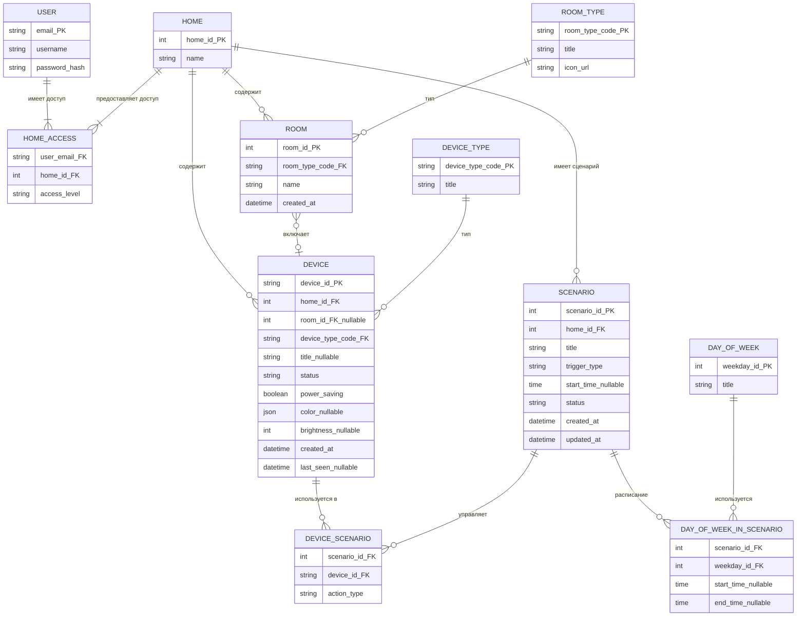

# ER-диаграмма (Mermaid)

Диаграмма повторяет актуальную версию `ER-модель, приведённая к 3НФ.drawio` и отображает те же сущности, атрибуты и ограничения кардинальности/модальности.

```mermaid
erDiagram
    USER ||--|{ HOME_ACCESS : "имеет доступ"
    HOME ||--|{ HOME_ACCESS : "предоставляет доступ"
    HOME ||--o{ ROOM : "содержит"
    HOME ||--o{ DEVICE : "содержит"
    HOME ||--o{ SCENARIO : "имеет сценарий"
    ROOM_TYPE ||--o{ ROOM : "тип"
    ROOM o{--o| DEVICE : "включает"
    DEVICE_TYPE ||--o{ DEVICE : "тип"
    DEVICE ||--o{ DEVICE_SCENARIO : "используется в"
    SCENARIO ||--o{ DEVICE_SCENARIO : "управляет"
    SCENARIO ||--o{ DAY_OF_WEEK_IN_SCENARIO : "расписание"
    DAY_OF_WEEK ||--o{ DAY_OF_WEEK_IN_SCENARIO : "используется"

    USER {
        string email_PK
        string username
        string password_hash
    }

    HOME_ACCESS {
        string user_email_FK
        int home_id_FK
        string access_level
    }

    HOME {
        int home_id_PK
        string name
    }

    ROOM {
        int room_id_PK
        string room_type_code_FK
        string name
        datetime created_at
    }

    ROOM_TYPE {
        string room_type_code_PK
        string title
        string icon_url
    }

    DEVICE {
        string device_id_PK
        int home_id_FK
        int room_id_FK_nullable
        string device_type_code_FK
        string title_nullable
        string status
        boolean power_saving
        json color_nullable
        int brightness_nullable
        datetime created_at
        datetime last_seen_nullable
    }

    DEVICE_TYPE {
        string device_type_code_PK
        string title
    }

    DEVICE_SCENARIO {
        int scenario_id_FK
        string device_id_FK
        string action_type
    }

    SCENARIO {
        int scenario_id_PK
        int home_id_FK
        string title
        string trigger_type
        time start_time_nullable
        string status
        datetime created_at
        datetime updated_at
    }

    DAY_OF_WEEK_IN_SCENARIO {
        int scenario_id_FK
        int weekday_id_FK
        time start_time_nullable
        time end_time_nullable
    }

    DAY_OF_WEEK {
        int weekday_id_PK
        string title
    }
```

