# Структура интерфейса (Interface Structure)

## Контекст

Структура интерфейса приложения Stets Home определяет навигационную архитектуру, ключевые экраны и пользовательские потоки для MVP. Документ служит основой для создания прототипа в Figma.

## Sitemap (Навигационная структура)

### Визуальная диаграмма

```mermaid
graph TD
    %% Главная структура приложения
    App["🏡 Stets Home App"]
    
    %% Splash и Onboarding
    Splash["📱 Splash Screen<br/>(Загрузочный экран)"]
    Onboarding["🎯 Onboarding Flow"]
    Welcome["👋 Welcome Screen"]
    Features["⭐ Features Overview"]
    Permissions["🔐 Permission Requests"]
    
    %% Authentication Flow
    Auth["🔑 Authentication Flow"]
    Login["📝 Login Screen"]
    Register["📋 Register Screen"]
    PasswordReset["🔒 Password Reset Screen"]
    EmailVerify["📧 Email Verification Screen"]
    
    %% Home Flow (Основной функционал)
    HomeFlow["🏠 Home Flow"]
    HomeSelection["🏘️ Home Selection Screen<br/>(если >1 дома)"]
    Dashboard["📊 Dashboard<br/>(Главный экран)"]
    RoomsOverview["🚪 Rooms Overview"]
    AllDevices["🔌 All Devices View"]
    QuickActions["⚡ Quick Actions"]
    
    %% Room Details
    RoomDetails["🚪 Room Details Screen"]
    DevicesInRoom["🔌 Devices in Room"]
    RoomControls["🎛️ Room Controls"]
    RoomSettings["⚙️ Room Settings"]
    
    %% Device Control
    DeviceControl["🔌 Device Control Screen"]
    DeviceStatus["📊 Device Status"]
    PowerToggle["🔘 Power Toggle"]
    EnergySaving["💡 Energy Saving Toggle"]
    DeviceSettings["⚙️ Device Settings"]
    
    %% Scenarios
    Scenarios["🤖 Scenarios Screen"]
    ScenarioList["📋 Scenario List"]
    CreateScenario["➕ Create Scenario Screen"]
    EditScenario["✏️ Edit Scenario Screen"]
    ScenarioDetails["📄 Scenario Details"]
    
    %% Add Device Flow
    AddDevice["➕ Add Device Flow"]
    AddDeviceScreen["📱 Add Device Screen"]
    QRScanner["📷 QR Scanner Screen"]
    ManualInput["⌨️ Manual Code Input"]
    DeviceSetup["🔧 Device Setup"]
    
    %% Settings Flow
    Settings["⚙️ Settings Flow"]
    Profile["👤 Profile Screen"]
    EditProfile["✏️ Edit Profile"]
    ChangeEmail["📧 Change Email"]
    ChangePassword["🔒 Change Password"]
    
    %% Home Settings
    HomeSettings["🏠 Home Settings Screen"]
    ManageRooms["🚪 Manage Rooms"]
    ManageMembers["👥 Manage Members"]
    HomeInfo["ℹ️ Home Information"]
    DeleteHome["🗑️ Delete Home"]
    
    %% App Settings
    AppSettings["📱 App Settings Screen"]
    Notifications["🔔 Notifications"]
    Privacy["🔒 Privacy"]
    About["ℹ️ About"]
    
    %% Error Screens
    Errors["❌ Error Screens"]
    NetworkError["🌐 Network Error"]
    DeviceUnavailable["📵 Device Unavailable"]
    GenericError["⚠️ Generic Error"]
    
    %% Связи
    App --> Splash
    Splash --> Onboarding
    Onboarding --> Welcome
    Onboarding --> Features
    Onboarding --> Permissions
    
    Splash --> Auth
    Auth --> Login
    Auth --> Register
    Auth --> PasswordReset
    Auth --> EmailVerify
    
    Login --> HomeFlow
    Register --> HomeFlow
    EmailVerify --> HomeFlow
    
    HomeFlow --> HomeSelection
    HomeFlow --> Dashboard
    Dashboard --> RoomsOverview
    Dashboard --> AllDevices
    Dashboard --> QuickActions
    
    Dashboard --> RoomDetails
    RoomDetails --> DevicesInRoom
    RoomDetails --> RoomControls
    RoomDetails --> RoomSettings
    
    Dashboard --> DeviceControl
    RoomDetails --> DeviceControl
    DeviceControl --> DeviceStatus
    DeviceControl --> PowerToggle
    DeviceControl --> EnergySaving
    DeviceControl --> DeviceSettings
    
    Dashboard --> Scenarios
    Scenarios --> ScenarioList
    Scenarios --> CreateScenario
    Scenarios --> EditScenario
    Scenarios --> ScenarioDetails
    
    Dashboard --> AddDevice
    AddDevice --> AddDeviceScreen
    AddDeviceScreen --> QRScanner
    AddDeviceScreen --> ManualInput
    QRScanner --> DeviceSetup
    ManualInput --> DeviceSetup
    
    Dashboard --> Settings
    Settings --> Profile
    Profile --> EditProfile
    Profile --> ChangeEmail
    Profile --> ChangePassword
    
    Settings --> HomeSettings
    HomeSettings --> ManageRooms
    HomeSettings --> ManageMembers
    HomeSettings --> HomeInfo
    HomeSettings --> DeleteHome
    
    Settings --> AppSettings
    AppSettings --> Notifications
    AppSettings --> Privacy
    AppSettings --> About
    
    %% Error connections
    DeviceControl --> Errors
    Dashboard --> Errors
    Errors --> NetworkError
    Errors --> DeviceUnavailable
    Errors --> GenericError
    
    %% Стили
    classDef mainApp fill:#e3f2fd,stroke:#1976d2,stroke-width:3px
    classDef auth fill:#fff3e0,stroke:#f57c00,stroke-width:2px
    classDef home fill:#e8f5e8,stroke:#388e3c,stroke-width:2px
    classDef settings fill:#fce4ec,stroke:#c2185b,stroke-width:2px
    classDef error fill:#ffebee,stroke:#d32f2f,stroke-width:2px
    
    class App mainApp
    class Splash,Onboarding,Welcome,Features,Permissions,Auth,Login,Register,PasswordReset,EmailVerify auth
    class HomeFlow,HomeSelection,Dashboard,RoomsOverview,AllDevices,QuickActions,RoomDetails,DevicesInRoom,RoomControls,RoomSettings,DeviceControl,DeviceStatus,PowerToggle,EnergySaving,DeviceSettings,Scenarios,ScenarioList,CreateScenario,EditScenario,ScenarioDetails,AddDevice,AddDeviceScreen,QRScanner,ManualInput,DeviceSetup home
    class Settings,Profile,EditProfile,ChangeEmail,ChangePassword,HomeSettings,ManageRooms,ManageMembers,HomeInfo,DeleteHome,AppSettings,Notifications,Privacy,About settings
    class Errors,NetworkError,DeviceUnavailable,GenericError error
```


### Главная структура приложения

## Детальное описание ключевых экранов

### 1. Dashboard (Главный экран)

**Назначение:** Центральный экран управления умным домом
**Навигация:** Доступен через Bottom Navigation

**Элементы интерфейса:**
- **Header:** Название дома, переключатель домов (если >1), уведомления
- **Quick Stats:** Количество устройств, активных сценариев, статус энергосбережения
- **Rooms Section:** Карточки комнат с устройствами
  - Иконка комнаты
  - Название комнаты
  - Количество устройств
  - Статус (все включены/выключены/частично)
  - Быстрые действия (включить все/выключить все)
- **All Devices Section:** Список всех устройств
  - Статус устройства (on/off/unavailable)
  - Название устройства
  - Комната (если привязано)
  - Переключатель включения/выключения
- **Scenarios Section:** Активные сценарии
  - Название сценария
  - Время следующего запуска
  - Кнопка ручного запуска
- **Floating Action Button:** Добавить устройство

**Состояния:**
- **Пустой дом:** Приветствие, кнопка "Добавить первое устройство"
- **Дом с устройствами:** Полный интерфейс
- **Нет комнат:** Устройства отображаются без группировки

### 2. Device Control Screen (Управление устройством)

**Назначение:** Детальное управление конкретным устройством
**Навигация:** Переход с Dashboard или Room Details

**Элементы интерфейса:**
- **Header:** Название устройства, комната, статус подключения
- **Device Status Card:**
  - Большой переключатель включения/выключения
  - Статус: "Включено", "Выключено", "Недоступно"
  - Время последнего обновления
- **Energy Saving Section:**
  - Переключатель режима энергосбережения
  - Индикатор экономии энергии
  - Предупреждение о замедленном отклике
- **Device Information:**
  - Модель устройства
  - Код устройства
  - Дата добавления
  - Последний контакт
- **Quick Actions:**
  - Переименовать устройство (не в MVP)
  - Переместить в другую комнату
  - Удалить устройство
- **Back Button:** Возврат к предыдущему экрану

**Состояния:**
- **Устройство доступно:** Полный функционал
- **Устройство недоступно:** Серый интерфейс, кнопка "Попробовать снова"
- **Загрузка:** Skeleton loader

### 3. Create Scenario Screen (Создание сценария)

**Назначение:** Пошаговое создание сценария автоматизации
**Навигация:** Переход с Scenarios Screen

**Элементы интерфейса (многошаговый процесс):**

**Шаг 1: Основная информация**
- Поле ввода названия сценария (максимум 30 символов)
- Счетчик символов
- Предупреждение о дублировании названий

**Шаг 2: Выбор устройств**
- Список доступных устройств
- Чекбоксы для выбора устройств
- Фильтр по комнатам
- Предварительный просмотр выбранных устройств

**Шаг 3: Настройка действий**
- Для каждого выбранного устройства:
  - Переключатель действия (включить/выключить)
  - Порядок выполнения (drag & drop)
- Предварительный просмотр последовательности

**Шаг 4: Расписание (опционально)**
- Переключатель "Ручной запуск" / "По расписанию"
- Календарь дней недели
- Время начала (Time Picker)
- Время окончания (Time Picker)
- Предварительный просмотр расписания

**Шаг 5: Подтверждение**
- Сводка сценария
- Кнопки "Создать" / "Отмена"
- Предупреждение о лимите сценариев (10 на дом)

**Навигация между шагами:**
- Кнопки "Назад" / "Далее"
- Индикатор прогресса (5 шагов)
- Возможность пропуска шага расписания

### 4. Add Device Screen (Добавление устройства)

**Назначение:** Добавление нового устройства в дом
**Навигация:** Переход с Dashboard через FAB

**Элементы интерфейса:**
- **Header:** "Добавить устройство"
- **Method Selection:**
  - Карточка "Сканировать QR-код" (основной метод)
  - Карточка "Ввести код вручную" (альтернативный метод)
- **QR Scanner Section:**
  - Камера для сканирования
  - Рамка для наведения на QR-код
  - Подсказки по использованию
  - Кнопка "Включить фонарик"
- **Manual Input Section:**
  - Поле ввода 12-значного кода
  - Валидация в реальном времени
  - Кнопка "Добавить"
- **Device Preview:**
  - Модель устройства (после сканирования/ввода)
  - Возможности устройства
  - Предупреждение о дубликатах
- **Room Assignment:**
  - Выбор комнаты (опционально)
  - Опция "Без комнаты"
- **Action Buttons:**
  - "Добавить устройство" / "Отмена"

**Состояния:**
- **Выбор метода:** Отображение карточек методов
- **Сканирование:** Активная камера с рамкой
- **Ввод кода:** Поле ввода с валидацией
- **Обработка:** Индикатор загрузки
- **Ошибка:** Сообщение об ошибке, кнопка "Попробовать снова"

### 5. Room Details Screen (Детали комнаты)

**Назначение:** Управление устройствами в конкретной комнате
**Навигация:** Переход с Dashboard через карточку комнаты

**Элементы интерфейса:**
- **Header:** Название комнаты, иконка, количество устройств
- **Room Controls:**
  - Большая кнопка "Включить все в комнате"
  - Большая кнопка "Выключить все в комнате"
  - Индикатор статуса комнаты
- **Devices List:**
  - Список устройств в комнате
  - Для каждого устройства:
    - Название устройства
    - Статус (on/off/unavailable)
    - Переключатель включения/выключения
    - Кнопка настроек устройства
- **Empty State:**
  - Иллюстрация пустой комнаты
  - Текст "В этой комнате нет устройств"
  - Кнопка "Добавить устройство"
- **Room Settings:**
  - Редактировать комнату
  - Удалить комнату
  - Статистика использования

**Состояния:**
- **Комната с устройствами:** Полный интерфейс управления
- **Пустая комната:** Empty state с призывом к действию
- **Все устройства недоступны:** Предупреждение о проблемах связи

### 6. Home Selection Screen (Выбор дома)

**Назначение:** Переключение между домами пользователя
**Навигация:** Доступен только при наличии >1 дома

**Элементы интерфейса:**
- **Header:** "Выберите дом"
- **Homes List:**
  - Карточка каждого дома:
    - Название дома
    - Количество комнат
    - Количество устройств
    - Последняя активность
    - Роль пользователя (владелец/член семьи)
- **Current Home Indicator:**
  - Выделение текущего дома
  - Метка "Текущий дом"
- **Add Home Button:**
  - Кнопка "Добавить дом" (если <10 домов)
  - Предупреждение о лимите (если 10 домов)
- **Action Buttons:**
  - "Переключиться" / "Отмена"

### 7. Profile Screen (Профиль пользователя)

**Назначение:** Управление учетной записью пользователя
**Навигация:** Переход через Bottom Navigation → Settings

**Элементы интерфейса:**
- **User Info Section:**
  - Аватар пользователя (заглушка)
  - Имя пользователя
  - Email адрес
  - Дата регистрации
- **Account Actions:**
  - "Редактировать профиль"
  - "Изменить email"
  - "Изменить пароль"
  - "Выйти из аккаунта"
- **App Information:**
  - Версия приложения
  - Ссылка на поддержку
  - Политика конфиденциальности
- **Danger Zone:**
  - "Удалить аккаунт" (красная кнопка)

## Навигационные паттерны

### 1. Bottom Navigation (Основная навигация)
**Экраны:** Dashboard, Scenarios, Settings
**Иконки:** Дом, Автоматизация, Настройки
**Состояния:** Активный экран выделен, счетчики уведомлений

### 2. Stack Navigation (Детальные экраны)
**Использование:** Переходы к детальным экранам
**Кнопка "Назад":** В header или системная
**Анимации:** Slide transition

### 3. Modal Navigation (Создание/редактирование)
**Использование:** Создание сценариев, добавление устройств
**Закрытие:** Swipe down или кнопка "Отмена"
**Анимации:** Slide up from bottom

### 4. Tab Navigation (Внутри экранов)
**Использование:** Переключение между методами добавления устройства
**Стиль:** Segmented control

## Пользовательские потоки (User Flows)

### 1. Первый запуск приложения
```
Splash Screen → Onboarding → Register → Dashboard (пустой дом)
```

### 2. Добавление первого устройства
```
Dashboard (пустой) → Add Device → QR Scanner → Device Setup → Dashboard (с устройством)
```

### 3. Создание сценария
```
Dashboard → Scenarios → Create Scenario → Step 1-5 → Scenario Created
```

### 4. Управление устройством
```
Dashboard → Device Card → Device Control → Toggle Power → Back to Dashboard
```

### 5. Добавление члена семьи
```
Dashboard → Settings → Home Settings → Manage Members → Invite Member
```

## Адаптивность и состояния

### Размеры экранов
- **Мобильные:** 375px - 414px (iPhone)
- **Планшеты:** 768px - 1024px (iPad)
- **Ориентация:** Portrait (основная), Landscape (поддержка)

### Темная тема
- Поддержка системной темы
- Переключатель в настройках
- Адаптация всех экранов

### Состояния загрузки
- **Skeleton loaders** для списков
- **Progress indicators** для длительных операций
- **Pull-to-refresh** для обновления данных

### Обработка ошибок
- **Network errors:** Кнопка "Попробовать снова"
- **Device unavailable:** Индикатор статуса, кнопка "Переподключить"
- **Validation errors:** Inline сообщения под полями

## Accessibility (Доступность)

### Поддержка скрин-ридеров
- Semantic labels для всех элементов
- ARIA attributes для динамического контента
- Logical tab order

### Контрастность
- Соответствие WCAG 2.1 AA
- Минимальный контраст 4.5:1

### Размеры касаний
- Минимум 44px для интерактивных элементов
- Достаточное расстояние между кнопками

## Рекомендации для дизайна

### Дизайн-система Stets
- Использовать готовые компоненты из дизайн-системы
- Следовать цветовой палитре бренда
- Применять типографику Stets

### Иконки
- Использовать иконки из справочника ICON
- Консистентный стиль для всех экранов
- Поддержка темной темы

### Анимации
- Плавные переходы между экранами (300ms)
- Микро-анимации для обратной связи
- Анимация загрузки для IoT-команд

### Производительность
- Lazy loading для больших списков
- Оптимизация изображений
- Минимизация количества экранов

## Связанные диаграммы

- **Sitemap:** [`../diagrams/04_interface/sitemap.mmd`](../diagrams/04_interface/sitemap.mmd)
- **User Flows:** [`../diagrams/04_interface/user_flows.mmd`](../diagrams/04_interface/user_flows.mmd)
- **User Story Map:** [`../02_analysis/user_story_map.md`](../02_analysis/user_story_map.md)
