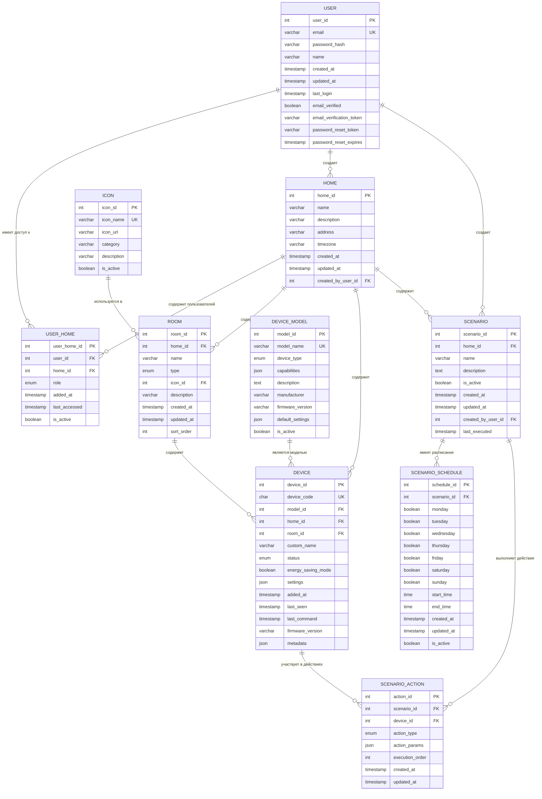

# Проект системы (модель данных) Stets Home

## 1. Общие сведения

### 1.1 Наименование системы
**Полное наименование:** Модель данных системы управления умным домом Stets Home  
**Краткое наименование:** Stets Home Data Model  
**Код проекта:** STETS-HOME-DATA-001

### 1.2 Назначение модели данных
Модель данных определяет структуру хранения информации в системе управления умным домом, включая:
- Пользователей и их права доступа к домам
- Структуру домов, комнат и устройств
- Сценарии автоматизации и их расписания
- Историю событий и метрики устройств

### 1.3 Принципы проектирования
- **Нормализация:** Приведение к 3NF для устранения избыточности
- **Масштабируемость:** Поддержка роста количества пользователей и устройств
- **Производительность:** Оптимизированные индексы для частых запросов
- **Целостность:** Обеспечение ссылочной целостности данных
- **Безопасность:** Разделение данных по домам и ролям пользователей

## 2. Концептуальная модель данных

### 2.1 Основные сущности

#### 2.1.1 Пользователи и доступ
- **USER** - пользователи системы
- **USER_HOME** - связь пользователей с домами и их роли
- **HOME** - умные дома

#### 2.1.2 Структура дома
- **ROOM** - комнаты в доме
- **ICON** - иконки для комнат
- **DEVICE** - умные устройства
- **DEVICE_MODEL** - модели устройств

#### 2.1.3 Автоматизация
- **SCENARIO** - сценарии автоматизации
- **SCENARIO_SCHEDULE** - расписание сценариев
- **SCENARIO_ACTION** - действия в сценариях

### 2.2 Связи между сущностями

```
USER ||--o{ USER_HOME : "имеет доступ к"
HOME ||--o{ USER_HOME : "содержит пользователей"
HOME ||--o{ ROOM : "содержит"
ICON ||--o{ ROOM : "используется в"
HOME ||--o{ DEVICE : "содержит"
ROOM ||--o{ DEVICE : "содержит"
DEVICE_MODEL ||--o{ DEVICE : "является моделью"
HOME ||--o{ SCENARIO : "содержит"
SCENARIO ||--o{ SCENARIO_SCHEDULE : "имеет расписание"
SCENARIO ||--o{ SCENARIO_ACTION : "выполняет действия"
DEVICE ||--o{ SCENARIO_ACTION : "участвует в действиях"
```

## 3. Логическая модель данных

### 3.1 Детальная ER-диаграмма



### 3.2 Описание сущностей

#### 3.2.1 USER (Пользователи)
**Назначение:** Хранение информации о пользователях системы

| Атрибут | Тип | Описание | Ограничения |
|---------|-----|----------|-------------|
| user_id | INT | Уникальный идентификатор пользователя | PK, AUTO_INCREMENT |
| email | VARCHAR(255) | Email адрес пользователя | UK, NOT NULL, UNIQUE |
| password_hash | VARCHAR(255) | Хэш пароля (bcrypt) | NOT NULL |
| name | VARCHAR(100) | Имя пользователя | NOT NULL |
| created_at | TIMESTAMP | Дата создания аккаунта | NOT NULL, DEFAULT NOW() |
| updated_at | TIMESTAMP | Дата последнего обновления | NOT NULL, DEFAULT NOW() |
| last_login | TIMESTAMP | Дата последнего входа | NULL |
| email_verified | BOOLEAN | Статус подтверждения email | DEFAULT FALSE |
| email_verification_token | VARCHAR(255) | Токен для подтверждения email | NULL |
| password_reset_token | VARCHAR(255) | Токен для сброса пароля | NULL |
| password_reset_expires | TIMESTAMP | Срок действия токена сброса | NULL |

**Индексы:**
- PRIMARY KEY (user_id)
- UNIQUE KEY (email)
- INDEX (email_verification_token)
- INDEX (password_reset_token)

#### 3.2.2 HOME (Дома)
**Назначение:** Хранение информации о умных домах

| Атрибут | Тип | Описание | Ограничения |
|---------|-----|----------|-------------|
| home_id | INT | Уникальный идентификатор дома | PK, AUTO_INCREMENT |
| name | VARCHAR(100) | Название дома | NOT NULL |
| description | TEXT | Описание дома | NULL |
| address | VARCHAR(255) | Адрес дома | NULL |
| timezone | VARCHAR(50) | Часовой пояс дома | DEFAULT 'UTC' |
| created_at | TIMESTAMP | Дата создания дома | NOT NULL, DEFAULT NOW() |
| updated_at | TIMESTAMP | Дата последнего обновления | NOT NULL, DEFAULT NOW() |
| created_by_user_id | INT | ID пользователя-создателя | FK, NOT NULL |

**Индексы:**
- PRIMARY KEY (home_id)
- INDEX (created_by_user_id)

#### 3.2.3 USER_HOME (Связь пользователей с домами)
**Назначение:** Определение доступа пользователей к домам и их ролей

| Атрибут | Тип | Описание | Ограничения |
|---------|-----|----------|-------------|
| user_home_id | INT | Уникальный идентификатор связи | PK, AUTO_INCREMENT |
| user_id | INT | ID пользователя | FK, NOT NULL |
| home_id | INT | ID дома | FK, NOT NULL |
| role | ENUM | Роль пользователя в доме | 'owner', 'member', 'guest' |
| added_at | TIMESTAMP | Дата добавления к дому | NOT NULL, DEFAULT NOW() |
| last_accessed | TIMESTAMP | Дата последнего доступа | NULL |
| is_active | BOOLEAN | Активность доступа | DEFAULT TRUE |

**Индексы:**
- PRIMARY KEY (user_home_id)
- UNIQUE KEY (user_id, home_id)
- INDEX (home_id)
- INDEX (role)

#### 3.2.4 ICON (Иконки)
**Назначение:** Справочник иконок для комнат

| Атрибут | Тип | Описание | Ограничения |
|---------|-----|----------|-------------|
| icon_id | INT | Уникальный идентификатор иконки | PK, AUTO_INCREMENT |
| icon_name | VARCHAR(50) | Название иконки | UK, NOT NULL, UNIQUE |
| icon_url | VARCHAR(255) | URL иконки | NOT NULL |
| category | VARCHAR(50) | Категория иконки | NOT NULL |
| description | VARCHAR(255) | Описание иконки | NULL |
| is_active | BOOLEAN | Активность иконки | DEFAULT TRUE |

**Индексы:**
- PRIMARY KEY (icon_id)
- UNIQUE KEY (icon_name)
- INDEX (category)

#### 3.2.5 ROOM (Комнаты)
**Назначение:** Хранение информации о комнатах в доме

| Атрибут | Тип | Описание | Ограничения |
|---------|-----|----------|-------------|
| room_id | INT | Уникальный идентификатор комнаты | PK, AUTO_INCREMENT |
| home_id | INT | ID дома | FK, NOT NULL |
| name | VARCHAR(100) | Название комнаты | NOT NULL |
| type | ENUM | Тип комнаты | 'bedroom', 'living_room', 'kitchen', 'bathroom', 'office', 'other' |
| icon_id | INT | ID иконки | FK, NOT NULL |
| description | TEXT | Описание комнаты | NULL |
| created_at | TIMESTAMP | Дата создания | NOT NULL, DEFAULT NOW() |
| updated_at | TIMESTAMP | Дата обновления | NOT NULL, DEFAULT NOW() |
| sort_order | INT | Порядок сортировки | DEFAULT 0 |

**Индексы:**
- PRIMARY KEY (room_id)
- INDEX (home_id)
- INDEX (type)
- INDEX (sort_order)

#### 3.2.6 DEVICE_MODEL (Модели устройств)
**Назначение:** Справочник моделей умных устройств

| Атрибут | Тип | Описание | Ограничения |
|---------|-----|----------|-------------|
| model_id | INT | Уникальный идентификатор модели | PK, AUTO_INCREMENT |
| model_name | VARCHAR(100) | Название модели | UK, NOT NULL, UNIQUE |
| device_type | ENUM | Тип устройства | 'light_bulb', 'smart_socket', 'sensor', 'switch' |
| capabilities | JSON | Возможности устройства | NOT NULL |
| description | TEXT | Описание модели | NULL |
| manufacturer | VARCHAR(100) | Производитель | NOT NULL |
| firmware_version | VARCHAR(50) | Версия прошивки | NULL |
| default_settings | JSON | Настройки по умолчанию | NULL |
| is_active | BOOLEAN | Активность модели | DEFAULT TRUE |

**Индексы:**
- PRIMARY KEY (model_id)
- UNIQUE KEY (model_name)
- INDEX (device_type)
- INDEX (manufacturer)

#### 3.2.7 DEVICE (Устройства)
**Назначение:** Хранение информации об умных устройствах

| Атрибут | Тип | Описание | Ограничения |
|---------|-----|----------|-------------|
| device_id | INT | Уникальный идентификатор устройства | PK, AUTO_INCREMENT |
| device_code | CHAR(12) | 12-значный код устройства | UK, NOT NULL, UNIQUE |
| model_id | INT | ID модели устройства | FK, NOT NULL |
| home_id | INT | ID дома | FK, NOT NULL |
| room_id | INT | ID комнаты | FK, NULL |
| custom_name | VARCHAR(100) | Пользовательское название | NULL |
| status | ENUM | Статус устройства | 'on', 'off', 'unavailable' |
| energy_saving_mode | BOOLEAN | Режим энергосбережения | DEFAULT FALSE |
| settings | JSON | Настройки устройства | NULL |
| added_at | TIMESTAMP | Дата добавления | NOT NULL, DEFAULT NOW() |
| last_seen | TIMESTAMP | Последняя активность | NULL |
| last_command | TIMESTAMP | Последняя команда | NULL |
| firmware_version | VARCHAR(50) | Версия прошивки | NULL |
| metadata | JSON | Дополнительные данные | NULL |

**Индексы:**
- PRIMARY KEY (device_id)
- UNIQUE KEY (device_code)
- INDEX (home_id)
- INDEX (room_id)
- INDEX (status)
- INDEX (last_seen)

#### 3.2.8 SCENARIO (Сценарии)
**Назначение:** Хранение сценариев автоматизации

| Атрибут | Тип | Описание | Ограничения |
|---------|-----|----------|-------------|
| scenario_id | INT | Уникальный идентификатор сценария | PK, AUTO_INCREMENT |
| home_id | INT | ID дома | FK, NOT NULL |
| name | VARCHAR(100) | Название сценария | NOT NULL |
| description | TEXT | Описание сценария | NULL |
| is_active | BOOLEAN | Активность сценария | DEFAULT TRUE |
| created_at | TIMESTAMP | Дата создания | NOT NULL, DEFAULT NOW() |
| updated_at | TIMESTAMP | Дата обновления | NOT NULL, DEFAULT NOW() |
| created_by_user_id | INT | ID создателя | FK, NOT NULL |
| last_executed | TIMESTAMP | Последнее выполнение | NULL |

**Индексы:**
- PRIMARY KEY (scenario_id)
- INDEX (home_id)
- INDEX (is_active)
- INDEX (created_by_user_id)

#### 3.2.9 SCENARIO_SCHEDULE (Расписание сценариев)
**Назначение:** Хранение расписания выполнения сценариев

| Атрибут | Тип | Описание | Ограничения |
|---------|-----|----------|-------------|
| schedule_id | INT | Уникальный идентификатор расписания | PK, AUTO_INCREMENT |
| scenario_id | INT | ID сценария | FK, NOT NULL |
| monday | BOOLEAN | Выполнение по понедельникам | DEFAULT FALSE |
| tuesday | BOOLEAN | Выполнение по вторникам | DEFAULT FALSE |
| wednesday | BOOLEAN | Выполнение по средам | DEFAULT FALSE |
| thursday | BOOLEAN | Выполнение по четвергам | DEFAULT FALSE |
| friday | BOOLEAN | Выполнение по пятницам | DEFAULT FALSE |
| saturday | BOOLEAN | Выполнение по субботам | DEFAULT FALSE |
| sunday | BOOLEAN | Выполнение по воскресеньям | DEFAULT FALSE |
| start_time | TIME | Время начала | NOT NULL |
| end_time | TIME | Время окончания | NOT NULL |
| created_at | TIMESTAMP | Дата создания | NOT NULL, DEFAULT NOW() |
| updated_at | TIMESTAMP | Дата обновления | NOT NULL, DEFAULT NOW() |
| is_active | BOOLEAN | Активность расписания | DEFAULT TRUE |

**Индексы:**
- PRIMARY KEY (schedule_id)
- INDEX (scenario_id)
- INDEX (is_active)

#### 3.2.10 SCENARIO_ACTION (Действия сценариев)
**Назначение:** Хранение действий в сценариях

| Атрибут | Тип | Описание | Ограничения |
|---------|-----|----------|-------------|
| action_id | INT | Уникальный идентификатор действия | PK, AUTO_INCREMENT |
| scenario_id | INT | ID сценария | FK, NOT NULL |
| device_id | INT | ID устройства | FK, NOT NULL |
| action_type | ENUM | Тип действия | 'turn_on', 'turn_off', 'set_brightness', 'set_color', 'set_energy_saving' |
| action_params | JSON | Параметры действия | NULL |
| execution_order | INT | Порядок выполнения | NOT NULL |
| created_at | TIMESTAMP | Дата создания | NOT NULL, DEFAULT NOW() |
| updated_at | TIMESTAMP | Дата обновления | NOT NULL, DEFAULT NOW() |

**Индексы:**
- PRIMARY KEY (action_id)
- INDEX (scenario_id)
- INDEX (device_id)
- INDEX (execution_order)

## 4. Физическая модель данных

### 4.1 Типы данных PostgreSQL

#### 4.1.1 Основные типы
- **INT** - целые числа (32-bit)
- **BIGINT** - большие целые числа (64-bit)
- **VARCHAR(n)** - строки переменной длины
- **CHAR(n)** - строки фиксированной длины
- **TEXT** - длинные текстовые поля
- **BOOLEAN** - логические значения
- **TIMESTAMP** - дата и время
- **TIME** - время
- **JSON** - JSON объекты
- **ENUM** - перечисления

#### 4.1.2 Специальные типы
- **UUID** - универсальные уникальные идентификаторы
- **INET** - IP адреса
- **MACADDR** - MAC адреса
- **TSVECTOR** - полнотекстовый поиск

### 4.2 Ограничения и правила

#### 4.2.1 Первичные ключи
```sql
ALTER TABLE users ADD CONSTRAINT pk_users PRIMARY KEY (user_id);
ALTER TABLE homes ADD CONSTRAINT pk_homes PRIMARY KEY (home_id);
ALTER TABLE user_homes ADD CONSTRAINT pk_user_homes PRIMARY KEY (user_home_id);
-- ... и так далее для всех таблиц
```

#### 4.2.2 Внешние ключи
```sql
ALTER TABLE user_homes 
ADD CONSTRAINT fk_user_homes_user 
FOREIGN KEY (user_id) REFERENCES users(user_id) 
ON DELETE CASCADE;

ALTER TABLE user_homes 
ADD CONSTRAINT fk_user_homes_home 
FOREIGN KEY (home_id) REFERENCES homes(home_id) 
ON DELETE CASCADE;

-- ... и так далее для всех связей
```

#### 4.2.3 Уникальные ограничения
```sql
ALTER TABLE users ADD CONSTRAINT uk_users_email UNIQUE (email);
ALTER TABLE devices ADD CONSTRAINT uk_devices_code UNIQUE (device_code);
ALTER TABLE user_homes ADD CONSTRAINT uk_user_homes_user_home UNIQUE (user_id, home_id);
```

#### 4.2.4 Проверочные ограничения
```sql
-- Проверка формата email
ALTER TABLE users ADD CONSTRAINT chk_users_email 
CHECK (email ~* '^[A-Za-z0-9._%+-]+@[A-Za-z0-9.-]+\.[A-Za-z]{2,}$');

-- Проверка длины пароля
ALTER TABLE users ADD CONSTRAINT chk_users_password 
CHECK (char_length(password_hash) >= 8);

-- Проверка формата кода устройства
ALTER TABLE devices ADD CONSTRAINT chk_devices_code 
CHECK (device_code ~ '^[0-9]{12}$');
```

### 4.3 Индексы для производительности

#### 4.3.1 Основные индексы
```sql
-- Индексы для частых запросов
CREATE INDEX idx_users_email ON users(email);
CREATE INDEX idx_users_last_login ON users(last_login);
CREATE INDEX idx_homes_created_by ON homes(created_by_user_id);
CREATE INDEX idx_user_homes_home_role ON user_homes(home_id, role);
CREATE INDEX idx_rooms_home_type ON rooms(home_id, type);
CREATE INDEX idx_devices_home_status ON devices(home_id, status);
CREATE INDEX idx_devices_room ON devices(room_id);
CREATE INDEX idx_scenarios_home_active ON scenarios(home_id, is_active);
CREATE INDEX idx_scenario_actions_scenario ON scenario_actions(scenario_id);
```

#### 4.3.2 Составные индексы
```sql
-- Составные индексы для сложных запросов
CREATE INDEX idx_user_homes_user_active ON user_homes(user_id, is_active);
CREATE INDEX idx_devices_home_room ON devices(home_id, room_id);
CREATE INDEX idx_scenario_schedule_active ON scenario_schedules(scenario_id, is_active);
CREATE INDEX idx_scenario_actions_order ON scenario_actions(scenario_id, execution_order);
```

#### 4.3.3 Частичные индексы
```sql
-- Индексы только для активных записей
CREATE INDEX idx_active_scenarios ON scenarios(home_id) WHERE is_active = true;
CREATE INDEX idx_active_devices ON devices(home_id) WHERE status != 'unavailable';
CREATE INDEX idx_active_user_homes ON user_homes(user_id) WHERE is_active = true;
```

### 4.4 Триггеры и функции

#### 4.4.1 Автоматическое обновление timestamps
```sql
-- Функция для обновления updated_at
CREATE OR REPLACE FUNCTION update_updated_at_column()
RETURNS TRIGGER AS $$
BEGIN
    NEW.updated_at = NOW();
    RETURN NEW;
END;
$$ language 'plpgsql';

-- Триггеры для всех таблиц с updated_at
CREATE TRIGGER update_users_updated_at 
    BEFORE UPDATE ON users 
    FOR EACH ROW EXECUTE FUNCTION update_updated_at_column();

CREATE TRIGGER update_homes_updated_at 
    BEFORE UPDATE ON homes 
    FOR EACH ROW EXECUTE FUNCTION update_updated_at_column();

-- ... и так далее для всех таблиц
```

#### 4.4.2 Валидация данных
```sql
-- Функция проверки уникальности кода устройства
CREATE OR REPLACE FUNCTION check_device_code_unique()
RETURNS TRIGGER AS $$
BEGIN
    IF EXISTS (SELECT 1 FROM devices WHERE device_code = NEW.device_code AND device_id != NEW.device_id) THEN
        RAISE EXCEPTION 'Device code % already exists', NEW.device_code;
    END IF;
    RETURN NEW;
END;
$$ language 'plpgsql';

CREATE TRIGGER check_device_code_unique_trigger
    BEFORE INSERT OR UPDATE ON devices
    FOR EACH ROW EXECUTE FUNCTION check_device_code_unique();
```

## 5. Оптимизация производительности

### 5.1 Стратегии индексирования

#### 5.1.1 Индексы для поиска
- **Поиск пользователей по email:** B-tree индекс на email
- **Поиск устройств по коду:** B-tree индекс на device_code
- **Поиск комнат по дому:** B-tree индекс на home_id
- **Поиск сценариев по дому:** B-tree индекс на home_id

#### 5.1.2 Индексы для сортировки
- **Сортировка комнат:** Индекс на sort_order
- **Сортировка действий сценария:** Индекс на execution_order
- **Сортировка по времени:** Индексы на created_at, updated_at

#### 5.1.3 Индексы для соединений
- **Соединение пользователей с домами:** Составной индекс на (user_id, home_id)
- **Соединение устройств с комнатами:** Индекс на room_id
- **Соединение сценариев с действиями:** Индекс на scenario_id

### 5.2 Партиционирование

#### 5.2.1 Партиционирование по времени
```sql
-- Партиционирование таблицы событий по месяцам
CREATE TABLE device_events (
    event_id BIGSERIAL,
    device_id INT,
    event_type VARCHAR(50),
    event_data JSON,
    created_at TIMESTAMP
) PARTITION BY RANGE (created_at);

-- Создание партиций
CREATE TABLE device_events_2024_01 PARTITION OF device_events
    FOR VALUES FROM ('2024-01-01') TO ('2024-02-01');

CREATE TABLE device_events_2024_02 PARTITION OF device_events
    FOR VALUES FROM ('2024-02-01') TO ('2024-03-01');
```

#### 5.2.2 Партиционирование по домам
```sql
-- Партиционирование метрик устройств по домам
CREATE TABLE device_metrics (
    metric_id BIGSERIAL,
    device_id INT,
    home_id INT,
    metric_type VARCHAR(50),
    metric_value DECIMAL,
    created_at TIMESTAMP
) PARTITION BY HASH (home_id);

-- Создание партиций
CREATE TABLE device_metrics_0 PARTITION OF device_metrics
    FOR VALUES WITH (modulus 4, remainder 0);
```

### 5.3 Кэширование

#### 5.3.1 Материализованные представления
```sql
-- Представление для быстрого доступа к информации о домах пользователя
CREATE MATERIALIZED VIEW user_homes_summary AS
SELECT 
    u.user_id,
    u.email,
    u.name,
    h.home_id,
    h.name as home_name,
    uh.role,
    uh.added_at,
    COUNT(d.device_id) as device_count,
    COUNT(r.room_id) as room_count
FROM users u
JOIN user_homes uh ON u.user_id = uh.user_id
JOIN homes h ON uh.home_id = h.home_id
LEFT JOIN devices d ON h.home_id = d.home_id
LEFT JOIN rooms r ON h.home_id = r.home_id
WHERE uh.is_active = true
GROUP BY u.user_id, u.email, u.name, h.home_id, h.name, uh.role, uh.added_at;

-- Индекс для быстрого поиска
CREATE UNIQUE INDEX idx_user_homes_summary_user_home 
ON user_homes_summary(user_id, home_id);

-- Обновление представления
CREATE OR REPLACE FUNCTION refresh_user_homes_summary()
RETURNS void AS $$
BEGIN
    REFRESH MATERIALIZED VIEW CONCURRENTLY user_homes_summary;
END;
$$ LANGUAGE plpgsql;
```

#### 5.3.2 Redis кэширование
```sql
-- Функция для кэширования часто запрашиваемых данных
CREATE OR REPLACE FUNCTION get_user_homes_cached(user_id_param INT)
RETURNS TABLE(home_id INT, home_name VARCHAR, role VARCHAR) AS $$
BEGIN
    -- Проверка кэша в Redis (через расширение redis_fdw)
    -- Если нет в кэше, запрос к БД и сохранение в кэш
    RETURN QUERY
    SELECT h.home_id, h.name, uh.role
    FROM homes h
    JOIN user_homes uh ON h.home_id = uh.home_id
    WHERE uh.user_id = user_id_param AND uh.is_active = true;
END;
$$ LANGUAGE plpgsql;
```

## 6. Безопасность данных

### 6.1 Шифрование

#### 6.1.1 Шифрование паролей
```sql
-- Функция для хэширования паролей
CREATE OR REPLACE FUNCTION hash_password(password TEXT)
RETURNS TEXT AS $$
BEGIN
    -- Использование bcrypt для хэширования
    RETURN crypt(password, gen_salt('bf', 12));
END;
$$ LANGUAGE plpgsql;

-- Функция для проверки пароля
CREATE OR REPLACE FUNCTION verify_password(password TEXT, hash TEXT)
RETURNS BOOLEAN AS $$
BEGIN
    RETURN hash = crypt(password, hash);
END;
$$ LANGUAGE plpgsql;
```

#### 6.1.2 Шифрование чувствительных данных
```sql
-- Расширение для шифрования
CREATE EXTENSION IF NOT EXISTS pgcrypto;

-- Функция для шифрования данных
CREATE OR REPLACE FUNCTION encrypt_sensitive_data(data TEXT, key TEXT)
RETURNS TEXT AS $$
BEGIN
    RETURN encode(encrypt(data::bytea, key::bytea, 'aes'), 'base64');
END;
$$ LANGUAGE plpgsql;

-- Функция для расшифровки данных
CREATE OR REPLACE FUNCTION decrypt_sensitive_data(encrypted_data TEXT, key TEXT)
RETURNS TEXT AS $$
BEGIN
    RETURN convert_from(decrypt(decode(encrypted_data, 'base64'), key::bytea, 'aes'), 'UTF8');
END;
$$ LANGUAGE plpgsql;
```

### 6.2 Row Level Security (RLS)

#### 6.2.1 Политики безопасности
```sql
-- Включение RLS для таблицы homes
ALTER TABLE homes ENABLE ROW LEVEL SECURITY;

-- Политика: пользователи могут видеть только свои дома
CREATE POLICY homes_user_policy ON homes
    FOR ALL TO authenticated_users
    USING (home_id IN (
        SELECT home_id FROM user_homes 
        WHERE user_id = current_user_id() AND is_active = true
    ));

-- Политика для устройств
ALTER TABLE devices ENABLE ROW LEVEL SECURITY;

CREATE POLICY devices_user_policy ON devices
    FOR ALL TO authenticated_users
    USING (home_id IN (
        SELECT home_id FROM user_homes 
        WHERE user_id = current_user_id() AND is_active = true
    ));
```

#### 6.2.2 Функция получения текущего пользователя
```sql
-- Функция для получения ID текущего пользователя
CREATE OR REPLACE FUNCTION current_user_id()
RETURNS INT AS $$
BEGIN
    -- Получение из JWT токена или сессии
    RETURN current_setting('app.current_user_id')::INT;
END;
$$ LANGUAGE plpgsql;
```

## 7. Резервное копирование и восстановление

### 7.1 Стратегия резервного копирования

#### 7.1.1 Полное резервное копирование
```bash
# Ежедневное полное резервное копирование
pg_dump -h localhost -U postgres -d stets_home \
    --format=custom \
    --compress=9 \
    --file=backup_$(date +%Y%m%d).dump
```

#### 7.1.2 Инкрементальное резервное копирование
```bash
# Инкрементальное резервное копирование с WAL
pg_basebackup -h localhost -U postgres \
    -D /backup/base_backup_$(date +%Y%m%d) \
    -Ft -z -P
```

### 7.2 Восстановление данных

#### 7.2.1 Восстановление из полного бэкапа
```bash
# Восстановление базы данных
pg_restore -h localhost -U postgres -d stets_home_new \
    --clean --if-exists \
    backup_20240115.dump
```

#### 7.2.2 Point-in-Time Recovery
```bash
# Восстановление на определенный момент времени
pg_recovery_target_time = '2024-01-15 14:30:00'
```

## 8. Мониторинг и оптимизация

### 8.1 Мониторинг производительности

#### 8.1.1 Статистика запросов
```sql
-- Включение статистики запросов
ALTER SYSTEM SET track_activities = on;
ALTER SYSTEM SET track_counts = on;
ALTER SYSTEM SET track_io_timing = on;
ALTER SYSTEM SET track_functions = all;

-- Просмотр медленных запросов
SELECT query, mean_time, calls, total_time
FROM pg_stat_statements
ORDER BY mean_time DESC
LIMIT 10;
```

#### 8.1.2 Мониторинг индексов
```sql
-- Статистика использования индексов
SELECT 
    schemaname,
    tablename,
    indexname,
    idx_scan,
    idx_tup_read,
    idx_tup_fetch
FROM pg_stat_user_indexes
ORDER BY idx_scan DESC;
```

### 8.2 Оптимизация запросов

#### 8.2.1 Анализ планов выполнения
```sql
-- Анализ плана выполнения запроса
EXPLAIN (ANALYZE, BUFFERS) 
SELECT h.name, COUNT(d.device_id) as device_count
FROM homes h
LEFT JOIN devices d ON h.home_id = d.home_id
GROUP BY h.home_id, h.name;
```

#### 8.2.2 Оптимизация соединений
```sql
-- Использование правильных индексов для соединений
CREATE INDEX CONCURRENTLY idx_devices_home_status_room 
ON devices(home_id, status, room_id) 
WHERE status != 'unavailable';
```

## 9. Заключение

### 9.1 Ключевые особенности модели данных

#### 9.1.1 Нормализация
- **3NF:** Устранение избыточности данных
- **Ссылочная целостность:** Обеспечение корректности связей
- **Гибкость:** Возможность расширения без изменения структуры

#### 9.1.2 Производительность
- **Оптимизированные индексы:** Для частых запросов
- **Партиционирование:** Для больших объемов данных
- **Кэширование:** Материализованные представления и Redis

#### 9.1.3 Безопасность
- **Шифрование:** Чувствительных данных
- **RLS:** Разделение данных по пользователям
- **Аудит:** Логирование изменений

### 9.2 Масштабируемость

#### 9.2.1 Горизонтальное масштабирование
- **Шардирование:** По домам для распределения нагрузки
- **Репликация:** Read replicas для запросов
- **Кэширование:** Redis Cluster для сессий

#### 9.2.2 Вертикальное масштабирование
- **Оптимизация запросов:** Индексы и материализованные представления
- **Партиционирование:** По времени и домам
- **Архивирование:** Старых данных

### 9.3 Следующие шаги

1. **Реализация схемы** в PostgreSQL
2. **Создание индексов** и ограничений
3. **Настройка мониторинга** производительности
4. **Тестирование** на реальных данных
5. **Оптимизация** на основе метрик

---

**Дата создания:** [Текущая дата]  
**Версия:** 1.0  
**Статус:** Утвержден
