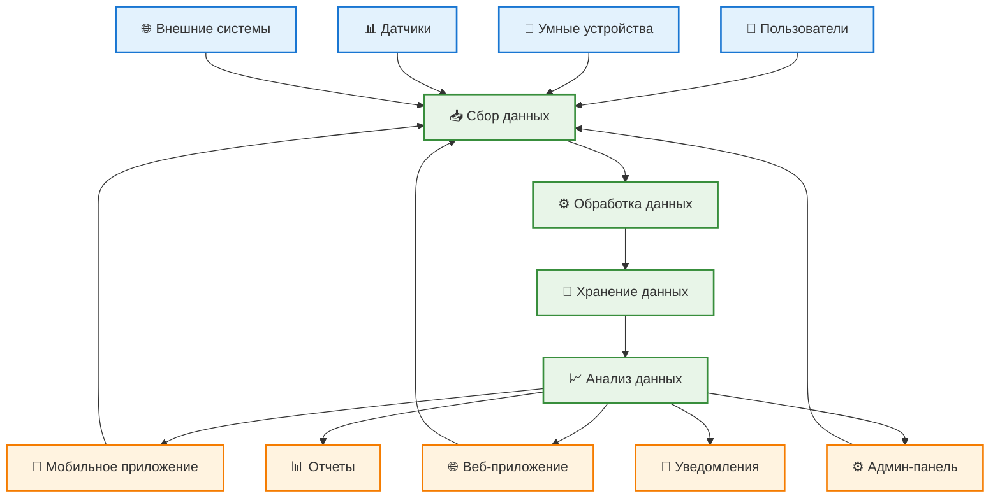

# Проект системы (информационное обеспечение) Stets Home

## 1. Общие сведения

### 1.1 Наименование системы
**Полное наименование:** Информационное обеспечение системы управления умным домом Stets Home  
**Краткое наименование:** Stets Home Information System  
**Код проекта:** STETS-HOME-INFO-001

### 1.2 Назначение информационного обеспечения
Информационное обеспечение определяет структуру данных, информационные потоки, процедуры обработки информации и системы поддержки принятия решений для управления умным домом, включая:
- Структуру информационных ресурсов
- Процедуры сбора, обработки и хранения данных
- Системы аналитики и отчетности
- Информационную безопасность
- Управление знаниями и документацией

### 1.3 Принципы информационного обеспечения
- **Целостность данных:** Обеспечение непротиворечивости информации
- **Доступность:** Обеспечение доступа к информации в нужное время
- **Конфиденциальность:** Защита чувствительной информации
- **Актуальность:** Поддержание актуальности данных
- **Масштабируемость:** Возможность роста объемов данных

## 2. Структура информационных ресурсов

### 2.1 Классификация информации

#### 2.1.1 По типам данных
**Структурированные данные:**
- Пользовательские данные (профили, настройки)
- Данные устройств (статус, конфигурация)
- Сценарии автоматизации
- Расписания и события
- Метрики и статистика

**Полуструктурированные данные:**
- Логи системы
- Конфигурационные файлы
- Шаблоны уведомлений
- Метаданные устройств

**Неструктурированные данные:**
- Документация пользователей
- Изображения и иконки
- Видео и аудио файлы
- Текстовые описания

#### 2.1.2 По уровням доступа
**Публичная информация:**
- Общая информация о продукте
- Документация для пользователей
- Публичные API

**Внутренняя информация:**
- Данные пользователей
- Конфигурация системы
- Операционные данные

**Конфиденциальная информация:**
- Пароли и токены
- Персональные данные
- Финансовая информация

**Секретная информация:**
- Ключи шифрования
- Внутренние алгоритмы
- Данные безопасности

### 2.2 Информационные объекты

#### 2.2.1 Основные информационные объекты

**Пользователь (User)**
```json
{
  "id": "integer",
  "email": "string",
  "name": "string",
  "password_hash": "string",
  "email_verified": "boolean",
  "created_at": "timestamp",
  "updated_at": "timestamp",
  "last_login": "timestamp",
  "preferences": {
    "notifications": {
      "email": "boolean",
      "push": "boolean",
      "sms": "boolean"
    },
    "language": "string",
    "timezone": "string",
    "theme": "string"
  },
  "security": {
    "two_factor_enabled": "boolean",
    "password_reset_token": "string",
    "password_reset_expires": "timestamp"
  }
}
```

**Дом (Home)**
```json
{
  "id": "integer",
  "name": "string",
  "description": "string",
  "address": "string",
  "timezone": "string",
  "created_at": "timestamp",
  "updated_at": "timestamp",
  "created_by_user_id": "integer",
  "settings": {
    "auto_discovery": "boolean",
    "energy_saving_mode": "boolean",
    "notification_settings": "object"
  },
  "members": [
    {
      "user_id": "integer",
      "role": "string",
      "added_at": "timestamp",
      "permissions": "object"
    }
  ]
}
```

**Устройство (Device)**
```json
{
  "id": "integer",
  "device_code": "string",
  "model_id": "integer",
  "home_id": "integer",
  "room_id": "integer",
  "custom_name": "string",
  "status": "enum",
  "energy_saving_mode": "boolean",
  "settings": "object",
  "added_at": "timestamp",
  "last_seen": "timestamp",
  "last_command": "timestamp",
  "firmware_version": "string",
  "capabilities": "array",
  "metadata": "object"
}
```

**Сценарий (Scenario)**
```json
{
  "id": "integer",
  "home_id": "integer",
  "name": "string",
  "description": "string",
  "is_active": "boolean",
  "created_at": "timestamp",
  "updated_at": "timestamp",
  "created_by_user_id": "integer",
  "last_executed": "timestamp",
  "schedule": {
    "monday": "boolean",
    "tuesday": "boolean",
    "wednesday": "boolean",
    "thursday": "boolean",
    "friday": "boolean",
    "saturday": "boolean",
    "sunday": "boolean",
    "start_time": "time",
    "end_time": "time"
  },
  "actions": [
    {
      "device_id": "integer",
      "action_type": "enum",
      "action_params": "object",
      "execution_order": "integer"
    }
  ]
}
```

#### 2.2.2 Вспомогательные информационные объекты

**Модель устройства (Device Model)**
```json
{
  "id": "integer",
  "model_name": "string",
  "device_type": "enum",
  "manufacturer": "string",
  "capabilities": "array",
  "description": "string",
  "firmware_version": "string",
  "default_settings": "object",
  "is_active": "boolean"
}
```

**Комната (Room)**
```json
{
  "id": "integer",
  "home_id": "integer",
  "name": "string",
  "type": "enum",
  "icon_id": "integer",
  "description": "string",
  "created_at": "timestamp",
  "updated_at": "timestamp",
  "sort_order": "integer"
}
```

**Событие (Event)**
```json
{
  "id": "integer",
  "home_id": "integer",
  "device_id": "integer",
  "event_type": "enum",
  "event_data": "object",
  "timestamp": "timestamp",
  "severity": "enum",
  "processed": "boolean"
}
```

## 3. Информационные потоки

### 3.1 Схема информационных потоков



### 3.2 Детальные информационные потоки

#### 3.2.1 Поток данных от устройств
```
Устройство → MQTT Broker → Device Gateway → Device Service → Database
                ↓
            Event Processing → Notification Service → Users
                ↓
            Analytics Service → Reports & Dashboards
```

**Описание потока:**
1. **Устройство** отправляет данные о статусе через MQTT
2. **MQTT Broker** получает и маршрутизирует сообщения
3. **Device Gateway** обрабатывает протокол и форматирует данные
4. **Device Service** обновляет статус в базе данных
5. **Event Processing** анализирует события и триггеры
6. **Notification Service** отправляет уведомления пользователям
7. **Analytics Service** обрабатывает данные для аналитики

#### 3.2.2 Поток команд к устройствам
```
User → Mobile App → API Gateway → Device Service → MQTT Broker → Device
                ↓
            Database Update → Status Sync → User Notification
```

**Описание потока:**
1. **Пользователь** отправляет команду через мобильное приложение
2. **API Gateway** аутентифицирует и маршрутизирует запрос
3. **Device Service** обрабатывает команду и отправляет через MQTT
4. **Устройство** получает команду и выполняет действие
5. **Database Update** обновляет статус в базе данных
6. **Status Sync** синхронизирует статус с клиентами
7. **User Notification** уведомляет пользователя о результате

#### 3.2.3 Поток аналитических данных
```
Raw Data → Data Processing → Data Warehouse → Analytics Engine → Reports
                ↓
            Real-time Processing → Dashboards → Alerts
```

**Описание потока:**
1. **Raw Data** собирается из различных источников
2. **Data Processing** очищает и структурирует данные
3. **Data Warehouse** хранит исторические данные
4. **Analytics Engine** выполняет аналитические вычисления
5. **Reports** генерирует отчеты для пользователей
6. **Real-time Processing** обрабатывает данные в реальном времени
7. **Dashboards** отображает актуальную информацию
8. **Alerts** отправляет уведомления о важных событиях

## 4. Процедуры обработки информации

### 4.1 Сбор данных

#### 4.1.1 Автоматический сбор данных
**Источники данных:**
- Умные устройства (статус, метрики)
- Датчики (температура, влажность, освещение)
- Пользовательские действия (логи взаимодействия)
- Системные события (ошибки, предупреждения)

**Процедуры сбора:**
```typescript
// Сбор данных с устройств
export class DataCollectionService {
  async collectDeviceData(deviceId: number): Promise<DeviceData> {
    const device = await this.deviceService.getDevice(deviceId);
    const metrics = await this.mqttService.getDeviceMetrics(device.deviceCode);
    
    return {
      deviceId: device.id,
      timestamp: new Date(),
      status: metrics.status,
      energyConsumption: metrics.energy,
      temperature: metrics.temperature,
      brightness: metrics.brightness,
      color: metrics.color
    };
  }
  
  async collectUserActivity(userId: number): Promise<UserActivity> {
    const activities = await this.activityService.getRecentActivities(userId);
    
    return {
      userId,
      timestamp: new Date(),
      actions: activities.map(activity => ({
        action: activity.action,
        target: activity.target,
        timestamp: activity.timestamp
      }))
    };
  }
}
```

#### 4.1.2 Ручной ввод данных
**Типы ручного ввода:**
- Настройки пользователя
- Конфигурация устройств
- Создание сценариев
- Управление комнатами

**Процедуры валидации:**
```typescript
export class DataValidationService {
  validateUserInput(input: UserInput): ValidationResult {
    const errors: string[] = [];
    
    // Валидация email
    if (input.email && !this.isValidEmail(input.email)) {
      errors.push('Invalid email format');
    }
    
    // Валидация пароля
    if (input.password && !this.isValidPassword(input.password)) {
      errors.push('Password must be 8-16 characters with at least one uppercase and lowercase letter');
    }
    
    // Валидация имени
    if (input.name && (input.name.length < 2 || input.name.length > 50)) {
      errors.push('Name must be between 2 and 50 characters');
    }
    
    return {
      isValid: errors.length === 0,
      errors
    };
  }
  
  validateDeviceCode(deviceCode: string): boolean {
    return /^[0-9]{12}$/.test(deviceCode);
  }
}
```

### 4.2 Обработка данных

#### 4.2.1 Очистка и нормализация данных
```typescript
export class DataProcessingService {
  async cleanDeviceData(rawData: RawDeviceData): Promise<CleanDeviceData> {
    return {
      deviceId: rawData.deviceId,
      timestamp: this.normalizeTimestamp(rawData.timestamp),
      status: this.normalizeStatus(rawData.status),
      metrics: {
        energy: this.normalizeEnergy(rawData.energy),
        temperature: this.normalizeTemperature(rawData.temperature),
        brightness: this.normalizeBrightness(rawData.brightness)
      },
      quality: this.calculateDataQuality(rawData)
    };
  }
  
  private normalizeTimestamp(timestamp: any): Date {
    if (timestamp instanceof Date) return timestamp;
    if (typeof timestamp === 'string') return new Date(timestamp);
    if (typeof timestamp === 'number') return new Date(timestamp);
    return new Date();
  }
  
  private normalizeStatus(status: any): DeviceStatus {
    const statusMap = {
      'on': DeviceStatus.ON,
      'off': DeviceStatus.OFF,
      'unavailable': DeviceStatus.UNAVAILABLE,
      '1': DeviceStatus.ON,
      '0': DeviceStatus.OFF,
      true: DeviceStatus.ON,
      false: DeviceStatus.OFF
    };
    
    return statusMap[status] || DeviceStatus.UNAVAILABLE;
  }
}
```

#### 4.2.2 Агрегация и вычисления
```typescript
export class DataAggregationService {
  async aggregateDeviceMetrics(
    deviceId: number, 
    timeRange: TimeRange
  ): Promise<AggregatedMetrics> {
    const rawMetrics = await this.metricsService.getMetrics(deviceId, timeRange);
    
    return {
      deviceId,
      timeRange,
      totalEnergyConsumption: this.calculateTotalEnergy(rawMetrics),
      averageTemperature: this.calculateAverageTemperature(rawMetrics),
      usagePatterns: this.analyzeUsagePatterns(rawMetrics),
      efficiencyScore: this.calculateEfficiencyScore(rawMetrics),
      recommendations: this.generateRecommendations(rawMetrics)
    };
  }
  
  private calculateTotalEnergy(metrics: DeviceMetric[]): number {
    return metrics.reduce((total, metric) => total + metric.energyConsumption, 0);
  }
  
  private analyzeUsagePatterns(metrics: DeviceMetric[]): UsagePattern[] {
    const patterns: UsagePattern[] = [];
    
    // Анализ пиковых часов использования
    const hourlyUsage = this.groupByHour(metrics);
    const peakHours = this.findPeakHours(hourlyUsage);
    patterns.push({
      type: 'peak_usage',
      hours: peakHours,
      confidence: this.calculateConfidence(hourlyUsage)
    });
    
    // Анализ дней недели
    const weeklyUsage = this.groupByDayOfWeek(metrics);
    const activeDays = this.findActiveDays(weeklyUsage);
    patterns.push({
      type: 'weekly_pattern',
      days: activeDays,
      confidence: this.calculateConfidence(weeklyUsage)
    });
    
    return patterns;
  }
}
```

### 4.3 Хранение данных

#### 4.3.1 Стратегии хранения
**Горячие данные (Hot Data):**
- Текущий статус устройств
- Активные пользовательские сессии
- Кэш часто используемых данных
- Хранилище: Redis, In-Memory

**Теплые данные (Warm Data):**
- Недавние события и логи
- Пользовательские настройки
- Конфигурация системы
- Хранилище: PostgreSQL

**Холодные данные (Cold Data):**
- Исторические метрики
- Архивные логи
- Резервные копии
- Хранилище: InfluxDB, S3

#### 4.3.2 Процедуры архивирования
```typescript
export class DataArchivingService {
  async archiveOldData(): Promise<void> {
    const cutoffDate = new Date();
    cutoffDate.setDate(cutoffDate.getDate() - 90); // 90 дней
    
    // Архивирование метрик устройств
    await this.archiveDeviceMetrics(cutoffDate);
    
    // Архивирование логов событий
    await this.archiveEventLogs(cutoffDate);
    
    // Архивирование пользовательской активности
    await this.archiveUserActivity(cutoffDate);
  }
  
  private async archiveDeviceMetrics(cutoffDate: Date): Promise<void> {
    const oldMetrics = await this.metricsService.getMetricsBefore(cutoffDate);
    
    // Экспорт в архивное хранилище
    await this.archiveStorage.exportMetrics(oldMetrics);
    
    // Удаление из основного хранилища
    await this.metricsService.deleteMetricsBefore(cutoffDate);
    
    this.logger.info(`Archived ${oldMetrics.length} device metrics`);
  }
}
```

## 5. Системы аналитики и отчетности

### 5.1 Аналитическая система

#### 5.1.1 Компоненты аналитики
**Real-time Analytics:**
- Мониторинг статуса устройств
- Анализ энергопотребления
- Обнаружение аномалий
- Алерты и уведомления

**Batch Analytics:**
- Ежедневные отчеты
- Еженедельная аналитика
- Месячные тренды
- Годовая статистика

**Predictive Analytics:**
- Прогнозирование энергопотребления
- Предсказание отказов устройств
- Оптимизация сценариев
- Рекомендации по экономии

#### 5.1.2 Аналитические модели
```python
class AnalyticsEngine:
    def __init__(self):
        self.models = {
            'energy_prediction': EnergyPredictionModel(),
            'device_failure': DeviceFailureModel(),
            'usage_patterns': UsagePatternModel(),
            'anomaly_detection': AnomalyDetectionModel()
        }
    
    async def analyze_energy_consumption(self, home_id: int, time_range: TimeRange):
        """Анализ энергопотребления дома"""
        data = await self.data_service.get_energy_data(home_id, time_range)
        
        # Базовые метрики
        total_consumption = sum(metric.energy for metric in data)
        average_consumption = total_consumption / len(data)
        peak_consumption = max(metric.energy for metric in data)
        
        # Тренды
        trend = self.calculate_trend(data)
        
        # Сравнение с предыдущим периодом
        previous_data = await self.data_service.get_energy_data(
            home_id, 
            self.get_previous_period(time_range)
        )
        comparison = self.compare_periods(data, previous_data)
        
        # Прогноз
        forecast = await self.models['energy_prediction'].predict(data)
        
        return {
            'total_consumption': total_consumption,
            'average_consumption': average_consumption,
            'peak_consumption': peak_consumption,
            'trend': trend,
            'comparison': comparison,
            'forecast': forecast,
            'recommendations': self.generate_energy_recommendations(data)
        }
    
    async def detect_anomalies(self, device_id: int):
        """Обнаружение аномалий в работе устройства"""
        data = await self.data_service.get_device_metrics(device_id, days=30)
        
        anomalies = []
        
        # Аномалии энергопотребления
        energy_anomalies = await self.models['anomaly_detection'].detect_energy_anomalies(data)
        anomalies.extend(energy_anomalies)
        
        # Аномалии температуры
        temp_anomalies = await self.models['anomaly_detection'].detect_temperature_anomalies(data)
        anomalies.extend(temp_anomalies)
        
        # Аномалии времени работы
        usage_anomalies = await self.models['anomaly_detection'].detect_usage_anomalies(data)
        anomalies.extend(usage_anomalies)
        
        return {
            'device_id': device_id,
            'anomalies': anomalies,
            'severity': self.calculate_severity(anomalies),
            'recommendations': self.generate_anomaly_recommendations(anomalies)
        }
```

### 5.2 Система отчетности

#### 5.2.1 Типы отчетов
**Операционные отчеты:**
- Статус устройств
- Активность пользователей
- Выполнение сценариев
- Системные события

**Аналитические отчеты:**
- Энергопотребление
- Использование устройств
- Тренды и паттерны
- Эффективность системы

**Финансовые отчеты:**
- Стоимость энергопотребления
- Экономия от автоматизации
- ROI инвестиций
- Прогнозы расходов

#### 5.2.2 Генерация отчетов
```typescript
export class ReportGenerationService {
  async generateEnergyReport(homeId: number, period: ReportPeriod): Promise<EnergyReport> {
    const data = await this.analyticsService.getEnergyData(homeId, period);
    
    const report: EnergyReport = {
      homeId,
      period,
      generatedAt: new Date(),
      summary: {
        totalConsumption: data.totalConsumption,
        averageDailyConsumption: data.averageDailyConsumption,
        peakConsumption: data.peakConsumption,
        costEstimate: data.costEstimate,
        savings: data.savings
      },
      byDevice: await this.generateDeviceBreakdown(homeId, period),
      trends: await this.generateTrendAnalysis(data),
      recommendations: await this.generateRecommendations(data),
      charts: await this.generateCharts(data)
    };
    
    return report;
  }
  
  async generateUsageReport(homeId: number, period: ReportPeriod): Promise<UsageReport> {
    const usageData = await this.analyticsService.getUsageData(homeId, period);
    
    return {
      homeId,
      period,
      generatedAt: new Date(),
      summary: {
        totalUsageHours: usageData.totalUsageHours,
        mostUsedDevice: usageData.mostUsedDevice,
        leastUsedDevice: usageData.leastUsedDevice,
        averageSessionLength: usageData.averageSessionLength
      },
      deviceUsage: await this.generateDeviceUsageBreakdown(usageData),
      userActivity: await this.generateUserActivityBreakdown(usageData),
      patterns: await this.generateUsagePatterns(usageData)
    };
  }
  
  private async generateCharts(data: EnergyData): Promise<ChartData[]> {
    return [
      {
        type: 'line',
        title: 'Daily Energy Consumption',
        data: data.dailyConsumption,
        xAxis: 'date',
        yAxis: 'consumption'
      },
      {
        type: 'bar',
        title: 'Device Energy Usage',
        data: data.deviceConsumption,
        xAxis: 'device',
        yAxis: 'consumption'
      },
      {
        type: 'pie',
        title: 'Energy Distribution',
        data: data.energyDistribution,
        label: 'device',
        value: 'percentage'
      }
    ];
  }
}
```

## 6. Информационная безопасность

### 6.1 Классификация информации

#### 6.1.1 Уровни конфиденциальности
**Публичная информация (Public):**
- Общая информация о продукте
- Документация для пользователей
- Публичные API endpoints
- Маркетинговая информация

**Внутренняя информация (Internal):**
- Операционные данные
- Конфигурация системы
- Внутренние процедуры
- Техническая документация

**Конфиденциальная информация (Confidential):**
- Персональные данные пользователей
- Данные устройств
- Бизнес-логика
- Финансовая информация

**Секретная информация (Secret):**
- Ключи шифрования
- Пароли и токены
- Алгоритмы безопасности
- Данные аудита

#### 6.1.2 Матрица доступа
```typescript
export class AccessControlMatrix {
  private matrix: Map<string, Map<string, Permission[]>> = new Map();
  
  constructor() {
    this.initializeMatrix();
  }
  
  private initializeMatrix(): void {
    // Пользователи
    this.setPermissions('user', 'public', ['read']);
    this.setPermissions('user', 'internal', ['read']);
    this.setPermissions('user', 'confidential', ['read', 'update']);
    this.setPermissions('user', 'secret', []);
    
    // Владельцы домов
    this.setPermissions('home_owner', 'public', ['read']);
    this.setPermissions('home_owner', 'internal', ['read']);
    this.setPermissions('home_owner', 'confidential', ['read', 'update', 'create']);
    this.setPermissions('home_owner', 'secret', ['read']);
    
    // Администраторы
    this.setPermissions('admin', 'public', ['read', 'update', 'create', 'delete']);
    this.setPermissions('admin', 'internal', ['read', 'update', 'create', 'delete']);
    this.setPermissions('admin', 'confidential', ['read', 'update', 'create', 'delete']);
    this.setPermissions('admin', 'secret', ['read', 'update', 'create', 'delete']);
  }
  
  hasPermission(userRole: string, dataClass: string, permission: Permission): boolean {
    const rolePermissions = this.matrix.get(userRole);
    if (!rolePermissions) return false;
    
    const permissions = rolePermissions.get(dataClass);
    if (!permissions) return false;
    
    return permissions.includes(permission);
  }
}
```

### 6.2 Защита данных

#### 6.2.1 Шифрование данных
```typescript
export class DataEncryptionService {
  private readonly algorithm = 'aes-256-gcm';
  private readonly key: Buffer;
  
  constructor() {
    this.key = crypto.scryptSync(
      process.env.ENCRYPTION_KEY!,
      'salt',
      32
    );
  }
  
  encryptSensitiveData(data: any): EncryptedData {
    const iv = crypto.randomBytes(16);
    const cipher = crypto.createCipher(this.algorithm, this.key);
    
    const jsonData = JSON.stringify(data);
    let encrypted = cipher.update(jsonData, 'utf8', 'hex');
    encrypted += cipher.final('hex');
    
    const authTag = cipher.getAuthTag();
    
    return {
      encrypted,
      iv: iv.toString('hex'),
      authTag: authTag.toString('hex'),
      algorithm: this.algorithm
    };
  }
  
  decryptSensitiveData(encryptedData: EncryptedData): any {
    const decipher = crypto.createDecipher(
      encryptedData.algorithm,
      this.key
    );
    
    decipher.setAuthTag(Buffer.from(encryptedData.authTag, 'hex'));
    
    let decrypted = decipher.update(encryptedData.encrypted, 'hex', 'utf8');
    decrypted += decipher.final('utf8');
    
    return JSON.parse(decrypted);
  }
}
```

#### 6.2.2 Аудит доступа
```typescript
export class AuditService {
  async logDataAccess(
    userId: number,
    dataType: string,
    action: string,
    resourceId: string,
    metadata?: any
  ): Promise<void> {
    const auditLog: AuditLog = {
      id: await this.generateId(),
      userId,
      dataType,
      action,
      resourceId,
      timestamp: new Date(),
      ipAddress: await this.getClientIP(),
      userAgent: await this.getUserAgent(),
      metadata,
      severity: this.calculateSeverity(action, dataType)
    };
    
    await this.auditRepository.save(auditLog);
    
    // Проверка на подозрительную активность
    await this.checkSuspiciousActivity(auditLog);
  }
  
  private async checkSuspiciousActivity(log: AuditLog): Promise<void> {
    const recentLogs = await this.auditRepository.getRecentLogs(
      log.userId,
      24 * 60 * 60 * 1000 // 24 часа
    );
    
    // Проверка частоты доступа
    const accessCount = recentLogs.filter(
      l => l.dataType === log.dataType && l.action === log.action
    ).length;
    
    if (accessCount > 100) {
      await this.securityService.triggerAlert({
        type: 'suspicious_access',
        userId: log.userId,
        details: `Excessive access to ${log.dataType}`,
        severity: 'high'
      });
    }
    
    // Проверка необычного времени доступа
    const hour = log.timestamp.getHours();
    if (hour < 6 || hour > 22) {
      await this.securityService.triggerAlert({
        type: 'unusual_time_access',
        userId: log.userId,
        details: `Access at unusual time: ${hour}:00`,
        severity: 'medium'
      });
    }
  }
}
```

## 7. Управление знаниями

### 7.1 База знаний

#### 7.1.1 Структура базы знаний
**Техническая документация:**
- API документация
- Руководства по интеграции
- Схемы данных
- Процедуры развертывания

**Пользовательская документация:**
- Руководства пользователя
- FAQ и решения проблем
- Видео-туториалы
- Примеры использования

**Операционная документация:**
- Процедуры мониторинга
- Планы восстановления
- Процедуры резервного копирования
- Протоколы безопасности

#### 7.1.2 Система управления знаниями
```typescript
export class KnowledgeManagementService {
  async createKnowledgeArticle(article: KnowledgeArticle): Promise<void> {
    // Валидация статьи
    await this.validateArticle(article);
    
    // Индексация для поиска
    await this.searchService.indexArticle(article);
    
    // Сохранение в базе данных
    await this.knowledgeRepository.save(article);
    
    // Уведомление заинтересованных пользователей
    await this.notificationService.notifyArticleCreated(article);
  }
  
  async searchKnowledge(query: string, filters?: SearchFilters): Promise<SearchResult[]> {
    const searchResults = await this.searchService.search(query, filters);
    
    return searchResults.map(result => ({
      id: result.id,
      title: result.title,
      summary: result.summary,
      category: result.category,
      relevanceScore: result.score,
      lastUpdated: result.lastUpdated
    }));
  }
  
  async updateKnowledgeArticle(
    articleId: string, 
    updates: Partial<KnowledgeArticle>
  ): Promise<void> {
    const article = await this.knowledgeRepository.findById(articleId);
    if (!article) {
      throw new Error('Article not found');
    }
    
    // Обновление статьи
    const updatedArticle = { ...article, ...updates };
    updatedArticle.lastUpdated = new Date();
    updatedArticle.version++;
    
    await this.knowledgeRepository.save(updatedArticle);
    
    // Обновление индекса
    await this.searchService.updateIndex(updatedArticle);
    
    // Уведомление об обновлении
    await this.notificationService.notifyArticleUpdated(updatedArticle);
  }
}
```

### 7.2 Система обучения

#### 7.2.1 Программы обучения
**Для пользователей:**
- Базовое использование системы
- Расширенные функции
- Создание сценариев
- Оптимизация энергопотребления

**Для администраторов:**
- Управление системой
- Мониторинг и диагностика
- Безопасность и соответствие
- Обслуживание и обновления

**Для разработчиков:**
- API интеграция
- Разработка плагинов
- Кастомизация интерфейса
- Расширение функциональности

#### 7.2.2 Система сертификации
```typescript
export class CertificationService {
  async createCertificationProgram(program: CertificationProgram): Promise<void> {
    await this.certificationRepository.save(program);
    
    // Создание курсов
    for (const course of program.courses) {
      await this.courseService.createCourse(course);
    }
    
    // Настройка экзаменов
    for (const exam of program.exams) {
      await this.examService.createExam(exam);
    }
  }
  
  async enrollUser(userId: number, programId: string): Promise<void> {
    const enrollment: UserEnrollment = {
      userId,
      programId,
      enrolledAt: new Date(),
      status: 'enrolled',
      progress: 0,
      completedCourses: [],
      certifications: []
    };
    
    await this.enrollmentRepository.save(enrollment);
    
    // Отправка приветственного письма
    await this.notificationService.sendWelcomeEmail(userId, programId);
  }
  
  async completeCourse(userId: number, courseId: string): Promise<void> {
    const enrollment = await this.enrollmentRepository.findByUserAndProgram(userId);
    if (!enrollment) {
      throw new Error('User not enrolled');
    }
    
    // Обновление прогресса
    enrollment.completedCourses.push(courseId);
    enrollment.progress = this.calculateProgress(enrollment);
    
    await this.enrollmentRepository.save(enrollment);
    
    // Проверка готовности к экзамену
    if (await this.isReadyForExam(enrollment)) {
      await this.examService.scheduleExam(userId, enrollment.programId);
    }
  }
}
```

## 8. Информационные стандарты

### 8.1 Стандарты данных

#### 8.1.1 Форматы данных
**JSON Schema для API:**
```json
{
  "$schema": "http://json-schema.org/draft-07/schema#",
  "type": "object",
  "properties": {
    "user": {
      "type": "object",
      "properties": {
        "id": { "type": "integer", "minimum": 1 },
        "email": { "type": "string", "format": "email" },
        "name": { "type": "string", "minLength": 2, "maxLength": 50 },
        "created_at": { "type": "string", "format": "date-time" }
      },
      "required": ["id", "email", "name", "created_at"]
    },
    "device": {
      "type": "object",
      "properties": {
        "id": { "type": "integer", "minimum": 1 },
        "device_code": { "type": "string", "pattern": "^[0-9]{12}$" },
        "status": { "type": "string", "enum": ["on", "off", "unavailable"] },
        "last_seen": { "type": "string", "format": "date-time" }
      },
      "required": ["id", "device_code", "status"]
    }
  }
}
```

#### 8.1.2 Протоколы обмена данными
**REST API стандарты:**
- HTTP методы: GET, POST, PUT, DELETE, PATCH
- Статус коды: 200, 201, 400, 401, 403, 404, 500
- Заголовки: Content-Type, Authorization, X-Request-ID
- Формат ответов: JSON с единообразной структурой

**WebSocket протокол:**
```typescript
interface WebSocketMessage {
  type: string;
  data: any;
  timestamp: number;
  requestId?: string;
}

// Типы сообщений
const MessageTypes = {
  DEVICE_STATUS_UPDATE: 'device.status.update',
  SCENARIO_EXECUTED: 'scenario.executed',
  USER_NOTIFICATION: 'user.notification',
  SYSTEM_ALERT: 'system.alert'
} as const;
```

### 8.2 Стандарты качества данных

#### 8.2.1 Метрики качества данных
```typescript
export class DataQualityMetrics {
  async calculateCompleteness(data: any[]): Promise<number> {
    const totalFields = this.getTotalFields(data[0]);
    const completeRecords = data.filter(record => 
      this.isRecordComplete(record, totalFields)
    ).length;
    
    return completeRecords / data.length;
  }
  
  async calculateAccuracy(data: any[]): Promise<number> {
    const validatedRecords = data.filter(record => 
      this.validateRecord(record)
    ).length;
    
    return validatedRecords / data.length;
  }
  
  async calculateConsistency(data: any[]): Promise<number> {
    const consistentRecords = data.filter(record => 
      this.isRecordConsistent(record)
    ).length;
    
    return consistentRecords / data.length;
  }
  
  async calculateTimeliness(data: any[]): Promise<number> {
    const currentTime = new Date();
    const timelyRecords = data.filter(record => {
      const age = currentTime.getTime() - record.timestamp.getTime();
      return age < this.maxAgeThreshold;
    }).length;
    
    return timelyRecords / data.length;
  }
}
```

#### 8.2.2 Процедуры обеспечения качества
```typescript
export class DataQualityService {
  async validateDataQuality(): Promise<DataQualityReport> {
    const metrics = await this.collectAllMetrics();
    
    const report: DataQualityReport = {
      timestamp: new Date(),
      overallScore: this.calculateOverallScore(metrics),
      metrics: {
        completeness: metrics.completeness,
        accuracy: metrics.accuracy,
        consistency: metrics.consistency,
        timeliness: metrics.timeliness
      },
      issues: await this.identifyIssues(metrics),
      recommendations: await this.generateRecommendations(metrics)
    };
    
    // Автоматическое исправление критических проблем
    await this.autoFixCriticalIssues(report.issues);
    
    return report;
  }
  
  private async autoFixCriticalIssues(issues: DataQualityIssue[]): Promise<void> {
    const criticalIssues = issues.filter(issue => issue.severity === 'critical');
    
    for (const issue of criticalIssues) {
      switch (issue.type) {
        case 'missing_required_field':
          await this.fillMissingFields(issue);
          break;
        case 'invalid_format':
          await this.fixFormatIssues(issue);
          break;
        case 'duplicate_records':
          await this.removeDuplicates(issue);
          break;
      }
    }
  }
}
```

## 9. Заключение

### 9.1 Ключевые особенности информационного обеспечения

#### 9.1.1 Комплексность
- **Полный жизненный цикл данных:** От сбора до архивирования
- **Многоуровневая обработка:** Real-time, batch и predictive analytics
- **Интегрированная безопасность:** Защита на всех уровнях
- **Система качества:** Обеспечение качества данных

#### 9.1.2 Масштабируемость
- **Горизонтальное масштабирование:** Распределенная обработка данных
- **Вертикальное масштабирование:** Оптимизация производительности
- **Эластичное хранение:** Адаптация к объемам данных
- **Гибкая архитектура:** Легкое добавление новых компонентов

#### 9.1.3 Интеллектуальность
- **Машинное обучение:** Predictive analytics и рекомендации
- **Автоматизация:** Автоматическая обработка и анализ
- **Адаптивность:** Обучение на основе данных
- **Проактивность:** Предсказание и предотвращение проблем

### 9.2 Преимущества решения

#### 9.2.1 Для бизнеса
- **Информационные преимущества:** Полная видимость операций
- **Операционная эффективность:** Автоматизация процессов
- **Принятие решений:** Данные для стратегических решений
- **Соответствие требованиям:** Соответствие стандартам и регуляциям

#### 9.2.2 Для пользователей
- **Персонализация:** Адаптация под потребности пользователей
- **Проактивность:** Предупреждение о проблемах
- **Эффективность:** Оптимизация использования ресурсов
- **Удобство:** Интуитивные интерфейсы и отчеты

#### 9.2.3 Для системы
- **Надежность:** Стабильная работа информационных процессов
- **Производительность:** Оптимизированная обработка данных
- **Безопасность:** Защита информации на всех уровнях
- **Развитие:** Возможность роста и адаптации

### 9.3 Следующие шаги

1. **Реализация базовых компонентов:** Создание основных информационных процессов
2. **Настройка аналитики:** Внедрение систем анализа и отчетности
3. **Обеспечение безопасности:** Реализация мер информационной безопасности
4. **Тестирование и оптимизация:** Проверка качества и производительности
5. **Обучение пользователей:** Подготовка программ обучения и сертификации

---

**Дата создания:** [Текущая дата]  
**Версия:** 1.0  
**Статус:** Утвержден
