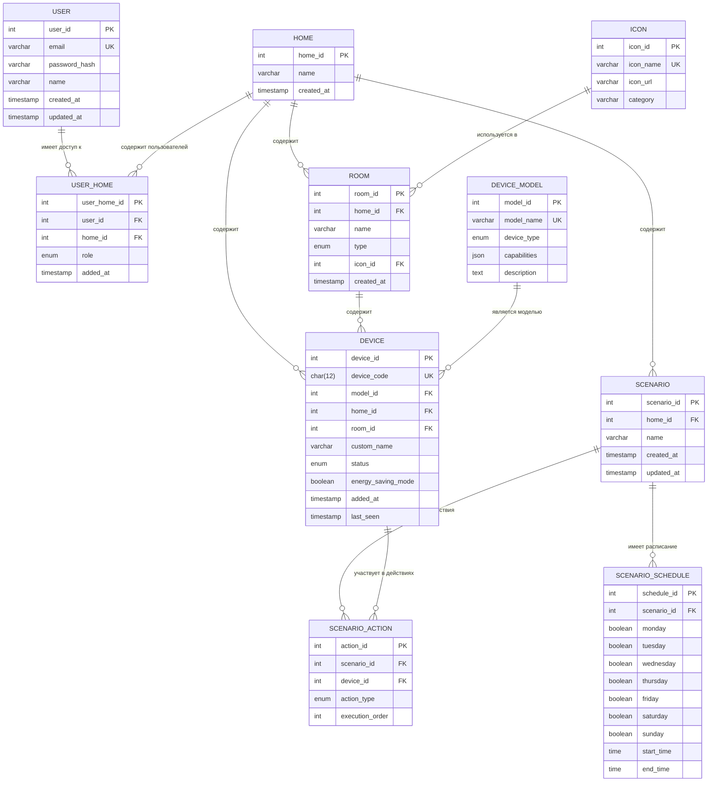

# ER-диаграмма Stets Home (основная)

## Описание

Основная ER-диаграмма показывает логическую модель данных приложения Stets Home с 10 сущностями и их связями в нотации Crow's Foot.

## Диаграмма

## Сущности и их назначение

### Основные сущности

#### USER (Пользователь)
- **Назначение:** Зарегистрированные пользователи системы
- **Ключевые атрибуты:** email (уникальный), password_hash, name
- **Особенности:** Автоматическое создание/обновление временных меток

#### HOME (Дом)
- **Назначение:** Умные дома пользователей
- **Ключевые атрибуты:** name (по умолчанию "Мой дом")
- **Особенности:** Автосоздание при регистрации пользователя

#### USER_HOME (Связь пользователей и домов)
- **Назначение:** Связующая таблица для связи многие-ко-многим
- **Ключевые атрибуты:** role (owner/member)
- **Особенности:** Один пользователь может быть в доме только один раз

### Справочные сущности

#### ICON (Справочник иконок)
- **Назначение:** Предустановленные иконки для комнат
- **Ключевые атрибуты:** icon_name (уникальный), icon_url, category
- **Особенности:** Только чтение, переиспользование

#### DEVICE_MODEL (Справочник моделей устройств)
- **Назначение:** Модели устройств Stets
- **Ключевые атрибуты:** model_name (уникальный), device_type, capabilities (JSON)
- **Особенности:** Масштабируемость при добавлении новых моделей

### Основные бизнес-сущности

#### ROOM (Комната)
- **Назначение:** Комнаты в домах
- **Ключевые атрибуты:** name, type (enum), icon_id
- **Особенности:** Опциональная привязка к дому

#### DEVICE (Устройство)
- **Назначение:** Умные устройства в домах
- **Ключевые атрибуты:** device_code (12 цифр, уникальный), status, energy_saving_mode
- **Особенности:** Может существовать без привязки к комнате

#### SCENARIO (Сценарий)
- **Назначение:** Сценарии автоматизации
- **Ключевые атрибуты:** name (до 30 символов)
- **Особенности:** Уникальное название в рамках дома

### Вспомогательные сущности

#### SCENARIO_SCHEDULE (Расписание сценария)
- **Назначение:** Расписания выполнения сценариев
- **Ключевые атрибуты:** Дни недели (boolean), start_time, end_time
- **Особенности:** Опциональное расписание

#### SCENARIO_ACTION (Действие сценария)
- **Назначение:** Действия, выполняемые сценарием
- **Ключевые атрибуты:** action_type, execution_order
- **Особенности:** Порядок выполнения действий

## Связи и кардинальность

### Связи один-ко-многим (1:M)
- **HOME → ROOM** - в доме может быть много комнат (максимум 10)
- **HOME → DEVICE** - в доме может быть много устройств (максимум 100)
- **HOME → SCENARIO** - в доме может быть много сценариев (максимум 10)
- **ICON → ROOM** - одну иконку могут использовать много комнат
- **DEVICE_MODEL → DEVICE** - одну модель могут иметь много устройств
- **SCENARIO → SCENARIO_SCHEDULE** - у сценария может быть одно расписание
- **SCENARIO → SCENARIO_ACTION** - сценарий может выполнять много действий

### Связи многие-ко-многим (M:N)
- **USER ↔ HOME** (через USER_HOME) - пользователь может управлять несколькими домами, дом может иметь несколько пользователей
- **SCENARIO ↔ DEVICE** (через SCENARIO_ACTION) - сценарий может управлять несколькими устройствами, устройство может участвовать в нескольких сценариях

### Опциональные связи
- **ROOM → DEVICE** - устройство может быть привязано к комнате или существовать без привязки (room_id может быть NULL)

## Ключевые особенности модели

### 1. Нормализация до 3НФ
- Выделены справочники (ICON, DEVICE_MODEL)
- Устранены транзитивные зависимости
- Связующие таблицы для M:N связей

### 2. Масштабируемость
- Справочники позволяют добавлять новые модели устройств и иконки
- Гибкая структура сценариев через SCENARIO_ACTION
- Поддержка множественных домов на пользователя

### 3. Бизнес-правила
- Ограничения количества (10 домов, 10 комнат, 100 устройств, 10 сценариев)
- Уникальность кодов устройств в системе
- Уникальность названий сценариев в доме

### 4. Гибкость
- Комнаты опциональны (снижение порога входа)
- Расписания сценариев опциональны (ручной запуск)
- Порядок выполнения действий в сценариях

## Связь с документацией

Эта диаграмма соответствует документу `04_data/er_model.md` и детализируется в `04_data/data_dictionary.md`.
