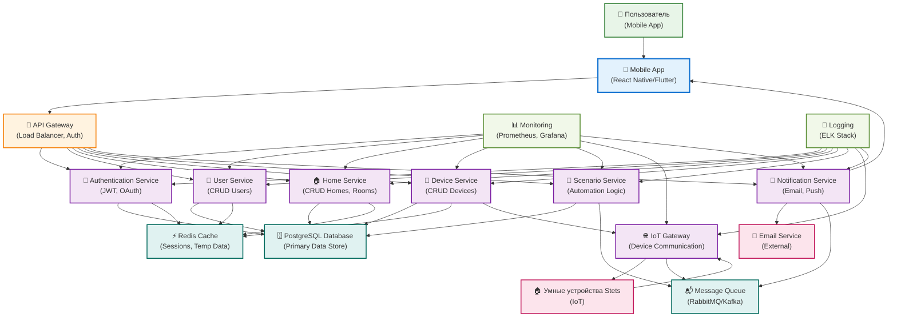

# Архитектура системы Stets Home

## Описание

Диаграмма архитектуры системы показывает компоненты Stets Home и их взаимодействие на высоком уровне. Использует UML Component Diagram для отображения архитектуры.

## Диаграмма

## Компоненты системы

### Frontend Layer (Слой представления)

#### Mobile App (React Native/Flutter)
- **Назначение:** Мобильное приложение для iOS и Android
- **Технологии:** React Native или Flutter
- **Функции:**
  - UI/UX интерфейс
  - Управление состоянием
  - Локальное кэширование
  - Push-уведомления
  - QR-сканер

### API Layer (Слой API)

#### API Gateway
- **Назначение:** Единая точка входа для всех API запросов
- **Функции:**
  - Маршрутизация запросов
  - Аутентификация и авторизация
  - Rate limiting
  - Логирование запросов
  - Load balancing

### Business Logic Layer (Слой бизнес-логики)

#### Authentication Service
- **Назначение:** Управление аутентификацией и авторизацией
- **Функции:**
  - Регистрация пользователей
  - Вход в систему
  - Восстановление пароля
  - Управление JWT токенами
  - Проверка прав доступа

#### User Service
- **Назначение:** Управление пользователями
- **Функции:**
  - CRUD операции с пользователями
  - Управление профилями
  - Изменение email и пароля
  - Удаление аккаунтов

#### Home Service
- **Назначение:** Управление домами и комнатами
- **Функции:**
  - CRUD операции с домами
  - CRUD операции с комнатами
  - Управление участниками дома
  - Приглашения пользователей

#### Device Service
- **Назначение:** Управление устройствами
- **Функции:**
  - Добавление устройств (QR + ручной ввод)
  - CRUD операции с устройствами
  - Управление статусом устройств
  - Предотвращение дубликатов

#### Scenario Service
- **Назначение:** Управление сценариями автоматизации
- **Функции:**
  - Создание и редактирование сценариев
  - Выполнение сценариев
  - Управление расписанием
  - Планировщик задач

#### IoT Gateway
- **Назначение:** Коммуникация с IoT устройствами
- **Функции:**
  - Протоколы связи с устройствами
  - Синхронизация статусов
  - Обработка ошибок связи
  - Режим энергосбережения

#### Notification Service
- **Назначение:** Отправка уведомлений
- **Функции:**
  - Email уведомления
  - Push уведомления
  - Восстановление пароля
  - Приглашения пользователей

### Data Layer (Слой данных)

#### PostgreSQL Database
- **Назначение:** Основное хранилище данных
- **Содержимое:**
  - Все бизнес-данные
  - Пользователи, дома, комнаты
  - Устройства и сценарии
  - Аудит и логи

#### Redis Cache
- **Назначение:** Кэширование и сессии
- **Использование:**
  - Сессии пользователей
  - Кэш часто запрашиваемых данных
  - Временные данные
  - Rate limiting

#### Message Queue (RabbitMQ/Kafka)
- **Назначение:** Асинхронная обработка
- **Использование:**
  - Выполнение сценариев
  - Отправка уведомлений
  - Синхронизация с IoT
  - Обработка событий

### External Services (Внешние сервисы)

#### Email Service
- **Назначение:** Отправка email
- **Функции:**
  - Восстановление пароля
  - Приглашения пользователей
  - Уведомления о событиях

#### IoT Devices (Умные устройства Stets)
- **Назначение:** Физические устройства
- **Функции:**
  - Выполнение команд
  - Передача статуса
  - Режим энергосбережения

### Monitoring Layer (Слой мониторинга)

#### Monitoring (Prometheus + Grafana)
- **Назначение:** Мониторинг системы
- **Метрики:**
  - Производительность API
  - Использование ресурсов
  - Доступность сервисов
  - Бизнес-метрики

#### Logging (ELK Stack)
- **Назначение:** Централизованное логирование
- **Компоненты:**
  - Elasticsearch (хранение)
  - Logstash (обработка)
  - Kibana (визуализация)

## Потоки данных

### Поток управления устройством
1. **Mobile App** → API Gateway → Device Service
2. **Device Service** → IoT Gateway → IoT Devices
3. **IoT Devices** → IoT Gateway → Device Service
4. **Device Service** → Database (обновление статуса)
5. **Device Service** → Mobile App (подтверждение)

### Поток создания сценария
1. **Mobile App** → API Gateway → Scenario Service
2. **Scenario Service** → Database (сохранение сценария)
3. **Scenario Service** → Message Queue (планирование)
4. **Message Queue** → Scenario Service (выполнение)
5. **Scenario Service** → Device Service (команды)

### Поток аутентификации
1. **Mobile App** → API Gateway → Auth Service
2. **Auth Service** → Database (проверка учетных данных)
3. **Auth Service** → Redis (сохранение сессии)
4. **Auth Service** → Mobile App (JWT токен)

## Технологический стек

### Frontend
- **Mobile:** React Native или Flutter
- **State Management:** Redux/MobX или Provider/Bloc
- **Navigation:** React Navigation или Flutter Navigation

### Backend
- **API Gateway:** Kong, AWS API Gateway, или NGINX
- **Services:** Node.js, Python (FastAPI), или Go
- **Database:** PostgreSQL
- **Cache:** Redis
- **Message Queue:** RabbitMQ или Apache Kafka

### Infrastructure
- **Containerization:** Docker + Kubernetes
- **Cloud:** AWS, Google Cloud, или Azure
- **CI/CD:** GitHub Actions, GitLab CI, или Jenkins
- **Monitoring:** Prometheus + Grafana
- **Logging:** ELK Stack

## Масштабируемость

### Горизонтальное масштабирование
- **API Gateway:** Load balancer с множественными инстансами
- **Services:** Микросервисная архитектура
- **Database:** Read replicas для чтения
- **Cache:** Redis Cluster

### Вертикальное масштабирование
- **Database:** Увеличение ресурсов сервера
- **Services:** Увеличение CPU/RAM для сервисов
- **IoT Gateway:** Оптимизация протоколов связи

## Безопасность

### Аутентификация и авторизация
- **JWT токены** с коротким временем жизни
- **Refresh токены** для обновления сессий
- **Role-based access control** (RBAC)
- **API ключи** для IoT устройств

### Защита данных
- **HTTPS** для всех соединений
- **Шифрование** паролей (bcrypt)
- **Валидация** всех входных данных
- **Rate limiting** для предотвращения атак

### Мониторинг безопасности
- **Логирование** всех операций
- **Алерты** на подозрительную активность
- **Аудит** доступа к данным

## Связь с документацией

Эта диаграмма дополняет техническую документацию и соответствует архитектурным решениям из документа `06_summary/project_summary.md`.
