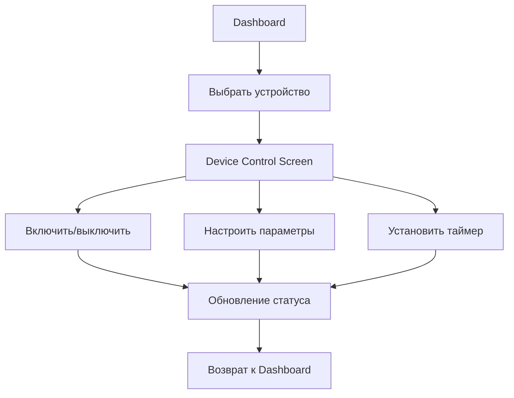

# Проект системы (интерфейс) Stets Home

## 1. Общие сведения

### 1.1 Наименование системы
**Полное наименование:** Проект пользовательского интерфейса системы управления умным домом Stets Home  
**Краткое наименование:** Stets Home UI Design  
**Код проекта:** STETS-HOME-UI-001

### 1.2 Назначение проекта
Проект определяет структуру, дизайн и поведение пользовательского интерфейса мобильного приложения для управления умным домом, обеспечивая:
- Интуитивную навигацию между экранами
- Эффективное управление устройствами
- Удобное создание и управление сценариями
- Совместный доступ к дому для членов семьи

### 1.3 Принципы проектирования
- **User-Centered Design:** Интерфейс ориентирован на потребности пользователей
- **Mobile-First:** Оптимизация для мобильных устройств
- **Accessibility:** Доступность для пользователей с ограниченными возможностями
- **Consistency:** Единообразие элементов интерфейса
- **Simplicity:** Простота и понятность взаимодействия

## 2. Архитектура интерфейса

### 2.1 Структура приложения

```mermaid
graph TD
    %% Главная структура приложения
    App["🏡 Stets Home App"]
    
    %% Splash и Onboarding
    Splash["📱 Splash Screen<br/>(Загрузочный экран)"]
    Onboarding["🎯 Onboarding Flow"]
    Welcome["👋 Welcome Screen"]
    Features["⭐ Features Overview"]
    Permissions["🔐 Permission Requests"]
    
    %% Authentication Flow
    Auth["🔑 Authentication Flow"]
    Login["📝 Login Screen"]
    Register["📋 Register Screen"]
    PasswordReset["🔒 Password Reset Screen"]
    EmailVerify["📧 Email Verification Screen"]
    
    %% Home Flow (Основной функционал)
    HomeFlow["🏠 Home Flow"]
    HomeSelection["🏘️ Home Selection Screen<br/>(если >1 дома)"]
    Dashboard["📊 Dashboard<br/>(Главный экран)"]
    RoomsOverview["🚪 Rooms Overview"]
    AllDevices["🔌 All Devices View"]
    QuickActions["⚡ Quick Actions"]
    
    %% Room Details
    RoomDetails["🚪 Room Details Screen"]
    DevicesInRoom["🔌 Devices in Room"]
    RoomControls["🎛️ Room Controls"]
    RoomSettings["⚙️ Room Settings"]
    
    %% Device Control
    DeviceControl["🔌 Device Control Screen"]
    DeviceStatus["📊 Device Status"]
    PowerToggle["🔘 Power Toggle"]
    EnergySaving["💡 Energy Saving Toggle"]
    DeviceSettings["⚙️ Device Settings"]
    
    %% Scenarios
    Scenarios["🤖 Scenarios Screen"]
    ScenarioList["📋 Scenario List"]
    CreateScenario["➕ Create Scenario Screen"]
    EditScenario["✏️ Edit Scenario Screen"]
    ScenarioDetails["📄 Scenario Details"]
    
    %% Add Device Flow
    AddDevice["➕ Add Device Flow"]
    AddDeviceScreen["📱 Add Device Screen"]
    QRScanner["📷 QR Scanner Screen"]
    ManualInput["⌨️ Manual Code Input"]
    DeviceSetup["🔧 Device Setup"]
    
    %% Settings Flow
    Settings["⚙️ Settings Flow"]
    Profile["👤 Profile Screen"]
    EditProfile["✏️ Edit Profile"]
    ChangeEmail["📧 Change Email"]
    ChangePassword["🔒 Change Password"]
    
    %% Home Settings
    HomeSettings["🏠 Home Settings Screen"]
    ManageRooms["🚪 Manage Rooms"]
    ManageMembers["👥 Manage Members"]
    HomeInfo["ℹ️ Home Information"]
    DeleteHome["🗑️ Delete Home"]
    
    %% App Settings
    AppSettings["📱 App Settings Screen"]
    Notifications["🔔 Notifications"]
    Privacy["🔒 Privacy"]
    About["ℹ️ About"]
    
    %% Error Screens
    Errors["❌ Error Screens"]
    NetworkError["🌐 Network Error"]
    DeviceUnavailable["📵 Device Unavailable"]
    GenericError["⚠️ Generic Error"]
    
    %% Связи
    App --> Splash
    Splash --> Onboarding
    Onboarding --> Welcome
    Onboarding --> Features
    Onboarding --> Permissions
    
    Splash --> Auth
    Auth --> Login
    Auth --> Register
    Auth --> PasswordReset
    Auth --> EmailVerify
    
    Login --> HomeFlow
    Register --> HomeFlow
    EmailVerify --> HomeFlow
    
    HomeFlow --> HomeSelection
    HomeFlow --> Dashboard
    Dashboard --> RoomsOverview
    Dashboard --> AllDevices
    Dashboard --> QuickActions
    
    Dashboard --> RoomDetails
    RoomDetails --> DevicesInRoom
    RoomDetails --> RoomControls
    RoomDetails --> RoomSettings
    
    Dashboard --> DeviceControl
    RoomDetails --> DeviceControl
    DeviceControl --> DeviceStatus
    DeviceControl --> PowerToggle
    DeviceControl --> EnergySaving
    DeviceControl --> DeviceSettings
    
    Dashboard --> Scenarios
    Scenarios --> ScenarioList
    Scenarios --> CreateScenario
    Scenarios --> EditScenario
    Scenarios --> ScenarioDetails
    
    Dashboard --> AddDevice
    AddDevice --> AddDeviceScreen
    AddDeviceScreen --> QRScanner
    AddDeviceScreen --> ManualInput
    QRScanner --> DeviceSetup
    ManualInput --> DeviceSetup
    
    Dashboard --> Settings
    Settings --> Profile
    Profile --> EditProfile
    Profile --> ChangeEmail
    Profile --> ChangePassword
    
    Settings --> HomeSettings
    HomeSettings --> ManageRooms
    HomeSettings --> ManageMembers
    HomeSettings --> HomeInfo
    HomeSettings --> DeleteHome
    
    Settings --> AppSettings
    AppSettings --> Notifications
    AppSettings --> Privacy
    AppSettings --> About
    
    %% Error connections
    DeviceControl --> Errors
    Dashboard --> Errors
    Errors --> NetworkError
    Errors --> DeviceUnavailable
    Errors --> GenericError
    
    %% Стили
    classDef mainApp fill:#e3f2fd,stroke:#1976d2,stroke-width:3px
    classDef auth fill:#fff3e0,stroke:#f57c00,stroke-width:2px
    classDef home fill:#e8f5e8,stroke:#388e3c,stroke-width:2px
    classDef settings fill:#fce4ec,stroke:#c2185b,stroke-width:2px
    classDef error fill:#ffebee,stroke:#d32f2f,stroke-width:2px
    
    class App mainApp
    class Splash,Onboarding,Welcome,Features,Permissions,Auth,Login,Register,PasswordReset,EmailVerify auth
    class HomeFlow,HomeSelection,Dashboard,RoomsOverview,AllDevices,QuickActions,RoomDetails,DevicesInRoom,RoomControls,RoomSettings,DeviceControl,DeviceStatus,PowerToggle,EnergySaving,DeviceSettings,Scenarios,ScenarioList,CreateScenario,EditScenario,ScenarioDetails,AddDevice,AddDeviceScreen,QRScanner,ManualInput,DeviceSetup home
    class Settings,Profile,EditProfile,ChangeEmail,ChangePassword,HomeSettings,ManageRooms,ManageMembers,HomeInfo,DeleteHome,AppSettings,Notifications,Privacy,About settings
    class Errors,NetworkError,DeviceUnavailable,GenericError error
```



### 2.2 Навигационная структура

#### 2.2.1 Основная навигация
- **Bottom Navigation:** Главные разделы приложения
- **Top Navigation:** Подразделы и действия
- **Drawer Navigation:** Дополнительные функции и настройки
- **Breadcrumbs:** Показ текущего местоположения

#### 2.2.2 Паттерны навигации
- **Tab Navigation:** Переключение между основными разделами
- **Stack Navigation:** Последовательные экраны (детали устройства)
- **Modal Navigation:** Временные экраны (добавление устройства)
- **Deep Linking:** Прямые ссылки на конкретные экраны

## 3. Дизайн-система

### 3.1 Цветовая палитра

#### 3.1.1 Основные цвета
```css
/* Primary Colors */
--primary-50: #E3F2FD;
--primary-100: #BBDEFB;
--primary-200: #90CAF9;
--primary-300: #64B5F6;
--primary-400: #42A5F5;
--primary-500: #2196F3;  /* Основной синий */
--primary-600: #1E88E5;
--primary-700: #1976D2;  /* Темно-синий */
--primary-800: #1565C0;
--primary-900: #0D47A1;

/* Secondary Colors */
--secondary-50: #E8F5E8;
--secondary-100: #C8E6C9;
--secondary-200: #A5D6A7;
--secondary-300: #81C784;
--secondary-400: #66BB6A;
--secondary-500: #4CAF50;  /* Основной зеленый */
--secondary-600: #43A047;
--secondary-700: #388E3C;  /* Темно-зеленый */
--secondary-800: #2E7D32;
--secondary-900: #1B5E20;

/* Accent Colors */
--accent-50: #FFF3E0;
--accent-100: #FFE0B2;
--accent-200: #FFCC80;
--accent-300: #FFB74D;
--accent-400: #FFA726;
--accent-500: #FF9800;  /* Основной оранжевый */
--accent-600: #FB8C00;
--accent-700: #F57C00;
--accent-800: #EF6C00;
--accent-900: #E65100;
```

#### 3.1.2 Семантические цвета
```css
/* Success */
--success-50: #E8F5E8;
--success-500: #4CAF50;
--success-700: #388E3C;

/* Warning */
--warning-50: #FFF8E1;
--warning-500: #FF9800;
--warning-700: #F57C00;

/* Error */
--error-50: #FFEBEE;
--error-500: #F44336;
--error-700: #D32F2F;

/* Info */
--info-50: #E3F2FD;
--info-500: #2196F3;
--info-700: #1976D2;

/* Neutral Colors */
--gray-50: #FAFAFA;
--gray-100: #F5F5F5;
--gray-200: #EEEEEE;
--gray-300: #E0E0E0;
--gray-400: #BDBDBD;
--gray-500: #9E9E9E;
--gray-600: #757575;
--gray-700: #616161;
--gray-800: #424242;
--gray-900: #212121;
```

### 3.2 Типографика

#### 3.2.1 Шрифты
```css
/* Основной шрифт */
--font-family-primary: 'Roboto', -apple-system, BlinkMacSystemFont, 'Segoe UI', sans-serif;

/* Моноширинный шрифт */
--font-family-mono: 'Roboto Mono', 'Courier New', monospace;
```

#### 3.2.2 Размеры шрифтов
```css
/* Заголовки */
--text-h1: 32px;  /* 2rem */
--text-h2: 28px;  /* 1.75rem */
--text-h3: 24px;  /* 1.5rem */
--text-h4: 20px;  /* 1.25rem */
--text-h5: 18px;  /* 1.125rem */
--text-h6: 16px;  /* 1rem */

/* Основной текст */
--text-body-large: 18px;   /* 1.125rem */
--text-body-medium: 16px;  /* 1rem */
--text-body-small: 14px;   /* 0.875rem */
--text-caption: 12px;       /* 0.75rem */

/* Веса шрифтов */
--font-weight-light: 300;
--font-weight-regular: 400;
--font-weight-medium: 500;
--font-weight-bold: 700;
```

#### 3.2.3 Высота строк
```css
--line-height-tight: 1.2;
--line-height-normal: 1.4;
--line-height-relaxed: 1.6;
```

### 3.3 Компоненты интерфейса

#### 3.3.1 Кнопки
```css
/* Primary Button */
.btn-primary {
    background-color: var(--primary-500);
    color: white;
    border-radius: 8px;
    padding: 12px 24px;
    font-weight: var(--font-weight-medium);
    font-size: var(--text-body-medium);
    border: none;
    cursor: pointer;
    transition: all 0.2s ease;
}

.btn-primary:hover {
    background-color: var(--primary-600);
    transform: translateY(-1px);
    box-shadow: 0 4px 8px rgba(33, 150, 243, 0.3);
}

.btn-primary:active {
    transform: translateY(0);
    box-shadow: 0 2px 4px rgba(33, 150, 243, 0.3);
}

/* Secondary Button */
.btn-secondary {
    background-color: transparent;
    color: var(--primary-500);
    border: 2px solid var(--primary-500);
    border-radius: 8px;
    padding: 10px 22px;
    font-weight: var(--font-weight-medium);
    font-size: var(--text-body-medium);
    cursor: pointer;
    transition: all 0.2s ease;
}

/* Icon Button */
.btn-icon {
    background-color: transparent;
    color: var(--gray-600);
    border: none;
    border-radius: 50%;
    width: 48px;
    height: 48px;
    display: flex;
    align-items: center;
    justify-content: center;
    cursor: pointer;
    transition: all 0.2s ease;
}

.btn-icon:hover {
    background-color: var(--gray-100);
    color: var(--gray-800);
}
```

#### 3.3.2 Карточки
```css
.card {
    background-color: white;
    border-radius: 12px;
    padding: 16px;
    box-shadow: 0 2px 8px rgba(0, 0, 0, 0.1);
    border: 1px solid var(--gray-200);
    transition: all 0.2s ease;
}

.card:hover {
    box-shadow: 0 4px 16px rgba(0, 0, 0, 0.15);
    transform: translateY(-2px);
}

.card-header {
    display: flex;
    align-items: center;
    justify-content: space-between;
    margin-bottom: 12px;
}

.card-title {
    font-size: var(--text-h6);
    font-weight: var(--font-weight-medium);
    color: var(--gray-800);
    margin: 0;
}

.card-content {
    color: var(--gray-600);
    font-size: var(--text-body-small);
    line-height: var(--line-height-normal);
}
```

#### 3.3.3 Формы
```css
.form-group {
    margin-bottom: 20px;
}

.form-label {
    display: block;
    font-size: var(--text-body-small);
    font-weight: var(--font-weight-medium);
    color: var(--gray-700);
    margin-bottom: 8px;
}

.form-input {
    width: 100%;
    padding: 12px 16px;
    border: 2px solid var(--gray-300);
    border-radius: 8px;
    font-size: var(--text-body-medium);
    font-family: var(--font-family-primary);
    transition: border-color 0.2s ease;
    box-sizing: border-box;
}

.form-input:focus {
    outline: none;
    border-color: var(--primary-500);
    box-shadow: 0 0 0 3px rgba(33, 150, 243, 0.1);
}

.form-input.error {
    border-color: var(--error-500);
}

.form-error {
    color: var(--error-500);
    font-size: var(--text-caption);
    margin-top: 4px;
}

.form-help {
    color: var(--gray-500);
    font-size: var(--text-caption);
    margin-top: 4px;
}
```

#### 3.3.4 Переключатели
```css
.toggle {
    position: relative;
    display: inline-block;
    width: 60px;
    height: 34px;
}

.toggle input {
    opacity: 0;
    width: 0;
    height: 0;
}

.toggle-slider {
    position: absolute;
    cursor: pointer;
    top: 0;
    left: 0;
    right: 0;
    bottom: 0;
    background-color: var(--gray-300);
    transition: 0.4s;
    border-radius: 34px;
}

.toggle-slider:before {
    position: absolute;
    content: "";
    height: 26px;
    width: 26px;
    left: 4px;
    bottom: 4px;
    background-color: white;
    transition: 0.4s;
    border-radius: 50%;
    box-shadow: 0 2px 4px rgba(0, 0, 0, 0.2);
}

.toggle input:checked + .toggle-slider {
    background-color: var(--primary-500);
}

.toggle input:checked + .toggle-slider:before {
    transform: translateX(26px);
}
```

### 3.4 Иконки

#### 3.4.1 Набор иконок
- **Material Design Icons:** Основной набор иконок
- **Custom Icons:** Специальные иконки для устройств
- **Room Icons:** Иконки для типов комнат
- **Status Icons:** Иконки статусов устройств

#### 3.4.2 Размеры иконок
```css
.icon-xs { width: 16px; height: 16px; }
.icon-sm { width: 20px; height: 20px; }
.icon-md { width: 24px; height: 24px; }
.icon-lg { width: 32px; height: 32px; }
.icon-xl { width: 48px; height: 48px; }
```

## 4. Детальное описание экранов

### 4.1 Splash Screen

#### 4.1.1 Назначение
Первый экран приложения, отображаемый при запуске для создания первого впечатления и загрузки необходимых данных.

#### 4.1.2 Элементы интерфейса
- **Логотип Stets:** Центрально расположенный логотип
- **Название приложения:** "Stets Home" под логотипом
- **Индикатор загрузки:** Анимированный индикатор прогресса
- **Версия приложения:** Номер версии внизу экрана

#### 4.1.3 Поведение
- **Время отображения:** 2-3 секунды
- **Анимация:** Плавное появление логотипа и текста
- **Переход:** Автоматический переход к Onboarding или Dashboard

#### 4.1.4 Состояния
- **Загрузка:** Отображение индикатора прогресса
- **Ошибка:** Сообщение об ошибке с кнопкой повтора
- **Готово:** Переход к следующему экрану

### 4.2 Onboarding Flow

#### 4.2.1 Welcome Screen
**Элементы:**
- Приветственный текст
- Описание возможностей приложения
- Кнопка "Начать"

**Дизайн:**
- Большой логотип вверху
- Иллюстрация умного дома
- Минимальный текст

#### 4.2.2 Features Overview
**Элементы:**
- Список основных функций
- Иконки для каждой функции
- Кнопка "Продолжить"

**Функции:**
- Управление устройствами
- Создание сценариев
- Совместный доступ
- Уведомления

#### 4.2.3 Permission Requests
**Элементы:**
- Объяснение необходимости разрешений
- Кнопки разрешений
- Кнопка "Пропустить"

**Разрешения:**
- Уведомления
- Камера (для QR-кодов)
- Локация (опционально)

### 4.3 Authentication Screens

#### 4.3.1 Login Screen
**Элементы:**
- Поле ввода email
- Поле ввода пароля
- Кнопка "Войти"
- Ссылка "Забыли пароль?"
- Ссылка "Нет аккаунта? Зарегистрироваться"

**Валидация:**
- Проверка формата email
- Проверка длины пароля
- Отображение ошибок

**Состояния:**
- Обычное состояние
- Загрузка (дизаблированная форма)
- Ошибка (красные поля, сообщение об ошибке)

#### 4.3.2 Register Screen
**Элементы:**
- Поле ввода имени
- Поле ввода email
- Поле ввода пароля
- Поле подтверждения пароля
- Чекбокс согласия с условиями
- Кнопка "Зарегистрироваться"
- Ссылка "Уже есть аккаунт? Войти"

**Валидация:**
- Проверка имени (не пустое)
- Проверка формата email
- Проверка пароля (8-16 символов, минимум 1 строчная и 1 заглавная)
- Совпадение паролей
- Согласие с условиями

### 4.4 Dashboard (Главный экран)

#### 4.4.1 Назначение
Центральный экран приложения, предоставляющий быстрый доступ ко всем основным функциям.

#### 4.4.2 Структура экрана
```
┌─────────────────────────────────────┐
│ Header                              │
│ [☰] Stets Home        [🔔] [👤]    │
├─────────────────────────────────────┤
│ Quick Stats                         │
│ [🏠] Дом: "Мой дом"                 │
│ [🔌] 5 устройств  [🚪] 3 комнаты   │
├─────────────────────────────────────┤
│ Quick Actions                       │
│ [⚡] Быстрые действия               │
│ [➕] Добавить устройство           │
│ [🤖] Сценарии                      │
├─────────────────────────────────────┤
│ Rooms Overview                       │
│ [🚪] Комнаты                       │
│ [🛏️] Спальня (2 устройства)        │
│ [🛋️] Гостиная (2 устройства)      │
│ [🍳] Кухня (1 устройство)          │
├─────────────────────────────────────┤
│ Recent Activity                     │
│ [📊] Последняя активность          │
│ • Лампа в спальне включена          │
│ • Сценарий "Утро" выполнен          │
└─────────────────────────────────────┘
```

#### 4.4.3 Элементы интерфейса

**Header:**
- Меню-гамбургер (слева)
- Название приложения (центр)
- Уведомления и профиль (справа)

**Quick Stats:**
- Название текущего дома
- Количество устройств
- Количество комнат

**Quick Actions:**
- Кнопка быстрых действий
- Кнопка добавления устройства
- Кнопка управления сценариями

**Rooms Overview:**
- Список комнат с количеством устройств
- Быстрый доступ к управлению комнатой

**Recent Activity:**
- Последние события в доме
- Ссылка на полную историю

#### 4.4.4 Состояния экрана

**Пустой дом:**
- Приветственное сообщение
- Кнопка "Добавить первое устройство"
- Подсказки по использованию

**Дом с устройствами:**
- Статистика и быстрые действия
- Список комнат
- Последняя активность

**Ошибка загрузки:**
- Сообщение об ошибке
- Кнопка "Повторить"
- Кнопка "Офлайн режим"

### 4.5 Device Control Screen

#### 4.5.1 Назначение
Экран для детального управления конкретным устройством.

#### 4.5.2 Структура экрана
```
┌─────────────────────────────────────┐
│ Header                              │
│ [←] Лампа в спальне    [⚙️] [ℹ️]   │
├─────────────────────────────────────┤
│ Device Status                        │
│ [💡] Статус: Включено               │
│ [🔋] Энергосбережение: Выключено    │
├─────────────────────────────────────┤
│ Quick Controls                      │
│ [🔘] Включить/Выключить             │
│ [💡] Режим энергосбережения         │
├─────────────────────────────────────┤
│ Advanced Controls                    │
│ [🔆] Яркость: 80%                   │
│ [🎨] Цвет: Белый                    │
│ [⏰] Таймер: Выключить через 1ч     │
├─────────────────────────────────────┤
│ Device Info                         │
│ [📊] Информация об устройстве       │
│ • Модель: Stets Smart Bulb          │
│ • Версия: 1.2.3                     │
│ • Последняя активность: 2 мин назад │
└─────────────────────────────────────┘
```

#### 4.5.3 Элементы управления

**Основные переключатели:**
- Включение/выключение устройства
- Режим энергосбережения

**Расширенные настройки:**
- Регулировка яркости (слайдер)
- Выбор цвета (цветовая палитра)
- Таймер включения/выключения

**Информация об устройстве:**
- Модель и версия прошивки
- Статус подключения
- Время последней активности

#### 4.5.4 Состояния устройства

**Включено:**
- Зеленый индикатор статуса
- Активные элементы управления
- Отображение текущих настроек

**Выключено:**
- Серый индикатор статуса
- Ограниченные элементы управления
- Кнопка включения

**Недоступно:**
- Красный индикатор статуса
- Заблокированные элементы управления
- Сообщение о проблеме подключения

### 4.6 Scenarios Screen

#### 4.6.1 Назначение
Экран для просмотра, создания и управления сценариями автоматизации.

#### 4.6.2 Структура экрана
```
┌─────────────────────────────────────┐
│ Header                              │
│ [←] Сценарии           [➕] [🔍]    │
├─────────────────────────────────────┤
│ Active Scenarios                     │
│ [🤖] Активные сценарии              │
│ [🌅] Утро (Пн-Пт, 7:00)             │
│ [🌙] Вечер (Ежедневно, 22:00)       │
├─────────────────────────────────────┤
│ Manual Scenarios                     │
│ [👆] Ручные сценарии                │
│ [🎉] Праздник                       │
│ [💤] Сон                             │
├─────────────────────────────────────┤
│ Quick Actions                        │
│ [⚡] Запустить все                  │
│ [⏸️] Остановить все                │
└─────────────────────────────────────┘
```

#### 4.6.3 Элементы интерфейса

**Список сценариев:**
- Название сценария
- Описание или расписание
- Статус (активен/неактивен)
- Кнопка быстрого запуска

**Действия:**
- Кнопка создания нового сценария
- Поиск по сценариям
- Массовые действия

#### 4.6.4 Создание сценария

**Шаг 1: Основная информация**
- Название сценария
- Описание (опционально)

**Шаг 2: Выбор устройств**
- Список доступных устройств
- Чекбоксы для выбора

**Шаг 3: Настройка действий**
- Для каждого устройства:
  - Тип действия (включить/выключить)
  - Параметры (яркость, цвет)
  - Порядок выполнения

**Шаг 4: Расписание**
- Тип запуска (ручной/по расписанию)
- Дни недели
- Время начала и окончания

**Шаг 5: Подтверждение**
- Предварительный просмотр
- Кнопка создания

### 4.7 Settings Screens

#### 4.7.1 Profile Screen
**Элементы:**
- Аватар пользователя
- Имя и email
- Кнопка редактирования профиля
- Список домов пользователя

#### 4.7.2 Home Settings Screen
**Элементы:**
- Информация о доме
- Управление комнатами
- Управление участниками
- Настройки уведомлений

#### 4.7.3 App Settings Screen
**Элементы:**
- Настройки уведомлений
- Приватность и безопасность
- О приложении
- Выход из аккаунта

## 5. Пользовательские потоки

### 5.1 Основные пользовательские потоки

#### 5.1.1 Добавление устройства
```mermaid
graph TD
    A[Dashboard] --> B[Нажать "Добавить устройство"]
    B --> C[Выбрать метод добавления]
    C --> D[QR-код]
    C --> E[Ручной ввод]
    D --> F[Сканировать QR-код]
    E --> G[Ввести 12-значный код]
    F --> H[Выбрать комнату]
    G --> H
    H --> I[Подтвердить добавление]
    I --> J[Устройство добавлено]
    J --> K[Переход к управлению устройством]
```

#### 5.1.2 Создание сценария
```mermaid
graph TD
    A[Scenarios Screen] --> B[Нажать "Создать сценарий"]
    B --> C[Ввести название]
    C --> D[Выбрать устройства]
    D --> E[Настроить действия]
    E --> F[Настроить расписание]
    F --> G[Предварительный просмотр]
    G --> H[Создать сценарий]
    H --> I[Сценарий создан]
    I --> J[Возврат к списку сценариев]
```

#### 5.1.3 Управление устройством


### 5.2 Обработка ошибок

#### 5.2.1 Сетевые ошибки
- Отображение сообщения об ошибке
- Кнопка повтора запроса
- Переход в офлайн режим

#### 5.2.2 Ошибки устройств
- Индикация недоступности устройства
- Предложение переподключения
- Информация о последней активности

#### 5.2.3 Ошибки валидации
- Подсветка неверных полей
- Сообщения об ошибках
- Подсказки по исправлению

## 6. Адаптивность и доступность

### 6.1 Адаптивность

#### 6.1.1 Размеры экранов
- **Small:** 320px - 480px (старые телефоны)
- **Medium:** 481px - 768px (современные телефоны)
- **Large:** 769px - 1024px (планшеты)
- **Extra Large:** 1025px+ (большие планшеты)

#### 6.1.2 Breakpoints
```css
/* Mobile First Approach */
@media (min-width: 481px) { /* Small tablets */ }
@media (min-width: 769px) { /* Large tablets */ }
@media (min-width: 1025px) { /* Small desktops */ }
```

#### 6.1.3 Адаптивные компоненты
- **Flexible Grid:** Адаптивная сетка для карточек
- **Responsive Images:** Изображения с разными размерами
- **Scalable Typography:** Масштабируемая типографика

### 6.2 Доступность (Accessibility)

#### 6.2.1 WCAG 2.1 Compliance
- **Level AA:** Минимальный уровень соответствия
- **Level AAA:** Рекомендуемый уровень для критических функций

#### 6.2.2 Ключевые принципы
- **Perceivable:** Воспринимаемость
- **Operable:** Управляемость
- **Understandable:** Понятность
- **Robust:** Надежность

#### 6.2.3 Реализация доступности

**Семантическая разметка:**
```html
<button aria-label="Включить устройство" aria-pressed="false">
    <span class="sr-only">Включить устройство</span>
    <svg aria-hidden="true">...</svg>
</button>
```

**ARIA атрибуты:**
- `aria-label`: Описание элемента
- `aria-pressed`: Состояние кнопки
- `aria-expanded`: Состояние раскрытия
- `aria-describedby`: Связь с описанием

**Клавиатурная навигация:**
- Tab порядок элементов
- Focus indicators
- Keyboard shortcuts

**Цветовой контраст:**
- Минимум 4.5:1 для обычного текста
- Минимум 3:1 для крупного текста
- Не только цвет для передачи информации

## 7. Производительность

### 7.1 Оптимизация загрузки

#### 7.1.1 Lazy Loading
- Отложенная загрузка изображений
- Виртуализация длинных списков
- Динамическая загрузка компонентов

#### 7.1.2 Кэширование
- Кэширование статических ресурсов
- Service Worker для офлайн работы
- Локальное хранение данных

#### 7.1.3 Оптимизация изображений
- WebP формат для современных браузеров
- Responsive images
- Оптимизация размеров

### 7.2 Анимации и переходы

#### 7.2.1 Принципы анимации
- **Purposeful:** Анимации с целью
- **Smooth:** Плавные переходы (60fps)
- **Consistent:** Единообразие стиля
- **Accessible:** Уважение к настройкам пользователя

#### 7.2.2 Типы анимаций
```css
/* Transition для hover эффектов */
.card {
    transition: transform 0.2s ease, box-shadow 0.2s ease;
}

/* Animation для загрузки */
@keyframes spin {
    from { transform: rotate(0deg); }
    to { transform: rotate(360deg); }
}

.loading {
    animation: spin 1s linear infinite;
}

/* Micro-interactions */
.button {
    transition: all 0.15s ease;
}

.button:active {
    transform: scale(0.98);
}
```

#### 7.2.3 Производительность анимаций
- Использование `transform` и `opacity`
- Избегание изменения layout свойств
- `will-change` для оптимизации
- `prefers-reduced-motion` для доступности

## 8. Тестирование интерфейса

### 8.1 Типы тестирования

#### 8.1.1 Unit Testing
- Тестирование отдельных компонентов
- Проверка логики взаимодействия
- Валидация пропсов и состояний

#### 8.1.2 Integration Testing
- Тестирование взаимодействия компонентов
- Проверка API интеграции
- Тестирование пользовательских потоков

#### 8.1.3 E2E Testing
- Полное тестирование сценариев
- Тестирование на реальных устройствах
- Проверка производительности

### 8.2 Accessibility Testing

#### 8.2.1 Автоматизированное тестирование
- axe-core для проверки WCAG
- Lighthouse для аудита доступности
- Jest-axe для unit тестов

#### 8.2.2 Ручное тестирование
- Тестирование с screen reader
- Проверка клавиатурной навигации
- Тестирование с различными настройками

### 8.3 Performance Testing

#### 8.3.1 Метрики производительности
- **FCP (First Contentful Paint):** < 1.5s
- **LCP (Largest Contentful Paint):** < 2.5s
- **FID (First Input Delay):** < 100ms
- **CLS (Cumulative Layout Shift):** < 0.1

#### 8.3.2 Инструменты тестирования
- Lighthouse для аудита производительности
- WebPageTest для детального анализа
- Chrome DevTools для профилирования

## 9. Заключение

### 9.1 Ключевые особенности дизайна

#### 9.1.1 Пользовательский опыт
- **Интуитивность:** Понятная навигация и управление
- **Эффективность:** Быстрый доступ к основным функциям
- **Надежность:** Стабильная работа и обработка ошибок
- **Удовлетворенность:** Приятный и современный дизайн

#### 9.1.2 Техническая реализация
- **Адаптивность:** Поддержка различных устройств
- **Доступность:** Соответствие стандартам WCAG
- **Производительность:** Оптимизированная загрузка и анимации
- **Масштабируемость:** Гибкая архитектура компонентов

### 9.2 Следующие шаги

1. **Создание прототипа** в Figma
2. **Разработка компонентов** согласно дизайн-системе
3. **Тестирование** на реальных устройствах
4. **Итеративное улучшение** на основе обратной связи
5. **Подготовка к разработке** полной версии

---

**Дата создания:** [Текущая дата]  
**Версия:** 1.0  
**Статус:** Утвержден
