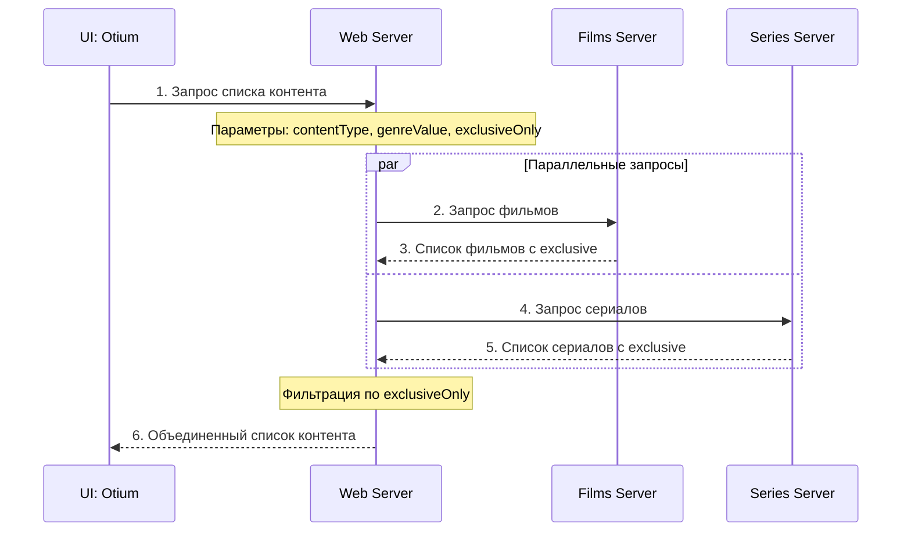

# Диаграмма последовательности: Получение списка контента

## Сценарий: Запрос списка всех фильмов и сериалов

### Участники взаимодействия

1. **UI: Otium** - пользовательский интерфейс
2. **Web Server** - веб-сервер с API
3. **Films Server** - сервис фильмов
4. **Series Server** - сервис сериалов

### Диаграмма последовательности

```
UI: Otium    Web Server    Films Server    Series Server
    |             |              |              |
    |--1. Запрос списка контента-->|              |
    |             |              |              |
    |             |--2. Запрос списка фильмов-->|
    |             |              |              |
    |             |              |--3. Ответ со списком фильмов--|
    |             |              |              |
    |             |--4. Запрос списка сериалов-------->|
    |             |              |              |
    |             |              |--5. Ответ со списком сериалов--|
    |             |              |              |
    |             |--6. Объединение и возврат списка--|
    |<--7. Список всех фильмов и сериалов-------------|
```

### Описание взаимодействий

#### 1. Запрос списка контента
- **От:** UI: Otium
- **К:** Web Server
- **Операция:** `{{WebServer}}/content/list`
- **Параметры:** `contentType=all`, `genreValue` (опционально)

#### 2. Запрос списка фильмов
- **От:** Web Server
- **К:** Films Server
- **Операция:** `{{FilmsServer}}/films/list`
- **Параметры:** фильтры по жанру

#### 3. Ответ со списком фильмов
- **От:** Films Server
- **К:** Web Server
- **Данные:** список фильмов с атрибутом `exclusive`

#### 4. Запрос списка сериалов
- **От:** Web Server
- **К:** Series Server
- **Операция:** `{{SeriesServer}}/series/list`
- **Параметры:** фильтры по жанру

#### 5. Ответ со списком сериалов
- **От:** Series Server
- **К:** Web Server
- **Данные:** список сериалов с атрибутом `exclusive`

#### 6. Объединение данных
- **Действие:** Web Server объединяет списки фильмов и сериалов
- **Фильтрация:** применяет фильтры (если указаны)

#### 7. Возврат результата
- **От:** Web Server
- **К:** UI: Otium
- **Данные:** объединенный список контента

## Параллельное выполнение

### Фрейм с оператором `par`

```
par
  Web Server → Films Server: запрос фильмов
  Web Server → Series Server: запрос сериалов
end
```

**Обоснование:** Запросы к Films Server и Series Server выполняются параллельно, так как:
- Не зависят друг от друга
- Ускоряют общее время ответа
- Позволяют получить полный список контента быстрее

## Сценарий с фильтрацией по эксклюзивности

### Новый сценарий: Запрос только эксклюзивного контента

```
UI: Otium    Web Server    Films Server    Series Server
    |             |              |              |
    |--1. Запрос эксклюзивного контента-->|              |
    |             |              |              |
    |             |--2. Запрос фильмов (exclusive=true)-->|
    |             |              |              |
    |             |              |--3. Ответ с эксклюзивными фильмами--|
    |             |              |              |
    |             |--4. Запрос сериалов (exclusive=true)-->|
    |             |              |              |
    |             |              |--5. Ответ с эксклюзивными сериалами--|
    |             |              |              |
    |             |--6. Фильтрация и объединение--|
    |<--7. Список только эксклюзивного контента--|
```

### Изменения в запросе

**Новый параметр:**
```xml
<GetContentList>
  <contentType>all</contentType>
  <genreValue>drama</genreValue>
  <exclusiveOnly>true</exclusiveOnly>  <!-- НОВЫЙ ПАРАМЕТР -->
</GetContentList>
```

### Логика фильтрации

1. **Web Server** получает запрос с `exclusiveOnly=true`
2. **Films Server** возвращает все фильмы с `exclusive=true`
3. **Series Server** возвращает все сериалы с `exclusive=true`
4. **Web Server** объединяет и возвращает только эксклюзивный контент

## Диаграмма в формате Mermaid



## Ключевые моменты

1. **Параллельность** - запросы к Films и Series Server выполняются одновременно
2. **Фильтрация** - Web Server применяет фильтры после получения данных
3. **Обратная совместимость** - если `exclusiveOnly` не указан, возвращаются все записи
4. **Производительность** - параллельные запросы ускоряют ответ системы
